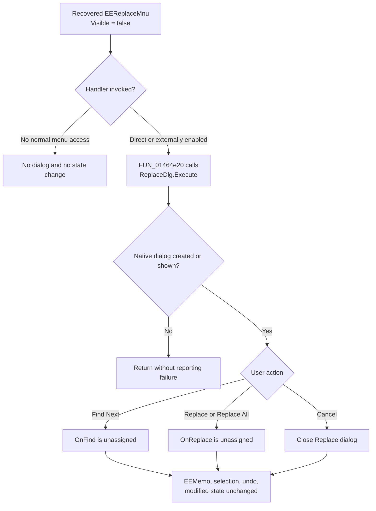

# Open the unbound Equation Editor Replace dialog

> Analysis status: Reviewed from the recovered menu resource, handler, TReplaceDialog component, graph neighborhood, all EquEditor references to the dialog field, and the event bindings of the other recovered TReplaceDialog components.

## Control

| Property | Recovered value |
| --- | --- |
| Form | EquEditor |
| Form caption | Equation Editor |
| Component path | EquEditor.EEMenu.EEEditMnu.EEReplaceMnu |
| Control class | TMenuItem |
| Caption | R&eplace... |
| Visible | false |
| Handler name | EEReplaceMnuClick |
| Handler address | 01464e20 |
| Graph node | `resource:dfm:EquEditor/EquEditor.EEMenu.EEEditMnu.EEReplaceMnu` |
| Handler node | `function:01464e20` |
| Graph layer | UI |

The recovered DFM makes this menu item invisible. No recovered EquEditor function changes that property, and the graph has no function caller for the handler apart from the DFM trigger. The behavior below applies if the handler is invoked after some external code makes the item available or calls it directly.

## What happens when invoked

[`FUN_01464e20`](../../../DecompiledSources/Tina16/functions/0000000001464E20__FUN_01464e20.c) reads the component at form offset `+0x7d0` and invokes virtual method `+0xa8`. The DFM identifies that field as `EquEditor.ReplaceDlg`, a Delphi VCL `TReplaceDialog`; the same virtual slot is the common-dialog `Execute` method used by recovered Open and Save dialogs.

The handler does nothing else. It does not read `EEMemo` at form offset `+0x750`, a selection, the equation model, the document, or a search result. It does not seed Find text or Replace text, set options, inspect the result of `Execute`, or call a replacement helper.

`TReplaceDialog` is modeless. After `Execute` creates or displays the native dialog, `FUN_01464e20` returns while the dialog can remain open.

## Why the dialog cannot replace Equation Editor text

The recovered `EquEditor.ReplaceDlg` resource has no event bindings. In particular, it has neither `OnFind` nor `OnReplace`. No other recovered EquEditor function reads the `+0x7d0` component field or installs an event callback after form creation.

This absence is significant because a VCL `TReplaceDialog` reports **Find Next**, **Replace**, and **Replace All** through those events; it does not know which editor control or document should be changed. The recovered application contains three other `TReplaceDialog` components, and all three explicitly bind both `OnFind` and `OnReplace` to application handlers. `EquEditor.ReplaceDlg` is the only recovered instance with an empty event list.

Therefore, the native dialog can collect text and option choices, but there is no application callback that can apply them to `EEMemo`. The click opens an unconnected interface. It does not perform a replacement.

## Search text, options, and scope

The opener does not establish initial Find text, Replace text, or option values. The recovered DFM evidence records only the component's design coordinates and no event bindings; it does not establish whether a dialog value from an earlier display is retained.

The standard dialog can expose direction, case-sensitive, whole-word, Replace, and Replace All choices. However:

- no EquEditor code reads the dialog's Find text or Replace text;
- no EquEditor code reads or translates its direction, match-case, or whole-word flags;
- no code chooses the current selection, the remaining text, or the complete equation as a scope;
- no recovered wrap option or wrap-to-start branch exists; and
- Replace All has no loop because no `OnReplace` handler is assigned.

Changing any of these dialog controls therefore changes only dialog-owned state. It does not change Equation Editor search behavior.

## Document, undo, and modified state

This path does not call the memo text setter, selection setter, cut/paste methods, equation parser, render refresh, undo interface, modified-state setter, Save command, or document serializer. Find, Replace, and Replace All cannot create an undo record or mark the equation as modified because they never reach `EEMemo`.

The separate Cut, Copy, Paste, New, Open, Save, and equation-format handlers do contain explicit memo or model calls. None is called by `FUN_01464e20`.

## No-match, Cancel, repeated use, and errors

- There is no search, so the EquEditor path cannot produce either a match or a no-match result. It does not show a “text not found” message.
- Pressing **Cancel** closes the native Replace dialog. There is no staged equation change to commit or roll back.
- Find, Replace, or Replace All can cause the VCL dialog to attempt event dispatch, but the corresponding EquEditor events are unassigned. The equation remains unchanged and the handler reports no error.
- The opener ignores the `Execute` result. It has no local creation-failure message, retry, exception handler, or cleanup branch.
- Reopening can display the same form-owned dialog component again. Whether its edit fields retain native dialog state is not established by the recovered EquEditor code.

## Invocation flow

## Evidence

- Menu handler: [FUN_01464e20](../../../DecompiledSources/Tina16/functions/0000000001464E20__FUN_01464e20.c)
- Analogous Find-dialog opener: [FUN_014645e0](../../../DecompiledSources/Tina16/functions/00000000014645E0__FUN_014645e0.c)
- Equation Editor form creation: [FUN_01463690](../../../DecompiledSources/Tina16/functions/0000000001463690__FUN_01463690.c)
- Example application `OnReplace` consumer from Netlist Editor: [FUN_01534030](../../../DecompiledSources/Tina16/functions/0000000001534030__FUN_01534030.c)
- Example application `OnReplace` consumer from Netlist Viewer: [FUN_014b6360](../../../DecompiledSources/Tina16/functions/00000000014B6360__FUN_014b6360.c)
- Recovered resources and event bindings: [ui-evidence.json](../../../DecompiledSources/Tina16/resources/dfm/ui-evidence.json)

## Annotation ownership

This Bead owns only the unique `TEquEditor.EEReplaceMnuClick` handler `FUN_01464e20`. Bead `.468` owns the analogous Find-menu opener. The VCL dialog implementation and the functional replace handlers of other forms are shared evidence or belong to their later control owners; this Bead does not annotate them.
