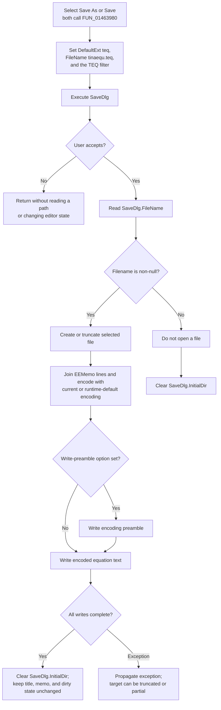

# Save &As...

> Analysis status: Evidence-backed source and file-writer review complete.

## Control

| Property | Recovered value |
| --- | --- |
| Form | EquEditor |
| Form caption | Equation Editor |
| Component path | EquEditor.EEMenu.EEFileMnu.EESaveAsMnu |
| Control class | TMenuItem |
| Caption | Save &As... |
| Hint | Not present in the recovered resource. |
| Text | Not present in the recovered resource. |
| Handler name | EESaveAsMnuClick |
| Handler address | 01463980 |
| Graph node | `resource:dfm:EquEditor/EquEditor.EEMenu.EEFileMnu.EESaveAsMnu` |
| Handler node | `function:01463980` |
| Graph layer | UI |

## What happens when clicked

`TEquEditor.EESaveAsMnuClick` configures the form's `SaveDlg` at offset `+0x718` on every invocation:

| Dialog value | Recovered value |
| --- | --- |
| Default extension | `teq` |
| Suggested filename | `tinaequ.teq` |
| Filter | `Tina equation (*.teq)\|*.teq` |

It then executes the Save dialog. Cancel returns without reading a path or opening a file. After acceptance, the handler reads `SaveDlg.FileName`. A null filename is an explicit no-write path. A non-null filename is passed to the one-argument `SaveToFile` virtual method of `EEMemo.Lines`.

The saved data is the complete line text that is currently in the Equation Editor memo. Equation commands such as the recovered fraction, exponent, integral, and symbol markup remain plain text in those lines. The command does not serialize an equation object, preview bitmap, font object, window state, selection, or binary header.

## Save and Save As use the same path

The **&Save** and **Save &As...** menu items both bind directly to `FUN_01463980`, with the same recovered handler name. The shared function cannot distinguish which menu item invoked it because it does not inspect the sender argument. Both commands therefore:

1. reset the dialog filename to `tinaequ.teq`;
2. present the same path-selection dialog;
3. write the same live `EEMemo.Lines` collection after acceptance.

There is no direct-save branch. The handler does not test a current-file sentinel, reuse a prior accepted path, or fall back to a path after cancellation. `tinaequ.teq` is a suggested dialog filename, not a stored current document name.

`SaveDlg.FileName` can contain the selected path after the dialog returns, but the next Save or Save As call replaces it with `tinaequ.teq`. The accepted path is not copied to another form field.

Bead `.480` documents the **Save** menu context and duplicates the canonical `FUN_01463980` annotation from this Bead exactly.

## Directory selection

During form creation, EquEditor seeds both `SaveDlg.InitialDir` and `OpenDlg.InitialDir` from the same application path. This handler does not calculate another starting folder before it opens the dialog.

After an accepted dialog result that reaches the end of the handler normally, it clears `SaveDlg.InitialDir`, including when the accepted filename is null. A file-write exception occurs before that clear. After cancellation, the handler also does not clear the property. The native dialog or Windows can retain other folder state, but the handler does not store that state as a current equation path.

## Text format and encoding

The virtual save call reaches the recovered `TStrings.SaveToFile` path:

1. the one-argument overload supplies the line collection's current encoding object;
2. the file overload opens the selected path in create/truncate mode;
3. the stream writer gets the complete memo text and encodes it in memory;
4. if the line collection's write-preamble option is set, it writes the selected encoding's preamble first;
5. it writes the encoded text and continues short writes until all requested bytes are written or an error is raised.

If the current encoding is null, the writer uses the line collection's stored default encoding, which is initialized from the runtime system encoding. The handler does not force UTF-8, UTF-16, another code page, a byte-order mark, or a line-ending convention. The complete-text getter uses the line collection's configured line break and trailing-line-break behavior.

The paired Open command loads `.teq` text through the corresponding line-collection file loader. That path can establish the collection's current encoding from the file. A later Save or Save As uses the current encoding that the line collection exposes at that time.

An empty memo is not rejected. It still reaches the create/truncate path and can produce an empty file or only an encoding preamble, depending on the live line-collection options.

## Modified, title, and editor state

A successful file write does not update a current filename, clear a recovered modified or dirty flag, change the form caption **Equation Editor**, or add the selected path to the title. It also does not change the memo text, caret, selection, visibility, preview, undo state, or editor mode.

This makes the command an output operation rather than a document-state commit. **New** separately clears `EEMemo.Lines` and switches to the edit surface. **Open** separately loads selected lines and regenerates the equation view. Save and Save As call neither path.

## Overwrite, failures, and partial output

- The application handler does not test whether the target exists and does not show its own overwrite question. The DFM does not preserve `SaveDlg.Options`, so a native overwrite prompt is not proven.
- After acceptance, the file stream creates a new file or truncates an existing file before it serializes the text. There is no temporary file, backup, atomic rename, retry, or rollback.
- A file-open failure raises before text is written. An allocation or encoding failure after file creation can leave an existing destination truncated.
- A write failure can occur after the encoding preamble or after part of the text payload has been written. The lower-level writer raises when a write fails or makes no progress, but the handler does not restore the old file or remove partial output.
- The handler has no local exception handler, success message, error message, or returned-status check. Delphi application-level exception handling remains the boundary.
- Cancel and an accepted null filename are the only explicit no-write paths. They leave the memo, preview, form title, and editor mode unchanged.

## Click flow

## Recovered evidence

- [`FUN_01463980`](../../../DecompiledSources/Tina16/functions/0000000001463980__FUN_01463980.c) configures `SaveDlg`, tests its virtual `Execute` result, reads an accepted filename, invokes virtual slot `+0x100` on `EEMemo.Lines`, and clears the dialog initial-directory field after acceptance.
- [`FUN_01463690`](../../../DecompiledSources/Tina16/functions/0000000001463690__FUN_01463690.c) seeds the Save and Open dialog initial directories during EquEditor creation.
- [`FUN_00724380`](../../../DecompiledSources/Tina16/functions/0000000000724380__FUN_00724380.c) compares and assigns the dialog filename field at `+0x108`. [`FUN_00724270`](../../../DecompiledSources/Tina16/functions/0000000000724270__FUN_00724270.c) reads that filename after acceptance. [`FUN_00724420`](../../../DecompiledSources/Tina16/functions/0000000000724420__FUN_00724420.c) assigns the dialog initial-directory field at `+0xf0`.
- [`FUN_004b4900`](../../../DecompiledSources/Tina16/functions/00000000004B4900__FUN_004b4900.c) is the one-argument `TStrings.SaveToFile` path. [`FUN_004b4920`](../../../DecompiledSources/Tina16/functions/00000000004B4920__FUN_004b4920.c) creates or truncates the file. [`FUN_004b49c0`](../../../DecompiledSources/Tina16/functions/00000000004B49C0__FUN_004b49c0.c) selects an encoding, optionally writes its preamble, and writes the complete encoded line text. [`FUN_004b8aa0`](../../../DecompiledSources/Tina16/functions/00000000004B8AA0__FUN_004b8aa0.c) completes short writes or raises on failure.
- [`FUN_01463b00`](../../../DecompiledSources/Tina16/functions/0000000001463B00__FUN_01463b00.c) is the separate Open path. It loads the selected `.teq` file into the same line collection and refreshes the equation view. Bead `.478` owns its application annotation.
- [`FUN_01463930`](../../../DecompiledSources/Tina16/functions/0000000001463930__FUN_01463930.c) is the separate New path. It clears the same line collection and switches to the memo editor. Bead `.477` owns its annotation.
- [`ui-evidence.json`](../../../DecompiledSources/Tina16/resources/dfm/ui-evidence.json) binds both Save menu items to `01463980`, identifies `SaveDlg` as `TSaveDialog`, identifies `EEMemo` as `TMemo`, and supplies the unchanged form caption **Equation Editor**.

## Analysis limits

The recovered DFM does not preserve the effective native Save dialog options, so this analysis does not claim a guaranteed overwrite prompt. The exact code page, preamble, and line endings depend on live `EEMemo.Lines` state. The handler proves create/truncate and non-atomic writing, but the exact file contents at each possible operating-system failure point depend on the underlying stream and file system.
