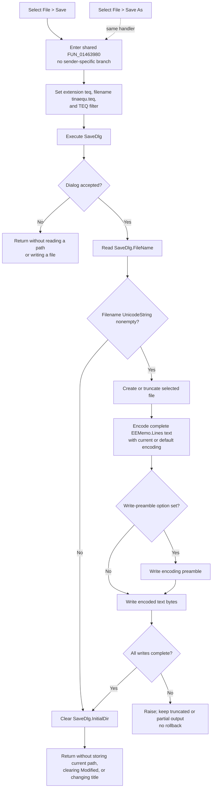

# Save Equation Editor text to a selected `.teq` file

> Analysis status: Evidence-backed source review complete.

## Control

| Property | Recovered value |
| --- | --- |
| Form | EquEditor |
| Form caption | Equation Editor |
| Menu path | File > Save |
| Component path | EquEditor.EEMenu.EEFileMnu.EESaveMnu |
| Control class | TMenuItem |
| Caption | &Save |
| Handler name | EESaveAsMnuClick |
| Handler address | 01463980 |
| Graph node | `resource:dfm:EquEditor/EquEditor.EEMenu.EEFileMnu.EESaveMnu` |
| Handler node | `function:01463980` |
| Graph layer | UI |

The menu item has no recovered hint, action, shortcut, image, or glyph. Its shared handler and `EquEditor.SaveDlg` establish the behavior.

## Save and Save As use the same path

Both `EESaveMnu.OnClick` and `EESaveAsMnu.OnClick` bind directly to `FUN_01463980`. The compiled function does not inspect an event sender and has no sender-specific branch. Therefore, **Save** does not write directly to a current file. It performs the same dialog operation as **Save As...**.

On every invocation, the handler configures `EquEditor.SaveDlg` at form offset `+0x718`:

| Dialog setting | Recovered value |
| --- | --- |
| Default extension | `teq` |
| Suggested filename | `tinaequ.teq` |
| Filter | `Tina equation (*.teq)\|*.teq` |

It then executes the `TSaveDialog`. Cancel returns from the handler without reading a selected filename or opening a file. After acceptance, `FUN_00724270` reads `SaveDlg.FileName` into a local UnicodeString that was initialized to null. If that value remains null or empty, the handler skips the file write.

For a nonempty accepted filename, the handler obtains `EEMemo.Lines` from the `TMemo` at form offset `+0x750` and calls the line collection's one-argument `SaveToFile` virtual method. The input is the current live memo text, including equation markup and retained result lines that are present in the memo. The command does not serialize the rendered preview, equation font, layout objects, selection, caret, Keep results setting, or other form state.

## Filename and directory state

`SaveDlg.FileName` is dialog state, not a recovered current-document path. The accepted filename can remain in that property after the dialog returns, but the next Save or Save As call overwrites it with `tinaequ.teq`. The handler does not copy the accepted path to another form field, document object, recent-file list, INI setting, or registry value.

The form-creation path seeds `SaveDlg.InitialDir` from the shared application directory. After any accepted dialog result, including an accepted result with a null filename, `FUN_01463980` clears that initial-directory field through `FUN_00724420`. Cancel does not execute this clear. This field controls the dialog's starting folder; it is not a saved-document filename or an in-place-save sentinel.

The local null UnicodeString is the only explicit filename sentinel in the handler. There is no `Untitled` marker, no last-path test, and no fallback from a canceled dialog to an older filename.

## Text format and encoding

The `.teq` file contains the `EEMemo.Lines` text. The application handler does not add a custom header, binary object record, font block, or preview image.

The recovered VCL save path supplies the byte format:

1. `FUN_004b4900`, the one-argument `TStrings.SaveToFile` path, forwards the line collection's current encoding object.
2. `FUN_004b4920` creates a file stream with mode `0xFF00`, the recovered create-or-truncate mode, before it calls the stream serializer.
3. `FUN_004b49c0` gets the complete line text and encodes it. If the supplied current encoding is null, it uses the line collection's stored default encoding.
4. If the collection's write-preamble option is set, the serializer writes that encoding's preamble first. It then writes the encoded text bytes.
5. `FUN_004b8aa0` repeats short writes until the requested byte count is complete and raises if a write is negative or stops making progress.

The handler does not select UTF-8, UTF-16, an ANSI code page, a byte-order mark, or a line-separator policy. These details depend on the live `Memo.Lines` encoding and preamble state. A prior Open operation can affect that current encoding through the paired VCL load path. An empty memo is allowed and can produce an empty file or only an encoding preamble.

## Overwrite and partial-file behavior

The handler tests only the dialog result and the nonempty filename. It does not validate equation text, the extension, target existence, write access, or free space.

- The recovered DFM and handler do not establish `SaveDlg.Options`. The application has no separate overwrite question, but this evidence does not prove whether the native dialog supplies one.
- After the dialog returns an accepted path, the stream is created or an existing file is truncated. There is no backup, temporary output, atomic rename, retry, or rollback.
- Stream creation occurs before text extraction and encoding. A later text or encoding exception can therefore leave an existing target truncated.
- The optional preamble and payload are separate writes. A failure can leave only a preamble or a partial payload. The write helper raises, but the handler does not restore or delete the target.
- File-open, encoding, disk-full, and write errors propagate through the Delphi runtime. The handler has no local error message, success message, status return, exception handler, or cleanup decision for partial output.

If the file write raises, the later initial-directory clear is not reached. If the write completes and clearing the dialog field then raises, the file is already saved. No form-state rollback is recovered for either ordering.

## Modified, title, and view state

A normal save writes the current memo lines but does not update a recovered application dirty flag or current filename. The handler does not clear `EEMemo.Modified`, change the form caption from `Equation Editor`, add the chosen path to the title, clear Undo, move the caret, change the selection, or switch between edit and preview mode.

The handler also does not close or hide the Equation Editor. The separate form-close handler hides the form without a save check. Thus, successful file output and the live editor's title, modified state, and lifetime remain separate concerns.

Cancel and an accepted empty filename leave the memo, title, modified state, and output files unchanged. Dialog defaults were assigned before Cancel and are not restored.

## Save flow

## Source evidence

- Shared Save and Save As handler: [FUN_01463980](../../../DecompiledSources/Tina16/functions/0000000001463980__FUN_01463980.c)
- Dialog filename getter, setter, and initial-directory setter: [FUN_00724270](../../../DecompiledSources/Tina16/functions/0000000000724270__FUN_00724270.c), [FUN_00724380](../../../DecompiledSources/Tina16/functions/0000000000724380__FUN_00724380.c), and [FUN_00724420](../../../DecompiledSources/Tina16/functions/0000000000724420__FUN_00724420.c)
- One-argument and stream-based `TStrings.SaveToFile` paths: [FUN_004b4900](../../../DecompiledSources/Tina16/functions/00000000004B4900__FUN_004b4900.c) and [FUN_004b4920](../../../DecompiledSources/Tina16/functions/00000000004B4920__FUN_004b4920.c)
- Text encoding and optional-preamble serializer: [FUN_004b49c0](../../../DecompiledSources/Tina16/functions/00000000004B49C0__FUN_004b49c0.c)
- Complete stream-write helpers: [FUN_004b8a80](../../../DecompiledSources/Tina16/functions/00000000004B8A80__FUN_004b8a80.c) and [FUN_004b8aa0](../../../DecompiledSources/Tina16/functions/00000000004B8AA0__FUN_004b8aa0.c)
- Save-dialog initial-directory setup: [FUN_01463690](../../../DecompiledSources/Tina16/functions/0000000001463690__FUN_01463690.c)
- Paired Open path and separate render call: [FUN_01463b00](../../../DecompiledSources/Tina16/functions/0000000001463B00__FUN_01463b00.c)
- New command and lack of a current-path assignment: [FUN_01463930](../../../DecompiledSources/Tina16/functions/0000000001463930__FUN_01463930.c)
- Form close without a save decision: [FUN_01464e40](../../../DecompiledSources/Tina16/functions/0000000001464E40__FUN_01464e40.c)
- Recovered form, menu, memo, Save dialog, and shared event bindings: [ui-evidence.json](../../../DecompiledSources/Tina16/resources/dfm/ui-evidence.json)

## Annotation ownership

Bead `.479` owns the canonical `FUN_01463980` annotation because Save As and Save share the same address. This Bead duplicates that complete annotation object exactly so both control fragments remain nonempty and conflict-free. The generic dialog helpers, VCL text serializer, Open and New commands, and form-close handler remain evidence-only here.
