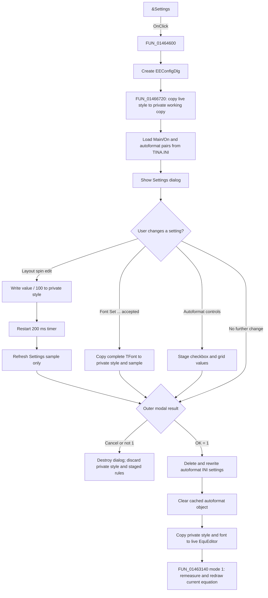

# &Settings

> Analysis status: Complete. The recovered caller, Settings form handlers, resources, and accepted-result path support this explanation.

## Control

| Property | Recovered value |
| --- | --- |
| Form | EquEditor |
| Component path | EquEditor.EEMenu.EESettingsMnu |
| Control class | TMenuItem |
| Caption | &Settings |
| Hint | Not present in the recovered resource. |
| Handler name | EESettingsMnuClick |
| Handler address | 01464600 |
| Graph node | `resource:dfm:EquEditor/EquEditor.EEMenu.EESettingsMnu` |
| Handler node | `function:01464600` |
| Graph layer | UI |

## What happens when clicked

`FUN_01464600` creates the modal `EEConfigDlg`, whose recovered caption is **Settings**. `FUN_01466720` allocates a dialog-private equation-layout style and copies the live EquEditor style into it. This is a working copy; opening the dialog does not change the live editor.

The initializer fills six numeric controls from the working copy. Stored ratios are multiplied by 100 for display:

| Settings control | Meaning from its resource label | Working-copy field |
| --- | --- | --- |
| `ExpSize` | Exponent relative size [%] | exponent size ratio |
| `ExpOvl` | Exponent base overlap [%] | exponent overlap ratio |
| `IndexSize` | Index relative size [%] | index size ratio |
| `IndexOvl` | Index label overlap [%] | index overlap ratio |
| `NDDist` | Numerator/denominator distance | fraction spacing ratio |
| `SpecOvl` | Special overlap | special-symbol overlap ratio |

It also copies the complete equation font, installs a recovered sample expression, and draws the initial sample.

## Dialog staging and preview

Each numeric control has a separate `OnChange` handler. The handler reads the current integer, divides it by `100.0`, and writes the result only to the dialog-private style. It then disables the preview timer, sets its interval to 200 ms, and enables it again. When the timer fires, `FUN_01466cb0` rebuilds the sample bitmap through the `.447`-owned sample renderer and disables the timer. Repeated edits therefore postpone the sample rebuild until the next 200 ms timer event.

The **Set ...** font button is covered by Bead `.447`. It opens a `TFontDialog`, copies an accepted complete `TFont` into the same private style, updates the font summary, and rebuilds the sample. Font face, size, style, color, and other copied `TFont` properties remain staged until the outer Settings dialog is accepted.

These previews affect only `EEConfigDlg.SampleImg`. They do not repaint the caller's current equation while the dialog is open. The Autoformat checkbox and replacement grid also have no live EquEditor preview path.

## Autoformat options

Before showing the dialog, the caller opens `TINA.INI` and initializes the Autoformat area:

- `Main/On` is read with default `1`. Text equal to `1` checks **Autoformat Expression**; another value clears it.
- All key names in the `Equation Editor Autoformat` section are loaded.
- The replacement grid is sized to at least six rows and large enough for the loaded rules.
- Each stored rule value is split on the literal delimiter `XXTOXX`; the two parts populate grid columns 0 and 1.

When the user selects column 1 in the last active row, `FUN_01466db0` adds one grid row if column 0 of that row is nonempty. This lets the user continue entering replacement pairs. The selection handler does not validate duplicates, empty targets, syntax, or cycles.

## OK and Cancel

The DFM supplies standard `bkOK` and `bkCancel` buttons without custom click handlers. After `ShowModal`, `FUN_01464600` commits only when the result is `1`:

1. It deletes the complete `Equation Editor Autoformat` section.
2. It writes `Main/On` as `1` when the checkbox is checked or `0` when it is clear.
3. For every grid data row whose column 0 is nonempty, it creates a generated `S`-prefixed key and writes `column 0 + "XXTOXX" + column 1` to the recreated section. Rows with an empty first column are skipped.
4. It destroys and clears the process-wide cached autoformat object so a later use reloads the rules.
5. It copies the complete private equation-layout style to the live EquEditor style. This includes the six ratios, line-height state, font, style string, and cached bounds. It also assigns the complete private font again.
6. It calls the `.472`-owned graphics coordinator with mode `1` to remeasure and redraw the current equation from `EEMemo.Lines`.

Cancel, or any modal result other than `1`, skips all six steps. It does not rewrite the INI section, clear the autoformat cache, copy the private style, or redraw the live editor. Destroying the Settings form discards the private working copy.

## Persistence boundaries

- Autoformat enablement and replacement pairs are persisted immediately to `TINA.INI` on outer OK.
- The font and six layout ratios are copied to the live EquEditor style in memory. This handler does not write those style values to `TINA.INI`, the registry, a document file, or another recovered serializer.
- The current memo text, caret, selection, scroll position, document filename, dirty state, and undo history are not changed by this handler.
- The accepted redraw replaces the shared rendered graphics used by EquEditor, but it does not export a file.

## Error and partial-commit behavior

- The six `OnChange` handlers do not perform their own range or semantic validation. The recovered resource does not preserve explicit `Min` or `Max` values for these spin edits.
- The autoformat save path accepts a nonempty source cell even when the target is empty. It does not detect duplicate sources or malformed expressions.
- The accepted path deletes the old autoformat section before it writes the new settings and rules. These writes are sequential and have no transaction, backup, retry, or rollback. An exception can leave a missing or partially rebuilt section.
- INI persistence happens before the live-style copy and editor redraw. A later style-copy or rendering exception does not undo already written autoformat settings.
- The handler has no local exception block or user-facing error message. Allocation, INI, grid, style-copy, or rendering failures propagate through the Delphi runtime.
- The live-style copy writes multiple fields in sequence. A failure during that copy or the following explicit font assignment can leave a partly updated live style; there is no restored snapshot.

## Click flow

## Source evidence

- Settings coordinator: [FUN_01464600](../../../DecompiledSources/Tina16/functions/0000000001464600__FUN_01464600.c)
- Private-style initializer: [FUN_01466720](../../../DecompiledSources/Tina16/functions/0000000001466720__FUN_01466720.c)
- Numeric staging handlers: [FUN_01466970](../../../DecompiledSources/Tina16/functions/0000000001466970__FUN_01466970.c), [FUN_014669e0](../../../DecompiledSources/Tina16/functions/00000000014669E0__FUN_014669e0.c), [FUN_01466a50](../../../DecompiledSources/Tina16/functions/0000000001466A50__FUN_01466a50.c), [FUN_01466ac0](../../../DecompiledSources/Tina16/functions/0000000001466AC0__FUN_01466ac0.c), [FUN_01466b30](../../../DecompiledSources/Tina16/functions/0000000001466B30__FUN_01466b30.c), and [FUN_01466ba0](../../../DecompiledSources/Tina16/functions/0000000001466BA0__FUN_01466ba0.c)
- Debounced sample refresh: [FUN_01466cb0](../../../DecompiledSources/Tina16/functions/0000000001466CB0__FUN_01466cb0.c)
- Autoformat row extension: [FUN_01466db0](../../../DecompiledSources/Tina16/functions/0000000001466DB0__FUN_01466db0.c)
- Complete style copy: [FUN_01d11f10](../../../DecompiledSources/Tina16/functions/0000000001D11F10__FUN_01d11f10.c)
- `.447` font and sample evidence: [FUN_01466c10](../../../DecompiledSources/Tina16/functions/0000000001466C10__FUN_01466c10.c), [FUN_014666a0](../../../DecompiledSources/Tina16/functions/00000000014666A0__FUN_014666a0.c), and [FUN_01466580](../../../DecompiledSources/Tina16/functions/0000000001466580__FUN_01466580.c)
- `.472` live-editor redraw coordinator: [FUN_01463140](../../../DecompiledSources/Tina16/functions/0000000001463140__FUN_01463140.c)

## Analysis limits

- The original Delphi field names for the private and live equation-layout objects are not recovered. Their ownership and copy direction are established by initialization, event writes, accepted-result copy-back, font assignment, and rendering.
- The literal `XXTOXX` rule encoding and `S`-prefixed generated keys are proven. The later rule-matching algorithm and precedence behavior are outside this click path.
- Bead `.447` owns the canonical font-button, font-summary, and sample-renderer annotations. Bead `.472` owns the shared EquEditor graphics coordinator. This article cites those functions without duplicating their graph fields.
