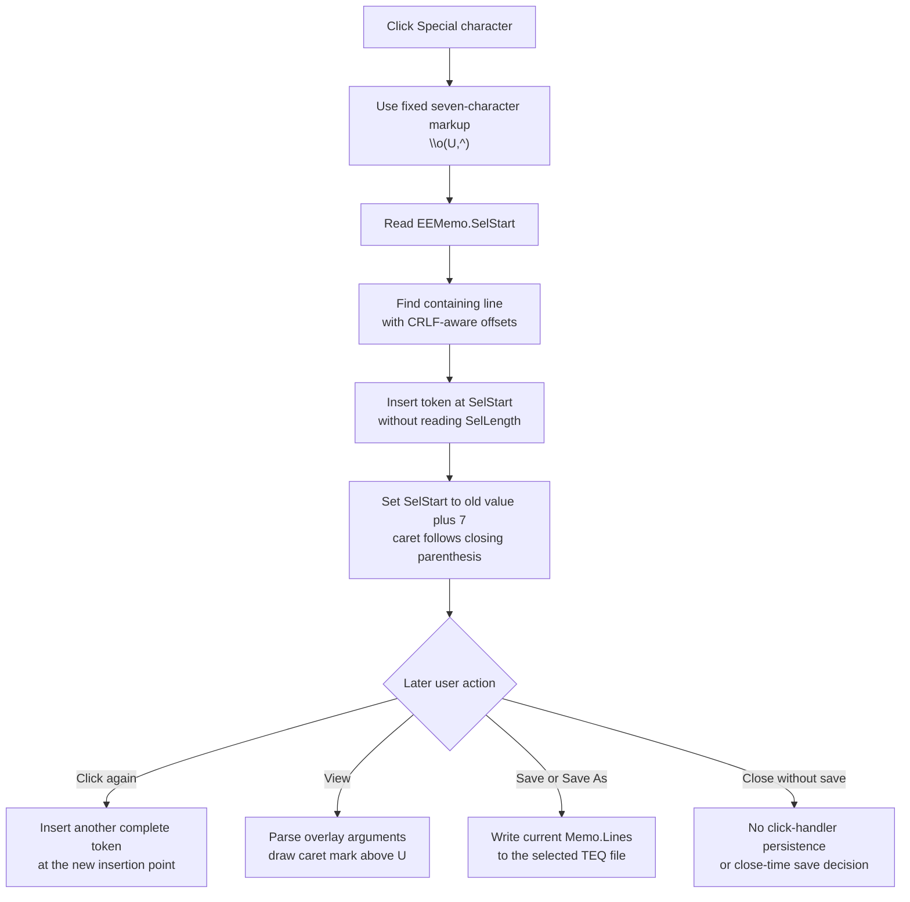

# Insert a special overlaid character template

> Analysis status: Complete. The recovered handler, shared insertion helper, independent matching control, renderer, and Equation Editor view and save paths establish the text, caret, preview, and persistence boundaries.

## Control

| Property | Recovered value |
| --- | --- |
| Form | EquEditor |
| Form caption | Equation Editor |
| Component path | EquEditor.EETPanel.EESpecBtn |
| Control class | TSpeedButton |
| Caption | Not present in the recovered resource. |
| Hint | Special character |
| Handler name | EESpecBtnClick |
| Handler address | 014644e0 |
| Graph node | `resource:dfm:EquEditor/EquEditor.EETPanel.EESpecBtn` |
| Handler node | `function:014644e0` |
| Graph layer | UI |

## What happens when clicked

`FUN_014644e0` passes one fixed seven-character Unicode string to the Equation Editor's shared memo-insertion helper:

`\o(U,^)`

This is TINA formatted-text overlay markup. The `\o` command has two arguments: `U` is the base, and `^` is the overlaid mark. The recovered renderer measures both arguments, centers them in one horizontal slot, and draws the second argument above the first. The 21 by 21 button glyph shows the same U with a centered caret mark.

The click inserts the seven markup characters. It does not insert the single Unicode character `Û`. It does not open a character map, popup menu, or dialog, and it does not let the user choose another base or mark. The user must edit the inserted source text to make a different composite.

The independent CSysTextDlg **Special character** button uses the same token and an equivalent memo-insertion path. Its extracted glyph has the same SHA-256 value as this button's glyph. This parallel control supports the intended formatted result; the literal and renderer establish the actual behavior.

## Insertion, selection, and caret

The `.483`-owned helper `FUN_014641a0` performs the insertion against `EquEditor.EEMemo`:

1. It reads the memo's zero-based absolute `SelStart`.
2. It walks `EEMemo.Lines`, adding each preceding line length plus two characters for its CRLF separator, until it finds the line that contains the insertion point.
3. It converts the absolute offset to the one-based in-line position required by the Delphi Unicode-string insertion primitive.
4. It inserts the complete token into a local copy of that line and assigns the changed line back to `EEMemo.Lines`.
5. It sets `SelStart` to its old value plus seven.

With a normal zero-length selection, the caret ends immediately after the closing parenthesis. The click does not select `U`, `^`, or the complete token for later replacement.

The helper does not read `SelLength` and does not call a selected-text replacement method. A nonempty selection is therefore not deliberately removed; insertion starts at its `SelStart`. The recovered code proves the new `SelStart`, but it does not prove whether the VCL line assignment and later selection-start setter clear or retain an existing nonzero selection length.

## Render, modified, and Undo state

The line assignment changes the live `EEMemo.Lines` text immediately. The click does not call the equation parser, layout calculator, graphics coordinator, paint handler, or an invalidation method, so it does not update the rendered preview itself.

When the user later selects **View**, `FUN_01463d20` enters view mode and calls `FUN_014635d0`. That function calls the `.472`-owned `FUN_01463140`, which copies the current memo lines into the equation-layout object, parses and measures them, and draws the result before it hides the memo and shows the preview. At that later point, the overlay renderer displays the caret mark above the U.

The handler and shared helper do not read or write an EquEditor dirty-document field, the memo's native modified flag, or an Undo interface. They also do not explicitly clear existing native Undo or modified state. Assigning one `Lines` entry uses a recovered VCL virtual setter whose internal Undo and modified-flag effects are not visible in this call path. Therefore, the source proves the text mutation but does not prove whether this programmatic line replacement creates a native Undo record or sets the native memo modified flag.

## Persistence boundary

The click updates only the live memo and caret. It does not write a file, set a current document path, update application settings, or save a caller-owned model.

The separate Save and Save As handler writes the complete current `EEMemo.Lines` collection to a user-selected `.teq` file. The form-close handler hides the Equation Editor without a save check. Thus, this inserted token becomes durable only after a later explicit save. There is no auto-save, close-time commit, or rollback in this click path.

## Click and later-use flow

## Source evidence

- Special-character handler: [FUN_014644e0](../../../DecompiledSources/Tina16/functions/00000000014644E0__FUN_014644e0.c)
- Shared Equation Editor insertion helper: [FUN_014641a0](../../../DecompiledSources/Tina16/functions/00000000014641A0__FUN_014641a0.c)
- Delphi Unicode-string insertion primitive: [FUN_00416ea0](../../../DecompiledSources/Tina16/functions/0000000000416EA0__FUN_00416ea0.c)
- Independent identical template: [CSysTextDlg handler FUN_014697f0](../../../DecompiledSources/Tina16/functions/00000000014697F0__FUN_014697f0.c)
- Two-argument format parser: [FUN_01d12460](../../../DecompiledSources/Tina16/functions/0000000001D12460__FUN_01d12460.c)
- Overlay-aware formatted-text renderer: [FUN_01d166e0](../../../DecompiledSources/Tina16/functions/0000000001D166E0__FUN_01d166e0.c)
- View command: [FUN_01463d20](../../../DecompiledSources/Tina16/functions/0000000001463D20__FUN_01463d20.c)
- View layout and render entry: [FUN_014635d0](../../../DecompiledSources/Tina16/functions/00000000014635D0__FUN_014635d0.c)
- Shared equation parse and render path: [FUN_01463140](../../../DecompiledSources/Tina16/functions/0000000001463140__FUN_01463140.c)
- Save and Save As handler: [FUN_01463980](../../../DecompiledSources/Tina16/functions/0000000001463980__FUN_01463980.c)
- Form-close handler: [FUN_01464e40](../../../DecompiledSources/Tina16/functions/0000000001464E40__FUN_01464e40.c)
- Recovered form and control properties: [ui-evidence.json](../../../DecompiledSources/Tina16/resources/dfm/ui-evidence.json)

## Direct call

- `function:014641a0` - Inserts supplied equation markup into `EEMemo.Lines` at `SelStart` and advances `SelStart` by the inserted length. Bead `.483` owns its canonical annotation; this article cites it without duplicating its graph fields.

## Resource and glyph evidence

- The control is a 31 by 31 `TSpeedButton` on `EquEditor.EETPanel`. Its recovered hint is **Special character**. It has no caption, action, image-list reference, button kind, checked state, or same-parent label candidate.
- Extracted glyph: [`0145_EquEditor_EquEditor_EETPanel_EESpecBtn_Glyph_Data.png`](../../../glyph/0145_EquEditor_EquEditor_EETPanel_EESpecBtn_Glyph_Data.png)
- The 374-byte Delphi BMP was extracted as a 21 by 21 PNG. It shows a U with a caret mark above it.
- Its SHA-256 value is `f38ba8fe961100026a9ab1564e2e4937e765a4e9f1fc25a2cd16885d8754cfb0`, identical to the CSysTextDlg Special character glyph. The handler and renderer, not the image alone, prove the token's meaning.

## Repeated clicks, guards, and errors

- The handler has no intentional no-op branch. Its fixed source token is nonempty, so each click attempts an insertion.
- After a normal successful insertion, a repeated click inserts another `\o(U,^)` immediately after the first. It adds no separator and performs no duplicate check.
- The handler does not inspect the sender, current view/edit mode, current text, markup syntax, line index, selection length, or read-only state. The helper relies on the VCL to supply a `SelStart` that maps to a memo line.
- The token already contains the opening parenthesis, top-level comma, and closing parenthesis required by the two-argument parser. Malformed markup caused by later manual edits is outside this click path.
- The Unicode insertion primitive clamps its one-based in-line position to the current line bounds and raises on combined string-length overflow.
- The handler and helper have no local exception handler, message, retry, or rollback. Allocation and line-read failures before assignment leave the memo unchanged. A failure after line assignment but before or during the final `SelStart` update can leave the token inserted without the requested caret move.
- The source does not establish final `SelLength`, native Undo state, or the memo's native modified flag after insertion into the VCL line collection.

## Analysis limits

- The original Delphi name of the shared insertion helper is not recovered. Its memo and caret behavior is established by repeated callers, the `EEMemo.Lines` access, and the `SelStart` getter and setter.
- The renderer composes the two arguments. This article does not identify the result as one Unicode code point.
- Bead `.483` owns `FUN_014641a0`. Bead `.472` owns `FUN_01463140`. The `.492` Symbol sibling uses the separate token `\s(b)` and owns its direct handler. This fragment owns only `FUN_014644e0`.
