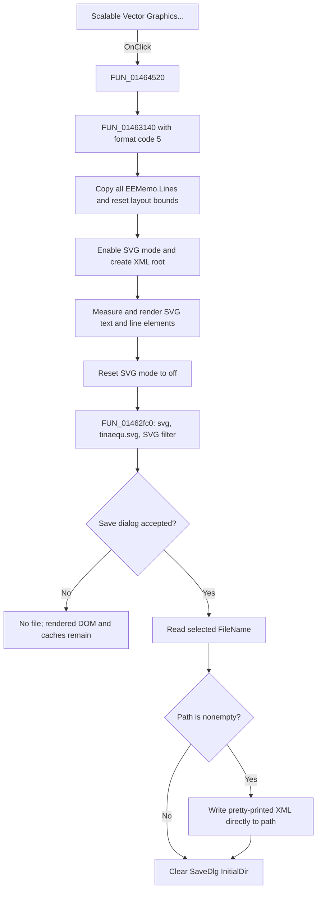

# Scalable Vector Graphics...

> Analysis status: Complete. The recovered menu handler, shared renderer, SVG element builders, XML writer, and Save dialog wrapper support this explanation.

## Control

| Property | Recovered value |
| --- | --- |
| Form | EquEditor |
| Component path | EquEditor.EEMenu.EEFileMnu.EEExportMnu.EESVGMnu |
| Control class | TMenuItem |
| Caption | Scalable Vector Graphics... |
| Hint | Not present in the recovered resource. |
| Handler name | EESVGMnuClick |
| Handler address | 01464520 |
| Graph node | `resource:dfm:EquEditor/EquEditor.EEMenu.EEFileMnu.EEExportMnu.EESVGMnu` |
| Handler node | `function:01464520` |
| Graph layer | UI |

## What happens when clicked

`FUN_01464520` calls the shared EquEditor graphics coordinator `FUN_01463140` with format code `5`. This code selects SVG output.

The coordinator performs the SVG render before it opens the Save dialog. It replaces the shared graphics targets, copies all current `EEMemo.Lines` into the equation-layout object, clears the cached bounds, and measures the full equation. It sets the layout object's SVG-mode byte, creates an XML document and its SVG root, and renders the equation into that document. The drawing origin uses the current equation spacing for both axes. The recovered constructor initializes this spacing to `2`.

On the normal path, the coordinator resets SVG mode to off before it calls `FUN_01462fc0` to show the Save dialog. The command does not export only the current selection or only the visible scroll-box area.

## SVG document

The SVG output keeps the equation as vector content:

| Content | Recovered output |
| --- | --- |
| Root size | Unitless decimal `width` and `height` attributes. Each is the measured equation dimension plus `4`. |
| View box | No recovered `viewBox` attribute or equivalent transform is written. |
| Text | SVG `text` elements with position attributes and text content. Text is not converted to outlines. |
| Font family | `Arial` for every recovered text element. Symbol-font characters are remapped before they are stored as Arial text. |
| Font size and style | Integer `font-size`; optional `font-weight="bold"`, `font-style="italic"`, and `text-decoration="underline"` from the current equation font. |
| Text color | A `color` attribute in lower-case `#rrggbb` form from the current font color. |
| Rules and bars | SVG `line` elements with endpoint attributes, the current pen width as `stroke-width`, and `stroke="black"`. |

The SVG branch does not set a physical size unit, DPI, scale, crop rectangle, background, or explicit color profile. Width and height describe the measured equation plus the fixed four-unit margin. Because there is no `viewBox`, the source does not establish a separate scalable coordinate viewport.

## Save dialog and file path

`FUN_01462fc0` configures `EquEditor.SaveDlg` on every click:

| Setting | Value |
| --- | --- |
| Default extension | `svg` |
| Default file name | `tinaequ.svg` |
| Filter | `SVG file (*.svg)\|*.svg` |
| Initial directory | Seeded during EquEditor setup from the shared application path. The SVG wrapper does not calculate a new directory. |

If the user accepts, the wrapper reads `SaveDlg.FileName`. A nonempty path is passed directly to the XML document writer with formatting mode `2`. The lower-level writer uses this mode to add line breaks and two spaces for each nesting level. The wrapper does not explicitly select UTF-8 or another named encoding. The lower-level text writer obtains its encoding through a runtime default-encoding object and writes that encoding's preamble when it has one. Therefore, the exact output encoding and BOM are not proven by this export path.

After an accepted dialog, the wrapper clears `SaveDlg.InitialDir`, including the accepted branch where the selected path is empty. It does not save the selected output path in the equation model, document name, recent-file list, INI file, or registry.

## Cancel, overwrite, and failure behavior

- Cancel skips the filename read and XML file writer. It creates no output file and shows no cancel message.
- The XML document is already rendered before the dialog. Cancel leaves the refreshed layout caches and internal SVG DOM in the equation-layout object. It also leaves the dialog's seeded initial directory unchanged.
- The recovered DFM does not serialize `SaveDlg.Options`, and the application does not test whether the selected file exists. Any overwrite question is delegated to the Save dialog and its class defaults.
- The accepted nonempty path goes directly to the XML text writer. There is no temporary output, backup, atomic rename, retry, returned-status check, rollback, or partial-file deletion in this path. A write failure after file creation can therefore leave a partial or replaced file.
- There is no local exception handler or error dialog. XML allocation, rendering, dialog, path, or file-write exceptions propagate through the Delphi runtime.
- SVG mode is reset before the Save dialog on the normal render path. There is no `try`/`finally` around XML construction and rendering, so an exception before that reset can leave the internal SVG-mode byte set.
- A file-write exception occurs after the normal SVG-mode reset. It can prevent the later `InitialDir` clear, but it does not re-enable SVG mode.

## Empty content and application state

There is no empty-content guard. The command still builds an SVG document, writes its measured margin dimensions, opens the Save dialog, and can save an empty or margin-only SVG.

The command reads the current memo lines and current equation formatting. It does not change the memo text, selection, caret, scroll position, document filename, dirty state, or undo history. A successful save writes only the selected SVG file. No recovered project serializer or preference writer runs.

## Click flow

## Source evidence

- Menu handler: [FUN_01464520](../../../DecompiledSources/Tina16/functions/0000000001464520__FUN_01464520.c)
- Shared graphics coordinator: [FUN_01463140](../../../DecompiledSources/Tina16/functions/0000000001463140__FUN_01463140.c)
- SVG Save dialog and XML-writer wrapper: [FUN_01462fc0](../../../DecompiledSources/Tina16/functions/0000000001462FC0__FUN_01462fc0.c)
- Equation renderer and root dimensions: [FUN_01d1c9d0](../../../DecompiledSources/Tina16/functions/0000000001D1C9D0__FUN_01d1c9d0.c)
- SVG text construction: [FUN_01d15200](../../../DecompiledSources/Tina16/functions/0000000001D15200__FUN_01d15200.c)
- SVG line construction: [FUN_01d16380](../../../DecompiledSources/Tina16/functions/0000000001D16380__FUN_01d16380.c)
- Color formatter: [FUN_00636180](../../../DecompiledSources/Tina16/functions/0000000000636180__FUN_00636180.c)
- XML document save dispatch: [FUN_00c7cd60](../../../DecompiledSources/Tina16/functions/0000000000C7CD60__FUN_00c7cd60.c)
- File writer construction: [FUN_00bb4200](../../../DecompiledSources/Tina16/functions/0000000000BB4200__FUN_00bb4200.c)
- XML indentation: [FUN_00bad780](../../../DecompiledSources/Tina16/functions/0000000000BAD780__FUN_00bad780.c)
- Save dialog default-name setter, selected-name reader, and initial-directory setter: [FUN_00724380](../../../DecompiledSources/Tina16/functions/0000000000724380__FUN_00724380.c), [FUN_00724270](../../../DecompiledSources/Tina16/functions/0000000000724270__FUN_00724270.c), and [FUN_00724420](../../../DecompiledSources/Tina16/functions/0000000000724420__FUN_00724420.c)
- EquEditor setup: [FUN_01463690](../../../DecompiledSources/Tina16/functions/0000000001463690__FUN_01463690.c)

## Analysis limits

- The wrapper requests XML formatting mode `2`; it does not prove a specific byte encoding, BOM, newline sequence, or XML declaration.
- Some recovered SVG coordinate-attribute names remain static data references. Their endpoint and baseline roles are clear from the values, but this article does not assign names that the decompiler did not recover.
- `FUN_01463140` is the shared EquEditor graphics coordinator and is owned by the Bitmap control analysis. This article cites it but does not duplicate its annotation. Generic XML, VCL, and equation-layout helpers remain evidence-only.
