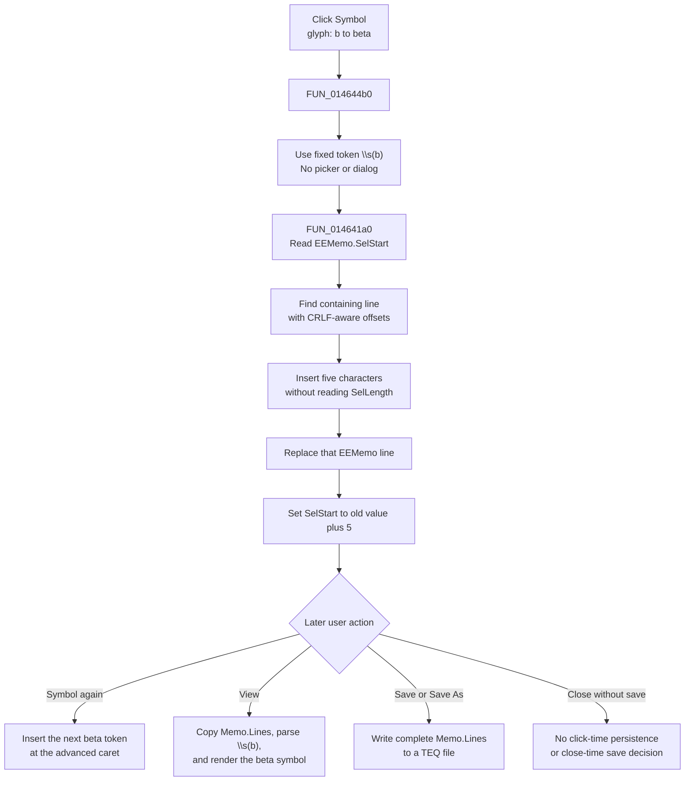

# Symbol

> Analysis status: Complete. The recovered handler, shared insertion helper, beta glyph, parallel markup use, and later Equation Editor render path support this explanation.

## Control

| Property | Recovered value |
| --- | --- |
| Form | EquEditor |
| Form caption | Equation Editor |
| Component path | EquEditor.EETPanel.EESymbolBtn |
| Control class | TSpeedButton |
| Caption | Not present in the recovered resource. |
| Hint | Symbol |
| Handler name | EESymbolBtnClick |
| Handler address | 014644b0 |
| Graph node | `resource:dfm:EquEditor/EquEditor.EETPanel.EESymbolBtn` |
| Handler node | `function:014644b0` |
| Graph layer | UI |

## What happens when clicked

`FUN_014644b0` passes one fixed five-character Unicode token to the Equation Editor's shared memo-insertion helper:

`\s(b)`

The command does not open a symbol picker, menu, or dialog. The extracted 21 by 21 glyph shows `b→β`. This matches the fixed `b` argument and identifies the inserted token as TINA's beta symbol markup. Recovered equations also use the same `\s(...)` form for Greek symbols such as omega and phi.

The token remains editable text in `EEMemo`. The button does not insert the Unicode beta character directly. It also does not select the `b` argument for replacement. After a normal insertion, the caret is after the closing parenthesis. A user who wants a different symbol must move the caret and edit the token.

## Caret and selection behavior

The shared helper `FUN_014641a0`, canonically annotated by Bead `.483`, performs these steps:

1. Read the absolute `EEMemo.SelStart` position.
2. Walk `EEMemo.Lines`. Add each line length and two characters for its CRLF separator until the helper finds the containing line.
3. Convert the absolute position to a one-based position in that line.
4. Insert all five characters of `\s(b)` into a local copy of the line.
5. Assign the changed line back to `EEMemo.Lines`.
6. Set `SelStart` to the old value plus five.

With a normal zero-length selection, the caret ends immediately after `)`. The helper never reads `SelLength` and does not call a selected-text replacement operation. It therefore inserts at the selection start without deliberately deleting the selected characters. The recovered calls do not establish whether the VCL line assignment and final `SelStart` setter clear or retain a nonzero selection highlight.

Each successful repeated click uses the advanced caret and inserts another complete `\s(b)` token immediately after the previous one. The handler does not add a space, test for duplicates, or toggle a symbol mode.

## Undo, modified, and render state

The click changes the live memo line through its `Lines` collection. It does not call the Equation Editor parser, rebuild the equation-layout object, redraw the rendered preview, or switch from Edit to View.

When the user later selects View, `FUN_01463d20` calls `FUN_014635d0`. That path copies the current memo lines into the internal equation object, parses the markup, calculates the layout, and renders the preview. Thus, a later View action consumes the inserted beta token. The click itself has no render result or render-error branch.

The handler and shared helper do not read or write an application dirty flag or the memo's named `Modified` property. They also do not call an undo method or deliberately clear an undo buffer. The recovered form's `Undo` menu item is hidden and has no event binding. The line replacement occurs through a VCL virtual method, so any internal Windows memo modified flag or native undo record is an implementation effect that this call path does not expose. It is not safe to promise that Undo restores the prior line.

## Persistence and close behavior

- The inserted token is immediately present in `EEMemo.Lines`, so the separate Save or Save As path can write it as part of the complete `.teq` text.
- The click does not write a file, change a document path, update an INI or registry value, create an undo entry explicitly, or mark a caller-owned model as committed.
- The form-close handler does not ask whether the memo changed and does not save it. The token becomes durable only through a later explicit save.
- A later View operation copies the memo into the internal render object. Until that boundary, this click changes only the edit text and caret position.

## Guards and errors

- The fixed token is nonempty, and the handler has no intentional no-op branch. Each click attempts an insertion.
- There is no check for edit mode, read-only state, maximum length, a valid current selection, or valid surrounding equation syntax.
- The Unicode insertion primitive clamps the one-based position to the current line bounds. It raises through the Delphi runtime if the combined string length overflows.
- The handler and helper have no local exception handler, message, retry, or rollback. A line-read or allocation failure before assignment leaves the memo unchanged. A failure after line assignment but before or during the final caret update can leave the token inserted without the requested caret move.
- Invalid surrounding markup is not validated during this click. Any parse or render problem can appear only when a later consumer processes the memo.

## Click and later-use flow

## Source evidence

- Symbol handler: [FUN_014644b0](../../../DecompiledSources/Tina16/functions/00000000014644B0__FUN_014644b0.c)
- Shared insertion helper, owned by Bead `.483`: [FUN_014641a0](../../../DecompiledSources/Tina16/functions/00000000014641A0__FUN_014641a0.c)
- Unicode string insertion primitive: [FUN_00416ea0](../../../DecompiledSources/Tina16/functions/0000000000416EA0__FUN_00416ea0.c)
- View command: [FUN_01463d20](../../../DecompiledSources/Tina16/functions/0000000001463D20__FUN_01463d20.c)
- View layout and render entry: [FUN_014635d0](../../../DecompiledSources/Tina16/functions/00000000014635D0__FUN_014635d0.c)
- Equation parse and render path: [FUN_01463140](../../../DecompiledSources/Tina16/functions/0000000001463140__FUN_01463140.c)
- Save As path: [FUN_01463980](../../../DecompiledSources/Tina16/functions/0000000001463980__FUN_01463980.c)
- Form-close handler: [FUN_01464e40](../../../DecompiledSources/Tina16/functions/0000000001464E40__FUN_01464e40.c)
- Independent matching beta-template command: [CSysTextDlg Symbol handler](../../../DecompiledSources/Tina16/functions/0000000001469870__FUN_01469870.c)
- Recovered form, hint, event, and hidden Undo resource: [ui-evidence.json](../../../DecompiledSources/Tina16/resources/dfm/ui-evidence.json)

## Resource and glyph evidence

- The control is a 31 by 31 `TSpeedButton` on `EquEditor.EETPanel` with hint `Symbol`. It has no caption, action, checked state, or same-parent label candidate.
- Extracted glyph: [`0146_EquEditor_EquEditor_EETPanel_EESymbolBtn_Glyph_Data.png`](../../../glyph/0146_EquEditor_EquEditor_EETPanel_EESymbolBtn_Glyph_Data.png).
- The 21 by 21 PNG was extracted from a 374-byte Delphi bitmap resource. It shows `b→β`, which supports the beta meaning established by the fixed handler token.

## Analysis limits

- The exact parser table that maps the `b` argument to beta is not named in the recovered source. The handler literal, glyph, independent matching control, and repeated `\s(...)` application syntax supply the mapping evidence.
- The recovered source proves the new `SelStart` value but does not prove the final `SelLength` after insertion into a nonzero selection.
- Native TMemo undo and modified-state effects are below the virtual line-assignment call and are not named by this path.
- Shared helper `FUN_014641a0` remains owned by `.483`; this control's annotation describes only its unique fixed-token wrapper.
