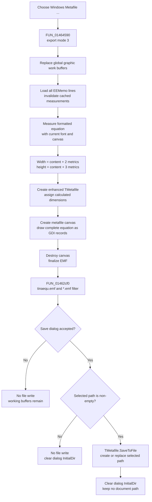

# Export the equation as an enhanced metafile

> Analysis status: Reviewed from the recovered Equation Editor resources, format wrapper, shared render coordinator, metafile and metafile-canvas constructors, equation measurement and drawing paths, Save dialog wrapper, and file boundary.

## Control

| Property | Recovered value |
| --- | --- |
| Form | EquEditor |
| Form caption | Equation Editor |
| Component path | EquEditor.EEMenu.EEFileMnu.EEExportMnu.EEWMFMnu |
| Control class | TMenuItem |
| Caption | &Windows Metafile ... |
| Output format | Enhanced Metafile (`.emf`) |
| Default file name | `tinaequ.emf` |
| Handler name | EEWMFMnuClick |
| Handler address | 01464590 |
| Graph node | `resource:dfm:EquEditor/EquEditor.EEMenu.EEFileMnu.EEExportMnu.EEWMFMnu` |
| Handler node | `function:01464590` |
| Graph layer | UI |

The resource has no shortcut, hint, action, image reference, or glyph for this menu item.

## What happens when selected

[`FUN_01464590`](../../../DecompiledSources/Tina16/functions/0000000001464590__FUN_01464590.c) is a format wrapper. It calls the shared Equation Editor export coordinator [`FUN_01463140`](../../../DecompiledSources/Tina16/functions/0000000001463140__FUN_01463140.c) with mode `3`. This mode selects file export through an enhanced metafile target.

The coordinator performs the expensive render work before it displays the Save dialog:

1. It destroys the previous global bitmap, metafile, and encoded-image working objects and creates new ones.
2. It copies every line from `EEMemo.Lines` into the equation-render model and invalidates the model's cached width and height.
3. It measures the complete formatted equation with the current Equation Editor drawing canvas.
4. It calculates output width as measured width plus two base-font metrics. It calculates output height as measured height plus three base-font metrics. Both values are clamped to at least zero.
5. It assigns those dimensions to a bitmap working object and to a new metafile object.
6. It creates a metafile canvas for that object, gets its drawing handle, and calls the normal equation renderer with one base-font metric as both the horizontal and vertical starting offset.
7. It destroys the temporary metafile canvas. This finalizes the metafile before the file-save wrapper runs.

This is a full-equation export. It does not use the memo selection, visible scroll area, window rectangle, or a screen capture.

## Actual format and vector content

The menu caption says “Windows Metafile,” but the output is EMF, not classic WMF:

- [`FUN_00605cc0`](../../../DecompiledSources/Tina16/functions/0000000000605CC0__FUN_00605cc0.c) constructs the VCL metafile object and initializes its enhanced-format byte to true.
- [`FUN_006056e0`](../../../DecompiledSources/Tina16/functions/00000000006056E0__FUN_006056e0.c) creates the metafile canvas used by mode 3.
- The Save wrapper uses the name `tinaequ.emf` and the filter `Windows Metafile (*.emf)|*.emf`.
- The completed object is saved through its graphic `SaveToFile` virtual method.

The file contains the GDI drawing records emitted by the equation renderer for text, symbols, fraction bars, exponents, indexes, and other formatted elements that occur in the expression. It is not a bitmap embedded in an EMF container. The renderer copies the current equation font into its canvas state and applies the translated current foreground color to its drawing state. The EMF branch does not paint an explicit background rectangle and exposes no background-color, transparency, DPI, scale, quality, or crop option.

The stored width and height are the calculated integer drawing extents described above. The dialog does not let the user override them. The recovered code does not name their physical unit; this article does not convert them to millimetres, points, or DPI.

## Save dialog and path behavior

[`FUN_01462cf0`](../../../DecompiledSources/Tina16/functions/0000000001462CF0__FUN_01462cf0.c) configures the form's existing `TSaveDialog`:

- it assigns the default-extension field from a static export literal;
- it resets `FileName` to `tinaequ.emf` on every invocation; and
- it replaces the filter with `Windows Metafile (*.emf)|*.emf`.

The static default-extension text is not rendered in the recovered C, but the forced `.emf` file name, only `.emf` filter, enhanced metafile object, and saved object type establish the actual format.

If the user cancels, the wrapper returns without reading a path or writing a file. The already-created render buffers remain, and the dialog keeps the newly assigned extension, file name, and filter fields.

If the user accepts, the wrapper reads `SaveDlg.FileName`. A non-empty name is passed to the metafile's `SaveToFile` method. After a normal accepted path, the wrapper clears the dialog's `InitialDir` field. The next export still starts from `tinaequ.emf`; it does not reuse the previous selected file name.

The DFM stores no `Options` override, and this wrapper does not add or remove an overwrite-prompt option. Therefore, any warning for an existing file comes from the `TSaveDialog` defaults in this VCL build, not from an application confirmation branch. Once the dialog accepts a path, `SaveToFile` can create or replace that file directly.

## Export flow

## Clipboard, document, and persistence boundaries

- Mode 3 saves a file. It does not place the metafile on the clipboard. The shared coordinator's separate mode 0 uses the clipboard, but this menu never requests mode 0.
- The command reads all memo text and the current equation font and drawing color. It does not change memo text, the text selection, equation settings, or the current document path.
- It invalidates and recomputes renderer measurement caches and replaces global export working objects. Those are transient render state, not equation-document content.
- The temporary metafile canvas is destroyed before a normal save. The new bitmap, metafile, and encoded-image working objects remain global until another export or later cleanup replaces them.
- The command does not set a modified flag, add an undo item, update a recent-file entry, write application settings, or persist the selected export path.
- The only durable effect is the selected `.emf` file after a successful write.

## Cancel, overwrite, and error boundaries

- Cancel happens after rendering. It prevents the file write but does not restore the earlier global render buffers or cached measurements.
- The application performs no separate existence check, overwrite confirmation, backup, temporary-file write, atomic rename, or rollback. Dialog-level overwrite behavior is left to the existing VCL dialog options.
- A write failure after the destination is created or truncated can leave an empty or partial `.emf` file. The previous file is not restored.
- The handler, render coordinator, and save wrapper have no local exception handler, retry, user-facing error conversion, or success result.
- A render or allocation failure occurs before the dialog. It can leave the old working objects already destroyed and some new working objects installed.
- A failure while finalizing the metafile canvas prevents the Save dialog from opening. A failure in `SaveToFile` prevents the later `InitialDir` clear.
- An accepted but empty file-name value skips `SaveToFile` and still clears `InitialDir`. Normal dialog routing is expected to return a non-empty name.

## Evidence

- Menu handler: [FUN_01464590](../../../DecompiledSources/Tina16/functions/0000000001464590__FUN_01464590.c)
- Shared Equation Editor render/export coordinator: [FUN_01463140](../../../DecompiledSources/Tina16/functions/0000000001463140__FUN_01463140.c)
- EMF Save dialog and file wrapper: [FUN_01462cf0](../../../DecompiledSources/Tina16/functions/0000000001462CF0__FUN_01462cf0.c)
- VCL enhanced-metafile constructor: [FUN_00605cc0](../../../DecompiledSources/Tina16/functions/0000000000605CC0__FUN_00605cc0.c)
- VCL metafile-canvas constructor: [FUN_006056e0](../../../DecompiledSources/Tina16/functions/00000000006056E0__FUN_006056e0.c)
- Equation width measurement: [FUN_01d1b660](../../../DecompiledSources/Tina16/functions/0000000001D1B660__FUN_01d1b660.c)
- Equation height measurement: [FUN_01d1bfb0](../../../DecompiledSources/Tina16/functions/0000000001D1BFB0__FUN_01d1bfb0.c)
- Equation vector drawing path: [FUN_01d1c9d0](../../../DecompiledSources/Tina16/functions/0000000001D1C9D0__FUN_01d1c9d0.c)
- Save-dialog file-name setter and getter: [FUN_00724380](../../../DecompiledSources/Tina16/functions/0000000000724380__FUN_00724380.c), [FUN_00724270](../../../DecompiledSources/Tina16/functions/0000000000724270__FUN_00724270.c)
- Save-dialog initial-directory setter: [FUN_00724420](../../../DecompiledSources/Tina16/functions/0000000000724420__FUN_00724420.c)
- Recovered form resources: [ui-evidence.json](../../../DecompiledSources/Tina16/resources/dfm/ui-evidence.json)

## Analysis limits

- The original Delphi names for the shared render objects and several drawing helpers are not recovered. Their constructors, dimensions, canvas handle, and call-site data flow establish their bitmap, enhanced-metafile, metafile-canvas, and encoded-image roles.
- The exact static text assigned to `DefaultExt` appears as `DAT_01462de4` in the decompilation. It is not emitted as a literal, so the article derives the EMF extension from the three independent format signals rather than inventing that hidden string.
- The `TSaveDialog` resource does not serialize an `Options` value. The article does not claim an application-owned overwrite prompt that the recovered path does not show.
- `TIARA-diz.6.7.472` owns the shared coordinator `FUN_01463140`. This article owns the mode-3 menu wrapper and the EMF-specific Save dialog and file wrapper.
