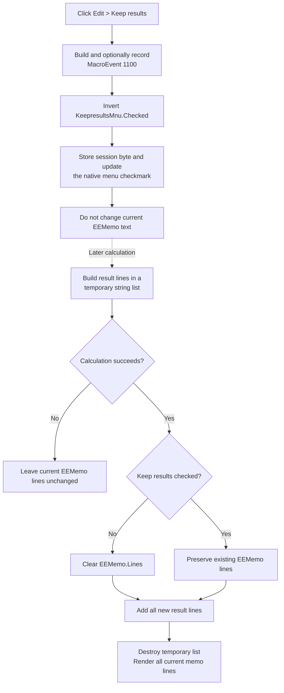

# Toggle retention of Equation Editor result text

## Control

| Property | Recovered value |
| --- | --- |
| Form | `EquEditor` (`TEquEditor`) |
| Component path | `EquEditor.EEMenu.EEEditMnu.KeepresultsMnu` |
| Menu path | **Edit > Keep results** |
| Control class | `TMenuItem` |
| Caption | `&Keep results` |
| Initial checked state | Not stored in the DFM; the default state is unchecked. |
| Shortcut | Not stored in the DFM. |
| Handler name | `KeepresultsMnuClick` |
| Handler address | `01465190` |
| Graph node | `resource:dfm:EquEditor/EquEditor.EEMenu.EEEditMnu.KeepresultsMnu` |
| Handler node | `function:01465190` |
| Graph layer | UI |

The resource has no hint, action, glyph, or image. The result behavior comes from the recovered handler and the functions that read this exact menu item.

## Immediate click behavior

`FUN_01465190` records the menu command for optional macro capture. It then reads the `Checked` byte at offset `+0x80` of the `KeepresultsMnu` object stored at form offset `+0x7e8`, inverts the byte, and calls the VCL checked-state setter `FUN_007e2d20`.

Each normal click therefore alternates the state:

- unchecked becomes checked;
- checked becomes unchecked.

The VCL setter stores the new byte and updates the owning native menu when one exists. This menu item is not a recovered radio item, so the setter does not select one exclusive option.

The click does not clear, append, parse, save, or redraw the current result text. It changes only the session policy that later result builders read.

The handler has no confirmation, document-state guard, local exception handler, or rollback. Macro preparation occurs before the toggle, so an exception there prevents the state change. The VCL setter writes the checked byte before it requests a native menu update; the caller does not inspect an update result or repair the checkmark if that publication fails.

## Exact downstream result lifecycle

Four recovered result builders read `EquEditor + 0x7e8 -> Checked` after they finish a calculation successfully:

- `FUN_0145e790` builds transfer-function, total-resistance, or total-impedance text.
- `FUN_0145ecb0` builds AC result text.
- `FUN_0145ef50` builds DC result text.
- `FUN_0145f1a0` builds named transient result text, including recovered `TR result`, `TR result (Ch1)`, and `TR result (Ch2)` headings.

Each builder first creates or clears a temporary string list at worker offset `+0xe38` and fills it during the analysis loop. It reaches the retention branch only when worker status byte `+0x92` remains zero.

On that successful branch:

- **Keep results unchecked:** the builder clears `EEMemo.Lines`, then adds all strings from the temporary result list.
- **Keep results checked:** the builder does not clear `EEMemo.Lines`; it adds the new temporary result strings after the existing lines.

Form offset `+0x750` is `EEMemo`. Its `Lines` object is at control offset `+0x4d8`. The virtual calls at `+0x90` and `+0x88` are the same clear-then-add sequence used by the recovered Delphi `TStrings.Assign` path. This establishes that the retained objects are Equation Editor memo lines, not DFWindow pages or analysis-model objects.

After the line update, each builder destroys its temporary result list. It then passes the complete current `EEMemo.Lines` collection to the Equation Editor rendering object, recalculates the form size, selects the expression view, and requests the recovered window refresh path.

Thus, unchecked means “replace the visible memo lines when the next result succeeds.” Checked means “append the next successful result to the existing memo lines.”

## Current results and failed calculations

Changing the checkmark does not remove or restore text that is already in `EEMemo`. The current text changes only when a later result builder reaches its successful publication block.

If worker status byte `+0x92` becomes nonzero, the four builders skip the clear, append, temporary-list release in this block, render transfer, and window refresh. In particular, an unchecked setting does not clear the previous visible result at the start of the attempted calculation.

If an exception occurs after a successful builder has cleared `EEMemo.Lines` but before all new lines and render state are installed, the recovered path has no transaction or rollback. The memo can then remain empty or partly updated.

## Programmatic preservation of compound results

`FUN_0145f5e0` can publish two related result blocks for one analysis. For those paired paths it:

1. saves the user's current `KeepresultsMnu.Checked` byte;
2. publishes the first result with the saved policy;
3. temporarily sets `KeepresultsMnu.Checked` to true;
4. publishes the second result so it appends to the first; and
5. restores the saved checked state.

This temporary override keeps both parts of one compound result together. When the saved state was unchecked, the first part replaces older memo text and the second part appends. When the saved state was checked, both parts append.

The save, force, and restore sequence has no recovered `try/finally` guard. An exception after the forced-true write can leave the menu checked instead of restoring the user's prior state.

## Macro and automation behavior

Before the toggle, the handler builds a component identifier from resource ID `0x406`, the form context at `+0x6b8`, and token `KeepresultsMnu`. `FUN_01aed550` wraps it in a `MacroEvent(1100, ...)` record and sends it to the active recorder only when macro recording is enabled.

This macro event records the command. It is not an INI or document write. If identifier construction or macro recording raises, the later toggle is not reached.

The four result builders also read macro or automation manager byte `+0x19` through `FUN_01aecdf0`. In these builders that state controls creation and release of a temporary evaluation helper. It is not part of the `EEMemo.Lines` clear condition. No recovered automation value forces old Equation Editor results to be cleared when **Keep results** is checked.

The programmatic checked-state override in `FUN_0145f5e0` is separate from macro recording. It exists to append the second part of a compound result.

## Default and persistence boundary

The EquEditor DFM does not store `Checked = true`, so a newly created item starts with the default unchecked state. `EEFormCreate` and `EEFormDestroy` do not read or write the menu field at `+0x7e8`.

The recovered Equation Editor settings command reads and writes only the `Equation Editor Autoformat` section in `TINA.INI`. It does not store this checked state. The equation Save command writes `EEMemo.Lines` to a `.teq` file, but it does not write the menu state.

The policy therefore lasts on the current `TEquEditor` menu object. A new form instance returns to the unchecked DFM default. The checkmark is not copied to the equation model, saved equation file, or INI settings by the recovered paths.

## Comparison with DFWindow Keep Results

The two controls use the same macro helpers and VCL checked-state setter, but their consumers differ.

| Behavior | EquEditor | DFWindow |
| --- | --- | --- |
| Default | Unchecked; no DFM `Checked` property | Checked in the DFM |
| Retained data | `EEMemo.Lines` result text | Diagram result pages |
| Unchecked publication | Clear memo lines, then add the new successful result | Clear page collection and page state before adding a new result page |
| Automation override | No automation-state clear override is present | Recovered automation states `1` and `2` force page clearing |
| Internal override | Compound-result dispatcher temporarily forces checked to append a second block | No equivalent conclusion is used here |

The matching caption and toggle pattern do not make the two storage lifecycles equivalent.

## Click and later-result flow

## Evidence

- [Click handler `FUN_01465190`](../../../DecompiledSources/Tina16/functions/0000000001465190__FUN_01465190.c) records the menu command and passes the inverse checked byte to the VCL setter.
- [VCL checked-state setter `FUN_007e2d20`](../../../DecompiledSources/Tina16/functions/00000000007E2D20__FUN_007e2d20.c) stores a changed checked byte and updates the native menu. Its canonical annotation belongs to `TIARA-diz.6.7.140`.
- [Transfer or impedance builder `FUN_0145e790`](../../../DecompiledSources/Tina16/functions/000000000145E790__FUN_0145e790.c), [AC builder `FUN_0145ecb0`](../../../DecompiledSources/Tina16/functions/000000000145ECB0__FUN_0145ecb0.c), [DC builder `FUN_0145ef50`](../../../DecompiledSources/Tina16/functions/000000000145EF50__FUN_0145ef50.c), and [transient builder `FUN_0145f1a0`](../../../DecompiledSources/Tina16/functions/000000000145F1A0__FUN_0145f1a0.c) contain the same successful-result clear-or-append branch.
- [Temporary result-list initializer `FUN_0145e640`](../../../DecompiledSources/Tina16/functions/000000000145E640__FUN_0145e640.c) clears the worker list; [release helper `FUN_0145e690`](../../../DecompiledSources/Tina16/functions/000000000145E690__FUN_0145e690.c) destroys it after publication.
- [Compound-result dispatcher `FUN_0145f5e0`](../../../DecompiledSources/Tina16/functions/000000000145F5E0__FUN_0145f5e0.c) saves the menu state, forces checked between paired result builders, and restores the saved state.
- [`FUN_004b31e0`](../../../DecompiledSources/Tina16/functions/00000000004B31E0__FUN_004b31e0.c) identifies virtual slots `+0x90` and `+0x88` as the clear-then-add sequence used for Delphi string-list assignment.
- [Equation Editor refresh `FUN_01465300`](../../../DecompiledSources/Tina16/functions/0000000001465300__FUN_01465300.c) assigns `EEMemo.Lines` to the render object and recalculates the form layout after publication.
- [Cut](../../../DecompiledSources/Tina16/functions/0000000001464E50__FUN_01464e50.c), [Copy](../../../DecompiledSources/Tina16/functions/0000000001464F00__FUN_01464f00.c), and [Paste](../../../DecompiledSources/Tina16/functions/0000000001465000__FUN_01465000.c) handlers independently map form field `+0x750` to the DFM's `EEMemo` control.
- [Equation save `FUN_01463980`](../../../DecompiledSources/Tina16/functions/0000000001463980__FUN_01463980.c) writes `EEMemo.Lines` to the selected `.teq` file without the menu state. [Form creation](../../../DecompiledSources/Tina16/functions/0000000001463690__FUN_01463690.c), [form destruction](../../../DecompiledSources/Tina16/functions/0000000001463C80__FUN_01463c80.c), and [settings](../../../DecompiledSources/Tina16/functions/0000000001464600__FUN_01464600.c) contain no persistence path for field `+0x7e8`.
- [Macro event recorder `FUN_01aed550`](../../../DecompiledSources/Tina16/functions/0000000001AED550__FUN_01aed550.c) proves conditional macro capture. [Automation-state reader `FUN_01aecdf0`](../../../DecompiledSources/Tina16/functions/0000000001AECDF0__FUN_01aecdf0.c) returns manager byte `+0x19`; the result-builder sources show that this byte does not select the memo clear branch.
- [Recovered UI evidence](../../../DecompiledSources/Tina16/resources/dfm/ui-evidence.json) supplies the menu hierarchy, caption, omitted checked and shortcut properties, event binding, and Equation Editor control tree.
- [DFWindow comparison](../dfwindow/keepresultsmnu-0165921419.md) documents its separate page-retention implementation and automation override.

## Annotation ownership

This Bead owns only `FUN_01465190`. The result builders, temporary forcing path, VCL setter, and macro helpers are evidence-only and keep their separate or future canonical ownership.
