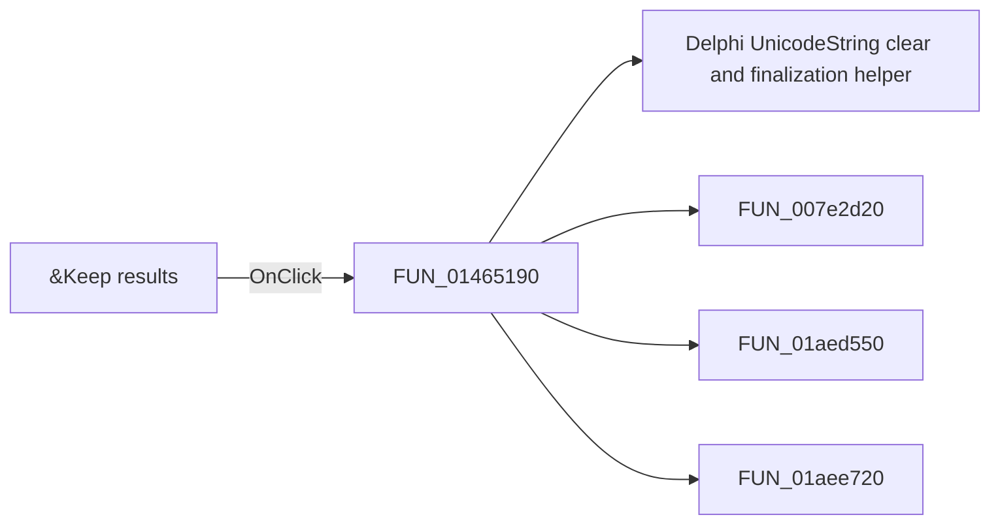

# &Keep results

> Analysis status: Pending individual source review.

## Control

| Property | Recovered value |
| --- | --- |
| Form | EquEditor |
| Component path | EquEditor.EEMenu.EEEditMnu.KeepresultsMnu |
| Control class | TMenuItem |
| Caption | &Keep results |
| Hint | Not present in the recovered resource. |
| Text | Not present in the recovered resource. |
| Handler name | KeepresultsMnuClick |
| Handler address | 01465190 |
| Graph node | `resource:dfm:EquEditor/EquEditor.EEMenu.EEEditMnu.KeepresultsMnu` |
| Handler node | `function:01465190` |
| Graph layer | UI |

## What happens when clicked

Pending individual analysis. An agent must read the recovered handler source and its relevant callees before it replaces this text.

## Click flow

## Handler evidence

- Source: [DecompiledSources/Tina16/functions/0000000001465190__FUN_01465190.c](../../../DecompiledSources/Tina16/functions/0000000001465190__FUN_01465190.c)
- Recovered role: Not present in the recovered resource.
- Current graph summary: Handles 1 Delphi UI event: EquEditor.EEMenu.EEEditMnu.KeepresultsMnu.OnClick.
- Current graph behavior: Not present in the recovered resource.
- Current graph evidence: Not present in the recovered resource.
- Complexity: complex
- Distinct outgoing calls: 4

## Direct calls

- `function:00414480` — Delphi UnicodeString clear and finalization helper
- `function:007e2d20` — FUN_007e2d20
- `function:01aed550` — FUN_01aed550
- `function:01aee720` — FUN_01aee720

## Resource evidence

- Kind: Not present in the recovered resource.
- Modal result: Not present in the recovered resource.
- Checked state: Not present in the recovered resource.
- List items: Not present in the recovered resource.
- Image reference: Not present in the recovered resource.
- Extracted glyph: None.

## Nearby label candidates

Nearby labels are layout candidates only. They are not proof of behavior.

- No same-parent label candidate is available.

## Analysis limits

- Do not infer behavior from the control class, caption, hint, glyph, or nearby label alone.
- Do not replace the pending status until the handler source and relevant call path provide enough evidence.
