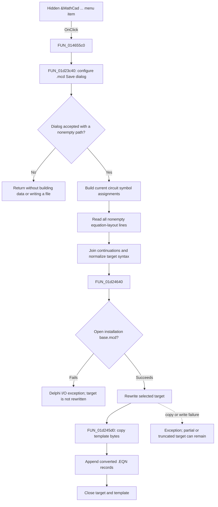

# &MathCad ...

> Analysis status: Complete. The recovered menu wrapper, export coordinator, equation conversion, and template writer support this explanation.

## Control

| Property | Recovered value |
| --- | --- |
| Form | EquEditor |
| Component path | EquEditor.EEMenu.EEFileMnu.EEExportMnu.MathCadMnu |
| Control class | TMenuItem |
| Caption | &MathCad ... |
| Visible in the recovered form | `false` |
| Hint | Not present in the recovered resource. |
| Handler name | MathCadMnuClick |
| Handler address | 014655c0 |
| Graph node | `resource:dfm:EquEditor/EquEditor.EEMenu.EEFileMnu.EEExportMnu.MathCadMnu` |
| Handler node | `function:014655c0` |
| Graph layer | UI |

The recovered form hides this menu item. The source in this call path does not show the code that can make it visible. The behavior below applies if the handler is invoked.

## What happens when clicked

`FUN_014655c0` passes the EquEditor equation-layout object at form offset `+0x860` to `FUN_01d23c40`. The wrapper has no other branch or state change.

`FUN_01d23c40` creates a temporary Save dialog. It does not use the form's shared image-export dialog or the graphics renderer documented for the Bitmap command. It configures this dialog as follows:

| Setting | Recovered value |
| --- | --- |
| Title | `Export to MathCad` |
| Default extension | `mcd` |
| Filter | `MathCad file (*.mcd)\|*.mcd` |
| Options | `0x116`: overwrite prompt, hide read-only, show Help, and require an existing path |
| Default file name | No file name is assigned by this handler. |
| Initial directory | No initial directory is assigned by this handler. |

Cancel ends the command before it builds export data or opens a file. After acceptance, the coordinator reads the selected path and also requires it to be nonempty.

## Exported equation scope

The accepted path builds a temporary line list from two sources:

1. It creates a temporary five-column symbol table and asks the current circuit context to populate it. Each populated symbol row becomes an assignment. Multi-character symbol names are converted to the equation editor's indexed-name form, and the associated numeric value is formatted for the target expression syntax.
2. It reads the complete internal line list at equation-layout offset `+0xA0`. It starts at line zero, skips empty source lines, and exports all other lines. There is no selection, caret, visible-page, or current-line limit.

The click does not first copy `EEMemo.Lines` into the layout object. Other EquEditor paths synchronize those objects, but this handler reads the layout's existing line list. The recovered click path does not prove what happens if the memo and layout are out of sync.

Before the binary writer runs, the coordinator performs these explicit source conversions:

- a trailing backslash or vertical bar joins a line to the next line after it removes the continuation character;
- `\\s(f)` becomes `\\s(P)`;
- `DegToRad` becomes `deg*`;
- decimal commas in symbol values become decimal points;
- scientific `E` notation becomes the equation syntax `*\\e(10,...)`.

The writer then parses the temporary lines into Mathcad equation records. The recovered parser handles names, numbers, operators, indexed names, arguments, functions, conditional expressions, degree notation, and the equation editor's backslash commands. It emits the literal record header `.EQN 6 0 ` and a record terminator for each converted equation. The source proves a fixed syntax translator. It does not prove that every equation-editor command has a Mathcad equivalent.

## File creation

`FUN_01d24640` resolves the installation-folder path `base.mcd`, opens that template for reading, and opens the selected target with Delphi `Rewrite` semantics. It first copies every template byte to the target through `FUN_01d245d0`. It then appends the generated binary equation records and closes the target and template on the normal path.

This is a binary template-based export, not a text-file export. The expression parser converts each Unicode source line to a single-byte string before it emits the records. The recovered conversion call uses code-page argument zero, so the exact system code page and the behavior for characters that it cannot represent are not established here.

## Cancel, overwrite, and failure behavior

- Cancel creates no output and does not build the temporary symbol or expression lists.
- The Save dialog requests overwrite confirmation. After acceptance, the writer's `Rewrite` call creates or truncates the selected file. There is no second overwrite question.
- The writer opens `base.mcd` before it rewrites the target. If the installation template cannot be opened, the selected target is not created by this path.
- Every recovered file open, byte copy, write, and close operation is followed by the Delphi I/O-status check `FUN_00409900`. A nonzero I/O status is raised through the runtime. The export functions contain no local retry or error dialog.
- After target creation starts, there is no temporary target, backup, atomic rename, rollback, or partial-file deletion. A copy, conversion, write, or close failure can therefore leave a truncated or partial `.mcd` file.
- The parser has no explicit user-facing validation branch. The recovered source does not define how an unsupported equation token appears in the output, so successful file creation alone does not prove that Mathcad can evaluate every exported expression.

## State and persistence

- The command reads the equation-layout lines and current symbol-table data. It does not change the editor text, equation selection, caret, scroll position, document file name, dirty state, or undo state.
- The Save dialog, symbol table, generated line list, and file records are temporary. Normal cleanup destroys the temporary objects.
- The accepted output path is kept only in local variables. The handler does not write it to the form, an INI file, the registry, a recent-file list, or the current project.
- The export writes only the selected `.mcd` file. It does not launch Mathcad, use COM automation, send a DDE command, or reopen the result.

## Click flow

## Source evidence

- Menu wrapper: [FUN_014655c0](../../../DecompiledSources/Tina16/functions/00000000014655C0__FUN_014655c0.c)
- Dialog, symbol-table preparation, line joining, and source normalization: [FUN_01d23c40](../../../DecompiledSources/Tina16/functions/0000000001D23C40__FUN_01d23c40.c)
- Symbol-value formatting: [FUN_01d23aa0](../../../DecompiledSources/Tina16/functions/0000000001D23AA0__FUN_01d23aa0.c)
- Template copy: [FUN_01d245d0](../../../DecompiledSources/Tina16/functions/0000000001D245D0__FUN_01d245d0.c)
- Binary equation-record writer: [FUN_01d24640](../../../DecompiledSources/Tina16/functions/0000000001D24640__FUN_01d24640.c)
- Current symbol-table population: [FUN_01694110](../../../DecompiledSources/Tina16/functions/0000000001694110__FUN_01694110.c)
- Delphi I/O-status check: [FUN_00409900](../../../DecompiledSources/Tina16/functions/0000000000409900__FUN_00409900.c)

## Analysis limits

- The resource proves that the menu item starts hidden. This analysis did not find the runtime condition that can expose it.
- The binary record constants and conversion branches prove a Mathcad-specific translator, but no target Mathcad release number is named in this call path.
- The exact single-byte code page comes from runtime setting zero and is not named by these recovered functions.
- The writer does not return a success value and the wrapper does not show a completion message. Success is inferred only from normal return after all I/O checks.
- The shared EquEditor graphics renderer owned by the Bitmap control analysis is not in this call path.
