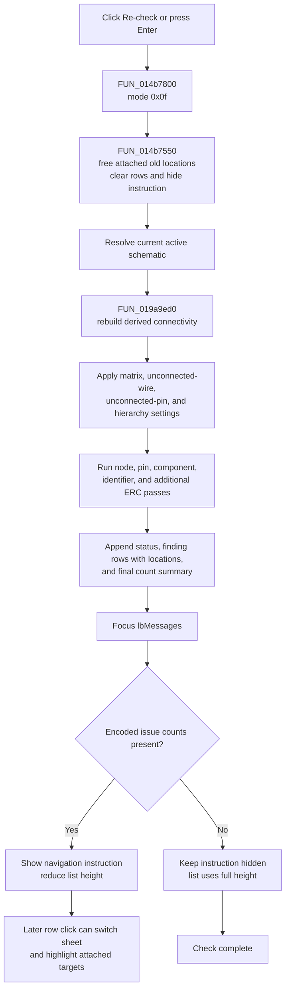

# Run the electrical rules check again

> Analysis status: Reviewed from the recovered ERC form, active-schematic resolver, result cleanup, ERC engine, rule settings, location records, result navigation, and persistence paths.

## Control

| Property | Recovered value |
| --- | --- |
| Form | ERCForm |
| Form caption | Electric Rules Check |
| Component path | ERCForm.btnCheck |
| Control class | TButton |
| Caption | Re-check |
| Default button | Yes |
| Handler name | btnCheckClick |
| Handler address | 014b7800 |
| Graph node | `resource:dfm:ERCForm/ERCForm.btnCheck` |
| Handler node | `function:014b7800` |
| Graph layer | UI |

## What happens when clicked

**Re-check** discards the current ERC result rows and runs a new electrical-rules check on the schematic that is active at the time of the click. The direct handler [`FUN_014b7800`](../../../DecompiledSources/Tina16/functions/00000000014B7800__FUN_014b7800.c) passes mode value `0x0f` to [`FUN_014b7750`](../../../DecompiledSources/Tina16/functions/00000000014B7750__FUN_014b7750.c). The recovered source does not publish the original enum name for this value.

The coordinator performs these steps:

1. [`FUN_014b7550`](../../../DecompiledSources/Tina16/functions/00000000014B7550__FUN_014b7550.c) frees every location object attached to the old list rows, clears the list, hides the navigation instruction label, and expands the list into the released space.
2. It resolves the current schematic model through the main application object.
3. It calls the core ERC engine [`FUN_019a9ed0`](../../../DecompiledSources/Tina16/functions/00000000019A9ED0__FUN_019a9ed0.c) with the active schematic, current rule matrix and rule flags, `lbMessages.Items`, and mode `0x0f`.
4. It gives focus to `lbMessages`.
5. If the encoded result contains reported issue counts above the engine-status portion, it shows `lblToDo` and reduces the list height to make room for the instruction text.

There is no merge with the old result set. Each click starts from an empty list.

## Schematic and hierarchy scope

The active-schematic resolver is called for each check. The operation is not permanently bound to the schematic that was active when ERCForm first opened. If another schematic becomes active while the modeless form remains open, **Re-check** uses that current schematic.

The engine rebuilds a derived connectivity structure on the schematic before it evaluates rules. It groups pins and wire endpoints by electrical node, records node membership, and then runs its node, component, identifier, and additional ERC passes. Proven report categories include:

- floating and grounded-node conditions;
- pin compatibility results from the ERC matrix;
- unconnected-pin and unconnected-wire conditions;
- a single-jumper condition; and
- duplicate identifiers.

The **Multi-level ERC** global controls recursion into eligible nested macro or subcircuit content. When it is clear, those recursive branches are skipped. When it is set, several collection and rule passes enter the referenced lower-level schematic data. The original type names of all eligible nested objects are not recovered.

## Rule configuration

The manual check reads the current global rule configuration. It does not read the three checkboxes from ERCForm during the click.

| Configuration | Proven use |
| --- | --- |
| ERC matrix | Rates combinations of pin electrical types such as input, output, bidirectional, power, passive, three-state, open collector, open emitter, and unconnected. |
| Apply ERC matrix rules | Enables pairwise matrix checks for connected pins on a node. |
| Always warn for unconnected pins | Participates in the one-pin node decision together with the matrix's unconnected rating. |
| Check for unconnected wires | Enables the separate unconnected-wire pass. |
| Multi-level ERC | Enables recursion into eligible nested schematic content. |

The matrix and the first three rule options are edited on the **ERC** page of Analysis Options. Its OK path copies the grid and checkboxes to the global configuration and writes the matrix to `TINA.INI`. The ERCForm **Multi-level ERC** checkbox updates its global immediately.

**Automatic ERC** and **Show on Warnings** do not restrict a manual **Re-check**. They control whether an automatic check is started and when automatic results are shown. The Re-check coordinator calls the engine directly.

## Result rows, locations, and navigation

The engine appends initialization or status text, individual findings, and a final count summary to `lbMessages.Items`. Findings that refer to schematic objects use the list API that stores both display text and an attached location collection. One finding can therefore refer to more than one wire, pin, or component.

The Re-check handler does not navigate or highlight a result. A later single click on a result row reads its attached locations. The list handler can switch the schematic editor to the target sheet, clears the prior highlight for the first target, and highlights or reveals each questioned object. This matches the recovered instruction:

> Click any of the errors/warnings above to highlight the questionable wires or components in the schematic editor.

Rows without an attached location collection, including headers and summaries, cause no navigation. Double-click uses a separate main-window command and is outside the Re-check path.

The location collections belong to the result list. The next Re-check and form destruction free them. The checker does not add persistent error-marker components to the schematic.

## Re-check flow

## Progress and cancellation

The check runs synchronously in the click path. The ERCForm has no progress bar, Cancel button, cancel flag, worker object, or completion callback for this operation. The engine drains the application message queue twice around early connectivity initialization, but it does not test a recovered user-cancel state and does not return a distinct cancelled result. The **Close** button is a separate form action; it is not an ERC cancellation command.

Some initialization failures are converted to result-list status messages and can bypass the detailed rule passes. This is error reporting, not cancellation. The recovered code does not report a percent complete or preserve a resumable checkpoint.

## Mutation and persistence boundaries

- The engine replaces and rebuilds a derived connectivity cache on the active schematic. This is an in-memory analysis-model mutation.
- The source does not show the check changing component parameters, wire geometry, pin types, identifiers, the circuit document, or an undo stack.
- The check does not call a project writer, schematic serializer, settings writer, or modified-state setter.
- Result text, attached location collections, selection, and highlighting are transient UI state. They are not written to the schematic or `.TSC` data by this path.
- Rule settings can persist through the separate Analysis Options or ERC close paths. **Re-check** only consumes those values and does not save them.

## No-op, error, and partial-result behavior

- There is no no-op guard for an unchanged schematic. Repeated clicks clear all results and run the complete check again.
- The coordinator has no explicit null check after resolving the active schematic. Normal application routing must supply a valid schematic; a direct call outside that state has no safe no-schematic branch in the recovered source.
- The reset, engine, and layout paths have no local exception handler, transaction, retry, or rollback.
- Old results are destroyed before the new connectivity build begins. A failure after cleanup can therefore leave the form with no results or only a partial new list.
- The engine appends rows as passes run. A later allocation, virtual call, rule pass, or formatting failure can leave earlier rows and a partially rebuilt connectivity cache in memory.
- The encoded engine result controls only the instruction-label layout in this coordinator. A nonzero result is not rolled back and does not restore the old list.
- If no reportable issue counter is present, the list can still contain headers, status text, and the final summary. The instruction label stays hidden.

## Evidence

- Direct button handler: [FUN_014b7800](../../../DecompiledSources/Tina16/functions/00000000014B7800__FUN_014b7800.c)
- ERCForm re-check coordinator: [FUN_014b7750](../../../DecompiledSources/Tina16/functions/00000000014B7750__FUN_014b7750.c)
- Old-result cleanup and layout reset: [FUN_014b7550](../../../DecompiledSources/Tina16/functions/00000000014B7550__FUN_014b7550.c)
- Active-schematic resolver: [FUN_019a4600](../../../DecompiledSources/Tina16/functions/00000000019A4600__FUN_019a4600.c)
- Core ERC engine: [FUN_019a9ed0](../../../DecompiledSources/Tina16/functions/00000000019A9ED0__FUN_019a9ed0.c)
- Connectivity and hierarchy collection: [FUN_019a76b0](../../../DecompiledSources/Tina16/functions/00000000019A76B0__FUN_019a76b0.c)
- Result-row click handler: [FUN_014b7840](../../../DecompiledSources/Tina16/functions/00000000014B7840__FUN_014b7840.c)
- Result-target navigation and highlighting: [FUN_014b7650](../../../DecompiledSources/Tina16/functions/00000000014B7650__FUN_014b7650.c)
- Analysis Options initialization and rule labels: [FUN_014f1700](../../../DecompiledSources/Tina16/functions/00000000014F1700__FUN_014f1700.c)
- Analysis Options apply and persistence: [FUN_014f28f0](../../../DecompiledSources/Tina16/functions/00000000014F28F0__FUN_014f28f0.c)
- Recovered resources: [ui-evidence.json](../../../DecompiledSources/Tina16/resources/dfm/ui-evidence.json)

The DFM proves the Electric Rules Check form caption, the **Re-check** caption, default-button state, result-list events, three ERCForm option captions, and the hidden navigation instruction. `btnCheck` has no recovered hint, action, image-list reference, or glyph.

## Analysis limits

- The original enum name for mode `0x0f`, the exact textual meaning of every localization ID, and the names of several internal connectivity types are not recovered.
- The return value packs initialization status and issue counters. The coordinator only tests whether it is greater than 99; this article does not assign unsupported names to its decimal fields.
- The list-row article owns the canonical navigation and highlighting helpers. The Automatic ERC, Show on Warnings, and Multi-level ERC controls own their direct setting handlers. This article owns the Re-check handler, its coordinator, the list reset, and the core ERC engine.
