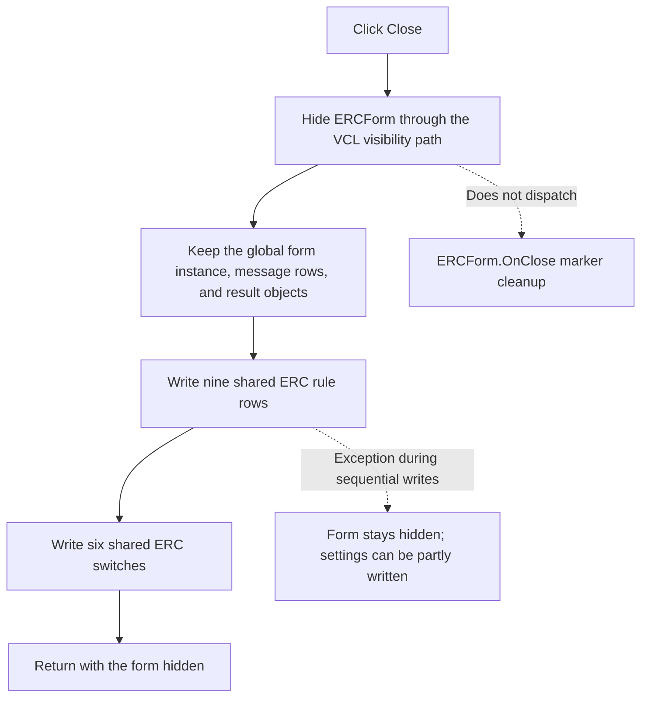

# Hide the ERC results and save ERC settings

## Control

| Property | Recovered value |
| --- | --- |
| Form | ERCForm |
| Component path | ERCForm.btnClose |
| Control class | TButton |
| Caption | Close |
| Hint | Not present in the recovered resource. |
| Form caption | Electric Rules Check |
| Handler name | btnCloseClick |
| Handler address | 014b78c0 |
| Graph node | `resource:dfm:ERCForm/ERCForm.btnClose` |
| Handler node | `function:014b78c0` |
| Graph layer | UI |

## What happens when clicked

Close hides the modeless Electric Rules Check form and then saves the shared ERC rules and switches. It does not run the normal VCL form-close pipeline, set a modal result, release the form, or delete the displayed ERC results.

The first call is the common VCL Hide wrapper. It sets the form's visible state to false. The second call writes nine shared rule-matrix rows, named `ERC_I`, `ERC_O`, `ERC_BIDI`, `ERC_PWR`, `ERC_PAS`, `ERC_3S`, `ERC_OC`, `ERC_OE`, and `ERC_uc`, followed by the `ERCUseRules`, `CheckUCWires`, `CheckUCPins`, `AutoERC`, `SkipAutoERCWarnings`, and `RecurseERC` switches. Form creation supplied this writer with the application's `TINA.INI`-backed settings object.

The order is important: the form is already hidden when persistence starts.

## Modeless lifecycle and ownership

The ERC form is a persistent modeless form. ERC callers test a global form reference, create the form with the application as owner only when the reference is null, and otherwise show and bring the existing instance to the front. The Close handler leaves that global reference intact. The next ERC request can show the same form without rerunning `FormCreate`.

`FormDestroy` is the separate final cleanup path. It releases the message-list payloads, clears the list, releases the settings object, and clears the global form reference. None of those actions occurs in `btnCloseClick`. The first `OnShow` also has a one-time placement branch; a later show of the hidden instance does not repeat that branch.

## ERC results, markers, and caller state

The current message rows and their attached ERC result objects remain owned by `lbMessages` after Close. The list cleanup helper runs before a re-check and during form destruction, not from this handler. The shared current-result status is also not reset here. Close does not accept, reject, replace, or recalculate pending ERC results.

Clicking a result uses its attached objects to select or highlight questionable schematic items. The form's separate `OnClose` handler runs the schematic selection/highlight cleanup path. This button calls Hide directly, so it does not dispatch that `OnClose` handler. A current schematic highlight can therefore remain after the ERC window becomes hidden. A later re-check or final destruction owns result replacement or cleanup.

There is no waiting caller and no result value to copy back. The handler does not set `ModalResult`, notify a caller, or change the schematic document's ERC result count. Its observable caller-facing state is that the reusable form becomes hidden and the current shared ERC configuration is written.

## Click flow

## Repeated close and failure behavior

- A second programmatic call while the form is hidden leaves visibility unchanged and writes the same current shared settings again. A user cannot click the hidden button without showing the form first.
- There is no confirmation, cancel branch, validation, or result-list guard.
- The settings writer performs its row and switch writes in sequence. The handler has no local exception handling or rollback. If a write fails, the form remains hidden, earlier settings can already be saved, and later settings can remain old.
- The handler does not clear the message list or its attached objects, so no result cleanup can fail in this path.
- It does not save form position, list selection, message text, current highlights, or ERC results. Only the shared ERC rule matrix and switches are proven persistent here.
- No form release occurs. Final cleanup remains the application-owned form's destruction responsibility.

## Handler evidence

- [Close handler `FUN_014b78c0`](../../../DecompiledSources/Tina16/functions/00000000014B78C0__FUN_014b78c0.c) calls the Hide wrapper first and the shared ERC settings writer second.
- [VCL Hide wrapper `FUN_00805990`](../../../DecompiledSources/Tina16/functions/0000000000805990__FUN_00805990.c) passes false to the [shared visible-state path `FUN_007fdf50`](../../../DecompiledSources/Tina16/functions/00000000007FDF50__FUN_007fdf50.c). This is not `TCustomForm.Close`.
- [Shared ERC settings writer `FUN_01d44460`](../../../DecompiledSources/Tina16/functions/0000000001D44460__FUN_01d44460.c) writes the nine named rule rows and six named Boolean switches.
- [Form creation `FUN_014b78f0`](../../../DecompiledSources/Tina16/functions/00000000014B78F0__FUN_014b78f0.c) initializes the three exposed check boxes from shared state and constructs the `TINA.INI`-backed settings object at form offset `+0x6F0`.
- [Result-list cleanup `FUN_014b7550`](../../../DecompiledSources/Tina16/functions/00000000014B7550__FUN_014b7550.c) releases attached row objects and clears `lbMessages`. [Re-check `FUN_014b7750`](../../../DecompiledSources/Tina16/functions/00000000014B7750__FUN_014b7750.c) calls that cleanup before it creates new results.
- [Form destruction `FUN_014b7a90`](../../../DecompiledSources/Tina16/functions/00000000014B7A90__FUN_014b7a90.c) calls the same list cleanup, releases the settings object, and clears the global form reference.
- [Form OnClose handler `FUN_014b7c20`](../../../DecompiledSources/Tina16/functions/00000000014B7C20__FUN_014b7c20.c) calls the schematic selection/highlight cleanup path. Direct Hide does not dispatch it.
- [Automatic ERC coordinator `FUN_014b7d50`](../../../DecompiledSources/Tina16/functions/00000000014B7D50__FUN_014b7d50.c) and [manual ERC opener `FUN_01c93da0`](../../../DecompiledSources/Tina16/functions/0000000001C93DA0__FUN_01c93da0.c) create the application-owned form only when its global reference is null, then show and bring that instance forward.
- [Recovered Delphi resource evidence](../../../DecompiledSources/Tina16/resources/dfm/ui-evidence.json) establishes the form caption, Close binding, form lifecycle events, message list, check boxes, and the instruction to click results to highlight questionable schematic items.

## Direct calls

- `FUN_00805990` hides the form without destroying it.
- `FUN_01d44460` writes the shared ERC matrix and switches to the settings sink.

## Resource evidence

- `btnClose` is a `TButton` with caption `Close` and no recovered hint or glyph.
- The form caption is `Electric Rules Check`.
- The form has `OnCreate`, `OnShow`, `OnClose`, and `OnDestroy` handlers, but the button uses direct Hide rather than the close-event pipeline.
- `lbMessages` holds the clickable results. The form instruction says that a click highlights the questionable wires or components in the schematic editor.
- `Automatic ERC`, `Show on Warnings`, and `Multi-level ERC` update shared switches before Close persists them.

## Analysis limits

- The recovered settings sink proves writes to the application `TINA.INI` configuration path. It does not expose an atomic transaction or recovery mechanism.
- The `OnClose` cleanup traverses the schematic result-object collection and calls its selection-reset path. The recovered symbols do not give a separate name to each visual marker type.
- The Close handler does not reveal when application shutdown later destroys the persistent form.
