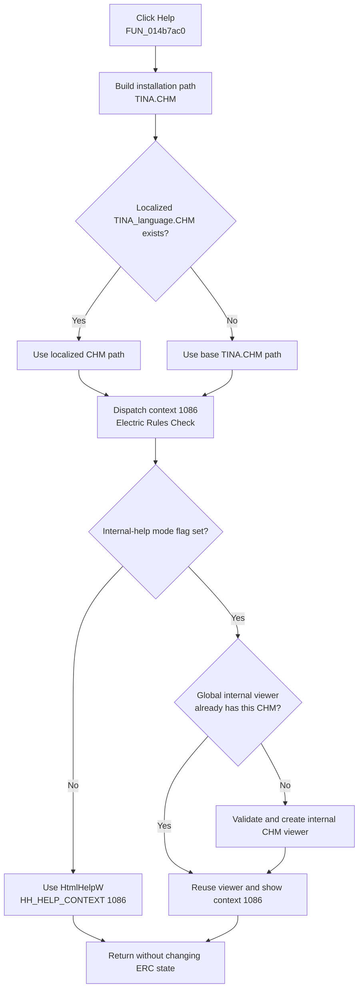

# Open the Electric Rules Check help topic

> Analysis status: Evidence-backed source review complete.

## Control

| Property | Recovered value |
| --- | --- |
| Form | ERCForm |
| Form caption | Electric Rules Check |
| Component path | ERCForm.btnHelp |
| Control class | TButton |
| Caption | Help |
| Hint | Not present in the recovered resource. |
| Handler name | btnHelpClick |
| Handler address | 014b7ac0 |
| Graph node | `resource:dfm:ERCForm/ERCForm.btnHelp` |
| Handler node | `function:014b7ac0` |
| Graph layer | UI |

## What happens when clicked

`TERCForm.btnHelpClick` builds the path `<TINA installation folder>\TINA.CHM`. It passes that path to the shared localized-help resolver. It then calls the process-wide application help interface with the resolved path and numeric context `1086` (`0x43e`).

Context `1086` is the Electric Rules Check form context. This identification does not come only from the caption: `TERCForm.FormCreate` assigns the same value to the form's VCL `HelpContext` field.

The recovered code does not expose the internal CHM topic file or topic title that context `1086` maps to. It does prove the help file, the context number, and the form that owns that context.

## Localized help-file selection

The shared resolver splits `TINA.CHM` into its base name and extension. It builds a candidate in this form:

`TINA_<current language>.CHM`

- If that localized candidate exists, the handler sends its path to the help interface.
- If it does not exist, the resolver returns the original `TINA.CHM` path.
- The fallback does not prove that the base file exists. The resolver does not report a missing base file.

Bead `.291` owns the canonical annotations for localized resolver `FUN_01b1def0` and help dispatcher `FUN_01d46890`. This article cites those shared functions but does not duplicate their annotations.

## External and internal viewer routes

The process-wide help dispatcher selects one of two routes with global mode flag `PTR_DAT_020017e8`:

- When the flag is zero, the dispatcher uses Windows HTML Help. It initializes the help subsystem, resolves the supplied CHM through the registered help manager, obtains the registered help-window owner handle, and calls `HtmlHelpW` with `HH_HELP_CONTEXT` and context `1086`.
- When the flag is nonzero, the dispatcher uses the application's internal CHM viewer. It reuses the process-global viewer at `PTR_DAT_02001270` when that viewer already has the same CHM path. Otherwise, it creates a viewer for the supplied CHM and stores it in that global slot. It then asks the viewer to show context `1086`.

Neither route opens a web URL or uses a browser. The external route uses `hhctrl.ocx`; the internal route parses the local CHM and displays it in an application-owned viewer.

## Click flow

## Missing help and error behavior

- The handler has no local file check, message, retry, alternate URL, or launch-status branch.
- In external mode, the HTML Help wrapper returns zero when `hhctrl.ocx` or its entry points cannot be loaded. A zero result from that wrapper or from `HtmlHelpW` causes no control-specific message in the shared dispatcher. The ERC handler does not inspect a result.
- In internal mode, construction checks that the selected CHM exists. A missing file raises an exception with a recovered `" does not exist."` suffix. Failure to extract uncached CHM data raises an exception with a recovered `" could not extract help file."` suffix.
- The handler has no local exception handler. An internal-viewer exception leaves the error to the normal application exception path.
- On a normal return, the handler finalizes its temporary Delphi strings.

## State changes and repeat behavior

- The click does not read or change the ERC message list, selected error, Automatic ERC option, Show on Warnings option, Multi-level ERC option, or schematic selection.
- It does not close or hide `ERCForm`, set a modal result, rerun the check, redraw the schematic, or write `TINA.INI`.
- External mode can initialize the process-wide HTML Help subsystem. Internal mode can create or replace the process-global viewer reference. These are shared help-system changes, not ERC model changes.
- A repeated click performs the same path resolution and context request. Internal mode can reuse the viewer when the selected CHM path is unchanged.
- The handler does not persist the selected help mode, language, context, or CHM path.

## Recovered evidence

- [`FUN_014b7ac0`](../../../DecompiledSources/Tina16/functions/00000000014B7AC0__FUN_014b7ac0.c) constructs the `TINA.CHM` path, calls the localized resolver, and sends context `0x43e` to the global application help interface at application offset `+0xb8`.
- [`FUN_014b78f0`](../../../DecompiledSources/Tina16/functions/00000000014B78F0__FUN_014b78f0.c), bound to `ERCForm.OnCreate`, passes `0x43e` to [`FUN_0064cf60`](../../../DecompiledSources/Tina16/functions/000000000064CF60__FUN_0064cf60.c), which writes the VCL help-context field.
- [`FUN_01b1def0`](../../../DecompiledSources/Tina16/functions/0000000001B1DEF0__FUN_01b1def0.c) selects an existing language-specific CHM or returns the original path. Bead `.291` owns its canonical annotation.
- [`FUN_01d46890`](../../../DecompiledSources/Tina16/functions/0000000001D46890__FUN_01d46890.c) implements the external/internal context-help dispatch. Bead `.291` owns its canonical annotation.
- [`FUN_0042a4a0`](../../../DecompiledSources/Tina16/functions/000000000042A4A0__FUN_0042a4a0.c) loads `hhctrl.ocx` and resolves `HtmlHelpA` and `HtmlHelpW`. [`FUN_0042a560`](../../../DecompiledSources/Tina16/functions/000000000042A560__FUN_0042a560.c) calls the Unicode entry point only when both exports are available.
- [`FUN_00b02f00`](../../../DecompiledSources/Tina16/functions/0000000000B02F00__FUN_00b02f00.c) constructs the internal viewer and supplies the recovered missing-file and extraction-failure exceptions. [`FUN_00b046f0`](../../../DecompiledSources/Tina16/functions/0000000000B046F0__FUN_00b046f0.c) selects the internal topic for a numeric context.
- [`ui-evidence.json`](../../../DecompiledSources/Tina16/resources/dfm/ui-evidence.json) binds `btnHelp.OnClick` to `014b7ac0` and identifies the form as `TERCForm` with caption **Electric Rules Check**. The button has no hint, image, or glyph.

## Analysis limits

The shared dispatcher reaches `FUN_01d46890` through the application's virtual help interface, so it is not a direct call edge from `FUN_014b7ac0`. The exact CHM topic name for context `1086`, the current language text, the configured help mode, and the installed help files are runtime values and are not present in this recovered handler.
