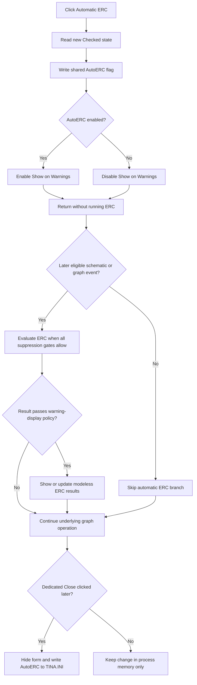

# Enable or disable automatic Electrical Rules Check

> Analysis status: Evidence-backed source review complete.

## Control

| Property | Recovered value |
| --- | --- |
| Form | ERCForm |
| Form caption | Electric Rules Check |
| Component path | ERCForm.chkAutoERC |
| Control class | TCheckBox |
| Caption | &Automatic ERC |
| Initial resource state | Checked |
| Handler name | chkAutoERCClick |
| Handler address | 014b7ba0 |
| Graph node | `resource:dfm:ERCForm/ERCForm.chkAutoERC` |
| Handler node | `function:014b7ba0` |
| Graph layer | UI |

The checkbox has no recovered hint, action, image reference, or glyph. Its DFM state is checked, but form creation replaces that state with the shared `AutoERC` setting that application startup read from `TINA.INI`.

## What happens when clicked

The VCL changes the checkbox state before it dispatches `OnClick`. `FUN_014b7ba0` then:

1. reads the new `chkAutoERC.Checked` value through the Boolean getter at VMT slot `+0x260`;
2. writes that value to the process-wide automatic-ERC flag; and
3. passes the same value to VCL `SetEnabled` at slot `+0x128` for `chkSkipWarnings`, captioned `Show on Warnings`.

Turning Automatic ERC off therefore disables the warning-display option because that option affects only automatic checks. Turning Automatic ERC on enables it again. The handler does not alter the warning option's checked state, the `Multi-level ERC` state, the current ERC result rows, or the selected message.

This click does not run an electrical rules check. It does not call the manual Re-check handler, the ERC evaluator, the result-list builder, or the schematic highlight path.

## Effect on later schematic operations

The shared coordinator `FUN_014b7d50` is called by many schematic and graph-operation paths. Its automatic-ERC branch runs only when all recovered gates allow it:

- the operation code is not `0x0F`;
- the event-kind byte is one of the two kinds selected by mask `0x03`;
- a separate global suppression byte is clear;
- the shared `AutoERC` flag is true; and
- the caller's suppress-automatic-check argument is false.

When those gates pass, the coordinator evaluates the current graph through the same ERC engine used by manual Re-check. The `Show on Warnings` policy then controls whether a nonzero packed result is enough to show or update the ERC form, or whether the coordinator requires the stricter recovered result test. If needed, the coordinator creates the persistent modeless ERC form, shows and brings it forward, clears its old displayed rows, fills the new results, and stores the latest result status.

When Automatic ERC is off, only that automatic evaluation and result-window branch is skipped. The coordinator continues its underlying graph operation and its normal error/result handling. Existing ERC messages are not cleared, and an already visible ERC form is not hidden.

The [Re-check button](btncheck-1847df806a.md) remains enabled. Its handler calls the manual ERC coordinator directly and does not test the automatic flag, so users can still request a check while Automatic ERC is off.

Several recovered internal operations temporarily save this shared flag, force it off, and restore it after their work. Those brackets suppress automatic checks without changing the checkbox or the saved preference. The click itself is the direct user-facing writer of the live flag.

## Startup and persistence

Application initialization opens `TINA.INI` and calls `FUN_01d43e00`. That reader loads the named `AutoERC`, `SkipAutoERCWarnings`, and `RecurseERC` settings with the ERC rule matrix. When `ERCForm` is first created, `FUN_014b78f0` copies the shared values into the three checkboxes and enables `Show on Warnings` according to the current Automatic ERC state.

This checkbox handler does not write `TINA.INI`. The new value is immediately active in process memory, but disk persistence occurs later:

- the [Close button](btnclose-9b3e76d9ea.md) hides the modeless form and then calls the shared ERC settings writer, which writes the named `AutoERC` value and the other ERC switches to `TINA.INI`;
- the Analysis Options accepted path also uses the same shared writer; and
- `ERCForm.FormDestroy` only clears results, releases its settings object, and clears the global form reference. It does not write settings.

There is no Cancel control or modal result on this form. The title-bar `OnClose` handler runs schematic selection/highlight cleanup but contains no settings write. Thus, the dedicated Close button is the persistence route proven for this form; a checkbox click followed only by another teardown path is not independently proven to save the change.

## Repeat, no-op, and error behavior

- Each user click normally changes the check state, writes the new shared value, and updates the enabled state of `Show on Warnings`.
- If the handler is called again without a state change, it rewrites the same global Boolean. `SetEnabled` changes the dependent control and sends `CM_ENABLEDCHANGED` only when its enabled state differs, so the UI part is otherwise a no-op.
- Turning the option off does not cancel a check that is already executing. The handler has no cancellation, synchronization, or in-progress test.
- The handler performs the global write before it calls `SetEnabled`. It has no local exception handler or rollback. If a lower VCL exception escapes from the enabled-state update, the live automatic flag has already changed.
- The handler shows no message and performs no validation. Errors from a future automatic or manual check belong to the ERC coordinator, not this click.
- Closing the form does not revert the live flag. The form is modeless and reusable, and its Close button saves the current shared value after hiding the form.

## Toggle flow

## Source evidence

- Checkbox handler and dependent-control enabled state: [FUN_014b7ba0](../../../DecompiledSources/Tina16/functions/00000000014B7BA0__FUN_014b7ba0.c)
- VCL enabled-state implementation for slot `+0x128`: [FUN_0064dc60](../../../DecompiledSources/Tina16/functions/000000000064DC60__FUN_0064dc60.c)
- Automatic ERC gates, evaluator call, warning policy, and modeless result update: [FUN_014b7d50](../../../DecompiledSources/Tina16/functions/00000000014B7D50__FUN_014b7d50.c)
- Manual Re-check wrapper and coordinator: [FUN_014b7800](../../../DecompiledSources/Tina16/functions/00000000014B7800__FUN_014b7800.c) and [FUN_014b7750](../../../DecompiledSources/Tina16/functions/00000000014B7750__FUN_014b7750.c)
- Startup `TINA.INI` open and ERC settings read: [FUN_01d79310](../../../DecompiledSources/Tina16/functions/0000000001D79310__FUN_01d79310.c), [FUN_01d43e00](../../../DecompiledSources/Tina16/functions/0000000001D43E00__FUN_01d43e00.c), and [FUN_01d43cb0](../../../DecompiledSources/Tina16/functions/0000000001D43CB0__FUN_01d43cb0.c)
- Form creation and initial checkbox synchronization: [FUN_014b78f0](../../../DecompiledSources/Tina16/functions/00000000014B78F0__FUN_014b78f0.c)
- Close-time settings write: [FUN_014b78c0](../../../DecompiledSources/Tina16/functions/00000000014B78C0__FUN_014b78c0.c) and [FUN_01d44460](../../../DecompiledSources/Tina16/functions/0000000001D44460__FUN_01d44460.c)
- Form-close and destruction boundaries: [FUN_014b7c20](../../../DecompiledSources/Tina16/functions/00000000014B7C20__FUN_014b7c20.c) and [FUN_014b7a90](../../../DecompiledSources/Tina16/functions/00000000014B7A90__FUN_014b7a90.c)
- Temporary automatic-ERC suppression examples: [FUN_01497c60](../../../DecompiledSources/Tina16/functions/0000000001497C60__FUN_01497c60.c), [FUN_014b4920](../../../DecompiledSources/Tina16/functions/00000000014B4920__FUN_014b4920.c), and [FUN_014b49a0](../../../DecompiledSources/Tina16/functions/00000000014B49A0__FUN_014b49a0.c)
- Recovered captions, checked state, component relationships, and event bindings: [ui-evidence.json](../../../DecompiledSources/Tina16/resources/dfm/ui-evidence.json)

## Evidence and annotation limits

- This Bead owns canonical annotations for click handler `FUN_014b7ba0` and automatic ERC coordinator `FUN_014b7d50`.
- Bead `.448` owns manual Re-check handler and coordinator. Bead `.449` owns the Close handler. Bead `.91` owns the shared ERC settings writer. Those functions remain evidence only here.
- The packed ERC result integer is tested in two ways according to the warning policy. The recovered code proves the branch behavior but does not provide safe names for each numeric subfield, so this article does not invent them.
- The many callers prove that the automatic coordinator is shared by schematic and graph-operation paths. Their recovered symbols do not identify every user gesture that reaches those paths.
