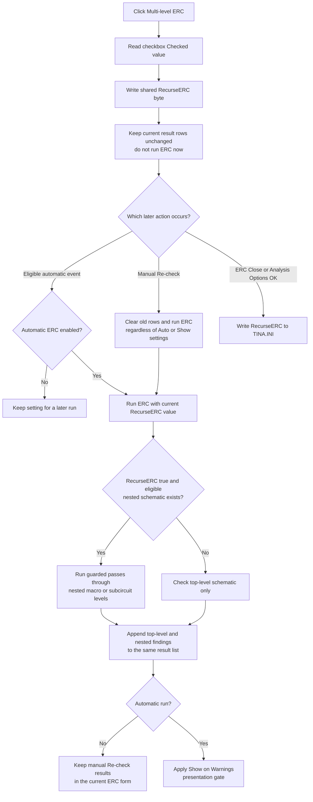

# Control multi-level electrical-rules checking

> Analysis status: Evidence-backed source review complete.

## Control

| Property | Recovered value |
| --- | --- |
| Form | ERCForm |
| Form caption | Electric Rules Check |
| Component path | ERCForm.chkbxRecurseERC |
| Control class | TCheckBox |
| Caption | Multi-level ERC |
| Handler name | chkbxRecurseERCClick |
| Handler address | 014b7c70 |
| Graph node | `resource:dfm:ERCForm/ERCForm.chkbxRecurseERC` |
| Handler node | `function:014b7c70` |
| Graph layer | UI |

The checkbox has no recovered hint, action, image reference, or glyph. The caption identifies the option, while the handler and the ERC engine establish its effect.

## What happens when clicked

`FUN_014b7c70` reads the checkbox's `Checked` value through its VCL virtual getter and copies that byte to the shared `RecurseERC` setting. It performs no other action.

- Checked stores true and enables hierarchy recursion for later ERC runs.
- Clear stores false and limits later ERC runs to the supplied top-level schematic.

The setting is process-wide rather than a field on the visible ERC form or current schematic. The form constructor reads the same shared setting and initializes this checkbox from it when another ERC form instance is created.

The handler does not start a check, clear `lbMessages`, filter current rows, change list selection, navigate to a result, redraw a schematic, or show a message. Existing results can therefore describe a check that used the previous option until the user selects **Re-check** or an automatic ERC run occurs.

## Recursive scope

The `.448`-owned core ERC engine `FUN_019a9ed0` uses the shared flag in several passes. The recursive branches have a consistent set of guards:

1. The shared `RecurseERC` byte must be true.
2. The schematic item must have the recovered general component category `4`.
3. Its virtual type code must be `0x39`.
4. Its recovered storage or content mode must match the pass, usually mode `1`; the main connectivity pass also handles part of mode `2`.
5. A referenced nested schematic collection must exist.

When these conditions are true, the engine enters the nested collection and repeats connectivity, unconnected-item, identifier, jumper, and related rule passes. The recursive functions include `FUN_019a76b0`, `FUN_019a7f90`, `FUN_019a82b0`, `FUN_019a8ac0`, `FUN_019a8eb0`, and `FUN_019a9230`.

The surrounding source uses the same type, mode, and nested-collection fields for embedded schematic macro content. Thus, **Multi-level ERC** covers eligible lower-level macro or subcircuit schematics. It does not blindly traverse every child object or every referenced library. The original Delphi class and enum names for all eligible objects are not recovered.

With the option clear, the top-level ERC passes still run. Only the guarded entries into lower-level schematic collections are skipped. Enabling the option does not merge the lower-level objects into the document and does not change their component or wire data. It only changes the analysis scope.

The recovered recursive helpers do not show a local maximum-depth or visited-set check. Normal hierarchical schematic data must therefore supply a finite, acyclic nested structure. The click handler does not validate that structure.

## Re-check and result-list behavior

The sibling [Re-check analysis](btncheck-1847df806a.md) owns the canonical checker annotations. Its handler clears all old result rows and attached location objects, resolves the currently active schematic, and runs `FUN_019a9ed0`. The engine reads the shared recursion setting during that run.

Nested findings are appended to the same `lbMessages` result collection as top-level findings. Location objects attached to those rows let the later list-click handler select the applicable sheet and highlight questioned wires or components. Toggling this checkbox alone does not add, remove, or relabel any row.

A manual Re-check does not inspect **Automatic ERC** or **Show on Warnings**. It always runs and uses the current recursion flag. Thus, Multi-level ERC affects manual checks even when Automatic ERC is off.

## Interaction with Automatic ERC and Show on Warnings

The three checkboxes store separate settings:

- **Automatic ERC** controls whether eligible application actions can start an automatic ERC run. Its handler also enables or disables the **Show on Warnings** checkbox.
- **Show on Warnings** controls whether automatic results cause the ERC result form to be shown for the applicable warning-only outcome. The automatic coordinator calls the ERC engine before it applies this presentation gate.
- **Multi-level ERC** controls whether that engine enters eligible nested schematic collections.

The Multi-level handler neither reads nor changes the other two settings. Automatic ERC does not enable or disable this checkbox. When automatic checking is enabled, a later automatic check uses the current Multi-level value. Show on Warnings can change whether the automatic result window appears, but it does not disable the recursive analysis itself. When automatic checking is disabled, the Multi-level value remains available to the manual Re-check command.

## Persistence and lifetime

The click changes the shared in-memory value immediately, but it does not write a file itself.

- Application settings initialization calls `FUN_01d43e00`, which reads `RecurseERC` from `TINA.INI` into the shared setting.
- ERCForm construction copies the loaded value into this checkbox.
- The ERCForm **Close** button hides the form and calls `.91`-owned `FUN_01d44460`. That writer stores `RecurseERC`, `AutoERC`, `SkipAutoERCWarnings`, the other ERC switches, and the rule matrix to the settings sink.
- The Analysis Options OK path can call the same writer after it commits ERC rule settings.

Therefore, a click survives later checks and ERC form instances in the current process. Durable persistence occurs only when a later settings-writer path runs. If the application terminates or fails before that path, this click provides no independent save or rollback guarantee. The setting is an application preference; it is not written into the active schematic document by this path.

## Guards, repeated clicks, and errors

- There is no current-schematic, result-list, Automatic ERC, or running-check guard. The handler only needs the form's checkbox object to be valid.
- Repeated events overwrite the shared byte with the current checkbox state. They do not toggle the byte independently of the VCL state and do not start repeated checks.
- The handler has no confirmation, error message, local exception handler, transaction, or rollback.
- The single byte write occurs after the VCL getter returns. If the getter raises, the global is not written. After a normal return, there is no later step in this handler that can fail partially.
- An ERC run already executing on the same UI thread is not changed by a concurrent click because this handler cannot run until that synchronous check returns. The new value applies to a later run.
- The later recursive engine has no local depth or cycle error path. A malformed nested model can fail after top-level or earlier lower-level results were already produced; no rollback is recovered.

## Click flow

## Source evidence

- Direct checkbox-state copy: [FUN_014b7c70](../../../DecompiledSources/Tina16/functions/00000000014B7C70__FUN_014b7c70.c)
- Form construction and checkbox initialization: [FUN_014b78f0](../../../DecompiledSources/Tina16/functions/00000000014B78F0__FUN_014b78f0.c)
- Manual Re-check wrapper and coordinator: [FUN_014b7800](../../../DecompiledSources/Tina16/functions/00000000014B7800__FUN_014b7800.c) and [FUN_014b7750](../../../DecompiledSources/Tina16/functions/00000000014B7750__FUN_014b7750.c)
- Core ERC engine and recursive-pass dispatch: [FUN_019a9ed0](../../../DecompiledSources/Tina16/functions/00000000019A9ED0__FUN_019a9ed0.c)
- Main recursive connectivity pass: [FUN_019a76b0](../../../DecompiledSources/Tina16/functions/00000000019A76B0__FUN_019a76b0.c)
- Additional recursive ERC passes: [FUN_019a7f90](../../../DecompiledSources/Tina16/functions/00000000019A7F90__FUN_019a7f90.c), [FUN_019a82b0](../../../DecompiledSources/Tina16/functions/00000000019A82B0__FUN_019a82b0.c), [FUN_019a8ac0](../../../DecompiledSources/Tina16/functions/00000000019A8AC0__FUN_019a8ac0.c), [FUN_019a8eb0](../../../DecompiledSources/Tina16/functions/00000000019A8EB0__FUN_019a8eb0.c), and [FUN_019a9230](../../../DecompiledSources/Tina16/functions/00000000019A9230__FUN_019a9230.c)
- Automatic-check and result-form presentation gate: [FUN_014b7d50](../../../DecompiledSources/Tina16/functions/00000000014B7D50__FUN_014b7d50.c)
- Automatic ERC and Show on Warnings state handlers: [FUN_014b7ba0](../../../DecompiledSources/Tina16/functions/00000000014B7BA0__FUN_014b7ba0.c) and [FUN_014b7bf0](../../../DecompiledSources/Tina16/functions/00000000014B7BF0__FUN_014b7bf0.c)
- ERC settings load and save: [FUN_01d43e00](../../../DecompiledSources/Tina16/functions/0000000001D43E00__FUN_01d43e00.c) and [FUN_01d44460](../../../DecompiledSources/Tina16/functions/0000000001D44460__FUN_01d44460.c)
- ERCForm Close-button persistence path: [FUN_014b78c0](../../../DecompiledSources/Tina16/functions/00000000014B78C0__FUN_014b78c0.c)
- Recovered control captions and event binding: [ui-evidence.json](../../../DecompiledSources/Tina16/resources/dfm/ui-evidence.json)

## Annotation ownership

This Bead owns only the unique Multi-level ERC handler `FUN_014b7c70`. Bead `.448` owns the manual Re-check wrapper, coordinator, result reset, and core engine. Beads `.451` and `.452` own the Automatic ERC and Show on Warnings handlers. Bead `.91` owns the shared ERC settings writer. Recursive engine passes, settings load, form initialization, and list behavior remain evidence-only here.
