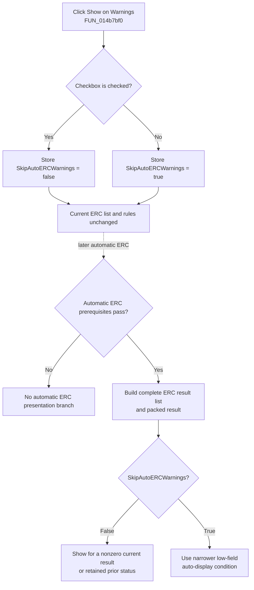

# Control automatic ERC display for warnings

> Analysis status: Evidence-backed source review complete.

## Control

| Property | Recovered value |
| --- | --- |
| Form | ERCForm |
| Component path | ERCForm.chkSkipWarnings |
| Control class | TCheckBox |
| Caption | &Show on Warnings |
| Handler name | chkSkipWarningsClick |
| Handler address | 014b7bf0 |
| Graph node | `resource:dfm:ERCForm/ERCForm.chkSkipWarnings` |
| Handler node | `function:014b7bf0` |
| Graph layer | UI |

## What happens when clicked

VCL changes the checkbox state before it calls `TERCForm.chkSkipWarningsClick`. The handler reads the checkbox's `Checked` property from form field `+0x6d8`, inverts it, and stores the result in the shared `SkipAutoERCWarnings` Boolean:

- Checked **Show on Warnings** stores `SkipAutoERCWarnings = false`.
- Cleared **Show on Warnings** stores `SkipAutoERCWarnings = true`.

The click changes the shared policy immediately. It does not call the ERC engine, clear or rebuild `lbMessages`, hide warning rows, change a rule, select a schematic object, redraw the editor, or write `TINA.INI`.

## Effect on later automatic checks

The automatic ERC coordinator reads this flag only after the automatic-check prerequisites pass and a new packed ERC result is available. When **Show on Warnings** is checked, a nonzero current packed result or a nonzero previously recorded result status can cause the modeless ERC results form to be created or shown and populated. The retained-status case lets the form receive the next result update after an earlier reported condition. When the checkbox is cleared, the coordinator does not use either broad condition; it uses a narrower low-field condition instead. The persisted name `SkipAutoERCWarnings` and the inverted checkbox mapping establish that this is the warning auto-display suppression path.

This option controls whether warning results make the form appear automatically. It does not remove warning messages from an ERC run. The core checker still generates its result list and summary before the coordinator tests the display policy. Manual **Re-check** also calls the core checker without testing `SkipAutoERCWarnings`.

The recovered packed result contains separate scaled counts and a low status field. The code proves the broad-versus-narrow display test, but it does not label every packed subfield. This article therefore does not assign an unsupported error or warning name to the low-field condition.

## Interaction with Automatic ERC and Multi-level ERC

**Automatic ERC** is the master switch for this automatic display route. Its click handler stores the Automatic ERC state and enables or disables **Show on Warnings** to match it. If Automatic ERC is off, the later coordinator does not enter the automatic ERC presentation branch, even if this checkbox's stored policy is still set.

Disabling the control does not overwrite `SkipAutoERCWarnings`. When Automatic ERC is enabled again, the previous Show on Warnings selection remains available.

**Multi-level ERC** is independent. Its checkbox stores the `RecurseERC` setting, and the core checker reads that setting when it decides whether to descend into eligible hierarchical circuit contents. The Show on Warnings handler does not change recursion, and recursion does not change the warning-display flag.

## Click flow

The dotted edge is later consumer behavior. It is not a direct call from the checkbox handler.

## Startup and persistence boundaries

- Application settings loading reads the Boolean key `SkipAutoERCWarnings` into shared state before the form is created.
- `ERCForm.OnCreate` initializes **Show on Warnings** to the inverse of that state. It also initializes **Automatic ERC** and **Multi-level ERC**, and it creates the form's `TINA.INI` settings object.
- The checkbox handler changes only the in-memory shared Boolean. It performs no settings I/O.
- The ERC form's **Close** button hides the modeless form and writes the shared ERC matrix and switches, including `SkipAutoERCWarnings`, through the form's settings object.
- Accepting the separate Analysis Options dialog also calls the canonical ERC settings writer.
- The recovered `ERCForm.OnClose` and `OnDestroy` handlers do not call that writer. `OnClose` clears schematic selection or highlight state, while `OnDestroy` clears result ownership and releases the settings object. Therefore, this source does not prove that every window-close or destruction route persists a last-second checkbox change.

## No-op and error behavior

- Clicking the already selected state is not a handler-level no-op: the handler reads the state and writes the same shared Boolean again. It still does no list, rule, or display work.
- The handler has no check for an active schematic, existing results, enabled state, Automatic ERC state, or Multi-level ERC state. Normal VCL interaction prevents a user click while the control is disabled.
- There is no validation, message box, retry, rollback, or local exception handler.
- A failure while VCL reads the checkbox property can propagate through the event. The shared one-byte assignment itself has no recovered failure branch.
- Settings-write errors can occur later on a persistence route. They are outside this direct click and do not roll back the already changed in-memory flag.

## Recovered evidence

- [`FUN_014b7bf0`](../../../DecompiledSources/Tina16/functions/00000000014B7BF0__FUN_014b7bf0.c) reads `Checked` through the control at form `+0x6d8` and writes its inverse to `PTR_DAT_020032a8`. It has no direct call edge.
- [`FUN_014b78f0`](../../../DecompiledSources/Tina16/functions/00000000014B78F0__FUN_014b78f0.c) is `ERCForm.OnCreate`. It sets the checkbox to `PTR_DAT_020032a8 == 0`, sets the Automatic and Multi-level checkboxes from their shared flags, and opens the form's `TINA.INI` settings object.
- [`FUN_014b7ba0`](../../../DecompiledSources/Tina16/functions/00000000014B7BA0__FUN_014b7ba0.c) stores the Automatic ERC checkbox state and enables or disables Show on Warnings. Neighboring Bead `.451` owns its automatic-check analysis and canonical coordinator annotation.
- [`FUN_014b7d50`](../../../DecompiledSources/Tina16/functions/00000000014B7D50__FUN_014b7d50.c) is the later automatic coordinator. It gates the branch on Automatic ERC, obtains the packed core-check result, and tests `SkipAutoERCWarnings` before it creates, shows, and populates the ERC form.
- [`FUN_019a9ed0`](../../../DecompiledSources/Tina16/functions/00000000019A9ED0__FUN_019a9ed0.c) generates the complete ERC result list and packed result before the warning-display policy is tested. Bead `.448` owns its canonical annotation.
- [`FUN_014b7800`](../../../DecompiledSources/Tina16/functions/00000000014B7800__FUN_014b7800.c) and [`FUN_014b7750`](../../../DecompiledSources/Tina16/functions/00000000014B7750__FUN_014b7750.c) implement manual Re-check without reading the skip-warning flag. Bead `.448` owns these functions.
- [`FUN_014b7c70`](../../../DecompiledSources/Tina16/functions/00000000014B7C70__FUN_014b7c70.c) stores the independent Multi-level ERC state. Recursive consumers use it in the core-check traversal.
- [`FUN_01d43e00`](../../../DecompiledSources/Tina16/functions/0000000001D43E00__FUN_01d43e00.c) loads named ERC switches, including `SkipAutoERCWarnings`. [`FUN_01d79310`](../../../DecompiledSources/Tina16/functions/0000000001D79310__FUN_01d79310.c) calls it during application settings initialization.
- [`FUN_014b78c0`](../../../DecompiledSources/Tina16/functions/00000000014B78C0__FUN_014b78c0.c) hides the ERC form and calls [`FUN_01d44460`](../../../DecompiledSources/Tina16/functions/0000000001D44460__FUN_01d44460.c), which writes `SkipAutoERCWarnings` and the other ERC settings. Beads `.449` and `.91` own the canonical Close and settings-writer annotations.
- [`FUN_014b7c20`](../../../DecompiledSources/Tina16/functions/00000000014B7C20__FUN_014b7c20.c) and [`FUN_014b7a90`](../../../DecompiledSources/Tina16/functions/00000000014B7A90__FUN_014b7a90.c) show the separate `OnClose` and `OnDestroy` behavior and do not call the writer.
- [`ui-evidence.json`](../../../DecompiledSources/Tina16/resources/dfm/ui-evidence.json) supplies the form, checkbox caption, event binding, sibling controls, and modeless form resources. The checkbox has no hint, glyph, or DFM default checked state.

## Analysis limits

The recovered Delphi field name for `PTR_DAT_020032a8` is not available. The settings key, inverse form initialization, direct click assignment, and later consumer prove that it is the `SkipAutoERCWarnings` state. The code does not label every subfield of the packed ERC return value, so the exact low-field category remains unspecified. Shared ERC initialization, execution, recursion, Close, and persistence helpers remain evidence-only under neighboring Bead ownership; `.452` owns only `FUN_014b7bf0`.
