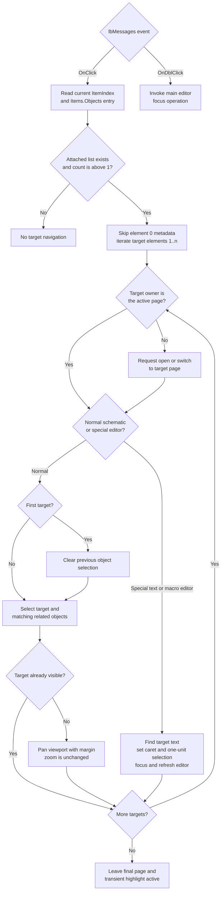

# Navigate to an ERC result

> Analysis status: Reviewed from the recovered ERC form, result-row storage, click and double-click handlers, schematic selection path, page switch path, viewport path, and special-editor path.

## Control

| Property | Recovered value |
| --- | --- |
| Form | ERCForm |
| Form caption | Electric Rules Check |
| Component path | ERCForm.lbMessages |
| Control class | TListBox |
| Caption | Not present in the recovered resource. |
| Hint | Not present in the recovered resource. |
| Handler names | lbMessagesClick; lbMessagesDblClick |
| Handler addresses | 014b7840; 014b7c40 |
| Graph node | `resource:dfm:ERCForm/ERCForm.lbMessages` |
| Handler nodes | `function:014b7840`; `function:014b7c40` |
| Graph layer | UI |

## What happens when a result is clicked

A single click uses the list's current item index. [`FUN_014b7840`](../../../DecompiledSources/Tina16/functions/00000000014B7840__FUN_014b7840.c) reads the object attached to that row. The ERC engine builds this attached object as an ordered list. Element 0 is checker metadata; elements 1 onward are pointers to the schematic objects reported by that result. The handler deliberately reads and discards element 0, then sends each remaining element to [`FUN_014b7650`](../../../DecompiledSources/Tina16/functions/00000000014B7650__FUN_014b7650.c).

For each target, the navigation coordinator performs these actions:

1. It obtains the target's owning sheet or page from target offset `+0x68`.
2. It compares that owner with the active schematic tab. If they differ, it asks the main editor to open or switch to the target owner.
3. In the normal schematic editor, it clears the existing object selection before the first target only. It then selects the target and matching related objects, and calls [`FUN_01c746c0`](../../../DecompiledSources/Tina16/functions/0000000001C746C0__FUN_01c746c0.c) to reveal the target.
4. In the special text or macro editor branch, it calls [`FUN_014b67c0`](../../../DecompiledSources/Tina16/functions/00000000014B67C0__FUN_014b67c0.c). That helper matches the target's recovered text identifier, finds the matching text position, moves the caret, selects one unit, focuses the editor, and refreshes its selection display.

The first-target flag is true only for attached element 1. It makes one result with several attached objects a multi-selection: the previous selection is cleared once, and later targets are added without another clear. If targets belong to different pages, the coordinator can switch pages more than once. The last successful page switch determines the page that remains active.

The viewport helper does not change the zoom factor. It tests whether the target is already inside the visible schematic rectangle. If not, it calculates horizontal and vertical offsets with a 50-unit margin and pans the viewport only when an offset is required.

This source path confirms the nearby instruction text: "Click any of the errors/warnings above to highlight the questionable wires or components in the schematic editor." The text supports the source trace; it is not the only evidence for the behavior.

## Double-click behavior

The same list also binds `OnDblClick` to [`FUN_014b7c40`](../../../DecompiledSources/Tina16/functions/00000000014B7C40__FUN_014b7c40.c). This handler invokes the main schematic editor's virtual focus operation. It does not read the row, create another location list, change the selection, or repeat the navigation loop. In normal VCL event order, the single-click selection path has already handled the current row; double-click then returns focus to the schematic editor so the highlighted target can receive editor input.

## Result ownership and lifetime

The result rows are products of the ERC engine. [`FUN_019a74e0`](../../../DecompiledSources/Tina16/functions/00000000019A74E0__FUN_019a74e0.c) allocates each attached list, writes the checker metadata first, and appends the reported object pointers. The Re-check path owned by `TIARA-diz.6.7.448` places these objects in `lbMessages.Items`.

The list owns those attached location lists. Re-check and form destruction use [`FUN_014b7550`](../../../DecompiledSources/Tina16/functions/00000000014B7550__FUN_014b7550.c) to destroy them before clearing the rows. The click handler only reads them. It does not free, replace, or persist them.

## Event flow

## No-op and error boundaries

- A row whose attached object is null causes no navigation.
- A list with count 0 causes no navigation. A list with only element 0 also causes no navigation because it has metadata but no target.
- The handler has no explicit `ItemIndex >= 0` guard before it asks the VCL items collection for the attached object. Therefore, behavior for an invalid current index belongs to that collection getter; this handler does not provide its own safe branch.
- The attached-list accessor is bounds checked. The loop uses the captured count and valid indexes, but corrupted or concurrently changed data can raise the list's bounds error.
- The coordinator requests a page switch but does not test a success result. If the switch path refuses or cancels an open request, target handling continues against the editor state that remains current.
- If there is no current schematic model after the page request, the normal selection and viewport work is skipped.
- If the special editor is not open, or its text identifier does not match the target, that branch makes no selection or caret change.
- The click, page-switch, selection, viewport, and text-reveal paths have no local exception handler, retry, transaction, or rollback. A failure after one target can leave earlier targets selected and an intermediate page active.
- Repeated clicks repeat the navigation. They do not create or remove ERC results.

## Mutation and persistence boundaries

- The command changes transient editor state: active page, selected or highlighted objects, viewport position, and, for the special editor, caret and text selection.
- It does not change component values, wire geometry, connectivity, ERC findings, or the circuit's persistent object list.
- It does not call a circuit serializer, settings writer, modified-state setter, or undo recorder.
- No persistent highlight marker is created. The form close path separately clears schematic selection or highlight state.

## Evidence

- Single-click handler: [FUN_014b7840](../../../DecompiledSources/Tina16/functions/00000000014B7840__FUN_014b7840.c)
- Per-target navigation coordinator: [FUN_014b7650](../../../DecompiledSources/Tina16/functions/00000000014B7650__FUN_014b7650.c)
- Double-click focus handler: [FUN_014b7c40](../../../DecompiledSources/Tina16/functions/00000000014B7C40__FUN_014b7c40.c)
- Attached result-list constructor: [FUN_019a74e0](../../../DecompiledSources/Tina16/functions/00000000019A74E0__FUN_019a74e0.c)
- Bounds-checked attached-list accessor: [FUN_004aeac0](../../../DecompiledSources/Tina16/functions/00000000004AEAC0__FUN_004aeac0.c)
- Shared selection clear and selection helpers: [FUN_01994230](../../../DecompiledSources/Tina16/functions/0000000001994230__FUN_01994230.c), [FUN_01993f30](../../../DecompiledSources/Tina16/functions/0000000001993F30__FUN_01993f30.c)
- Viewport reveal helper: [FUN_01c746c0](../../../DecompiledSources/Tina16/functions/0000000001C746C0__FUN_01c746c0.c)
- Special-editor reveal helper: [FUN_014b67c0](../../../DecompiledSources/Tina16/functions/00000000014B67C0__FUN_014b67c0.c)
- Result-list cleanup: [FUN_014b7550](../../../DecompiledSources/Tina16/functions/00000000014B7550__FUN_014b7550.c)
- Recovered resources: [ui-evidence.json](../../../DecompiledSources/Tina16/resources/dfm/ui-evidence.json)

The resource evidence proves the list class and both event bindings. It provides no caption, hint, static items, action, image, or glyph for `lbMessages`. The hidden nearby instruction names the intended schematic highlight result. The recovered handler and callees establish how the application performs that result.

## Analysis limits

- The original Delphi names for the checker metadata at attached-list element 0, the target base class, and the special editor type are not recovered.
- The page-switch routine includes protected or locked-content branches. This article does not assign unsupported names to those formats or promise that every switch succeeds.
- The exact VCL method name at virtual slot `+0x258` is not present in the decompilation. Its use after caret placement and on the main editor establishes a focus operation, but this article does not invent a Delphi symbol for the virtual method.
- `TIARA-diz.6.7.448` owns the ERC engine, Re-check coordinator, and result reset. This article owns the list event handlers and the specific navigation and reveal helpers. Broad shared schematic selection helpers remain evidence only.
