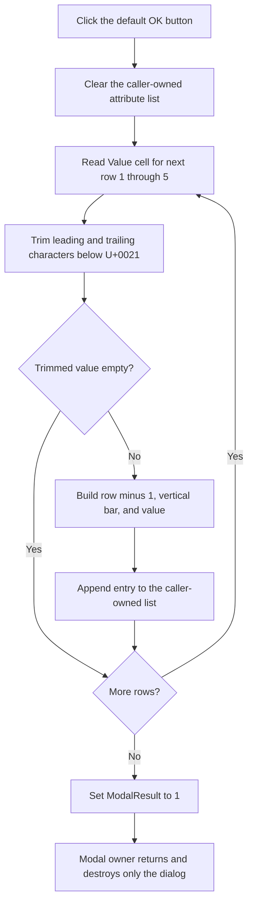

# Replace the caller's indexed extra-attribute values

> Analysis status: Reviewed from recovered handler, form initialization,
> grid-access, list-ownership, modal-owner, resource, and glyph evidence.

## Control

| Property | Recovered value |
| --- | --- |
| Form | `ExtraAttrsEditorDlg` (`TExtraAttrsEditorDlg`) |
| Form caption | `Parameters` |
| Component path | `ExtraAttrsEditorDlg.OKBtn` |
| Control class | `TBitBtn` |
| Caption | `OK` |
| Default button | `true` |
| Handler name | `OKBtnClick` |
| Handler address | `0141d620` |
| Accepted modal result | `1` (`mrOk`) |
| Graph node | `resource:dfm:ExtraAttrsEditorDlg/ExtraAttrsEditorDlg.OKBtn` |
| Handler node | `function:0141d620` |
| Graph layer | UI |

## What happens when clicked

`FUN_0141d620` replaces the caller-owned extra-attribute string list with the
nonempty values from `sgAttrs`. It does not copy a separate dialog result after
the form closes.

The commit order is:

1. Clear the caller-owned target list at form field `+0x6d0`.
2. Read `sgAttrs.Cells[1, row]` for rows `1` through `5`.
3. Trim characters below U+0021 from both ends of each value.
4. Skip the row when the trimmed value is empty.
5. For each retained row, append `row - 1`, a vertical bar, and the trimmed
   value. The stored form is therefore `0|value` through `4|value`.
6. Set form field `+0x508` to `1`, which accepts the modal form.

Internal spaces and control characters inside a value are preserved. Only its
leading and trailing characters below U+0021 are removed. The handler does not
parse a number, Boolean, path, expression, or other value type. It does not
reject a vertical bar inside a value; the later value splitter uses the first
bar and returns the remaining text.

## Grid initialization and attribute names

`FUN_0141d3b0`, the form-create handler, writes `Name` and `Value` to the grid
header. It then fills rows `1` through `4` in the Name column through
`FUN_01d43710`. That helper uses four configured extra-attribute names. If a
configured name is empty, it builds a localized fallback name with its ordinal.
The exact runtime-configured names are not stored in this DFM.

The OK handler does not read the Name column. It generates a numeric slot from
the row position. A user-supplied name, duplicate name, or reserved word cannot
change the stored key through this handler. Only the Value column is collected.

The source has an important fifth-row detail: form creation initializes four
name rows, but OK reads five value rows. An existing list entry with key `4`
can create and populate row `5`, and OK can preserve it as `4|value`. The
recovered code does not identify a visible name or purpose for this fifth slot.

## Existing-list loading and normalization

The form constructor `FUN_0141d2f0` stores the supplied list object directly at
`+0x6d0`; it does not clone it. During form creation, each existing list string
is split at its first vertical bar:

- The left part is parsed as a decimal slot number. A nonnumeric part defaults
  to slot `0`.
- The right part becomes the corresponding Value cell at row `slot + 1`.

Existing entries are applied in list order. If two entries use the same slot,
the later entry overwrites the earlier grid cell. A successful OK commit then
writes at most one entry for each row, in ascending row order. It therefore
removes duplicate slots and normalizes list ordering.

OK reads only slots `0` through `4`. Existing positive slots above `4` can be
loaded into other grid rows by the generic setter, but OK does not collect
them. Because it clears the target first, such entries are removed on a
successful commit. A negative row index can enter the generic grid error path;
the dialog has no local recovery for it.

There is no separate reserved-name table in the click handler. The fixed row
positions and the four configured labels define the normal supported
attributes. The handler does not check duplicates, reserved values, maximum
value length, or value syntax.

## Active cell and validation

This handler does not call the recovered active-grid-editor commit helper. It
does not set `EditorMode` to false and does not ask the grid to validate its
current in-place editor. It reads the grid's backing cell values directly
through `FUN_0084e320`.

Normal focus processing can synchronize an editor before `OnClick`, but that
behavior is not present in this application handler. The button is also the
default button, so Enter can invoke it. The recovered code cannot prove that
text still held only by an active in-place editor is included. There is no
validation result, error flag, message, or retry branch.

## Modal close, Cancel, and ownership

The handler writes modal result `1` only after it rebuilds all five rows. The
form has no recovered `OnCloseQuery` event, so there is no application close
veto. If the handler reaches the final write, the modal loop returns an
accepted result.

`CancelBtn` is a standard `bkCancel` button and has no custom `OnClick`.
Cancel therefore closes with the standard cancel result and does not run the
OK handler. The caller-owned list remains unchanged if Cancel is selected
before any OK attempt.

`FUN_01434d20` supplies the caller's list to the dialog constructor.
`FUN_00b088a0` creates the dialog through that editor, shows it modally, and
destroys the form after the modal method returns. The form destructor does not
destroy the list at `+0x6d0`. The list remains caller-owned.

There is no result-dependent copy-back after `ShowModal`: OK has already
changed the original list before it sets `mrOk`. This command performs no file,
INI, registry, or database write. Any later component or document
serialization of the caller-owned list is outside this click path.

## Commit flow

## Error and partial-state behavior

- The target list is cleared before the first grid value is read. There is no
  snapshot, transaction, or rollback.
- An exception during a grid read, trim, string allocation, or list append can
  leave the caller-owned list empty or partly rebuilt. The handler does not
  reach modal result `1` after such an exception.
- The handler has no local exception handler or custom error message.
  Exceptions use the normal Delphi application exception path.
- Cancel after an exception or after another externally interrupted OK attempt
  does not restore the old list. The old values were not retained by the
  dialog.
- Repeated successful clicks rebuild the list again from the current grid.
  Rows are emitted in the same order and blank rows remain absent.
- A completely blank value column commits an empty caller-owned list and then
  accepts the dialog. There is no required-value guard.
- The handler does not null-check the DFM-created grid or the supplied list.

## Evidence

- [OK handler `FUN_0141d620`](../../../DecompiledSources/Tina16/functions/000000000141D620__FUN_0141d620.c)
  clears the supplied list, scans five Value cells, trims, serializes retained
  rows, appends them, and writes modal result `1`.
- [Form-create handler `FUN_0141d3b0`](../../../DecompiledSources/Tina16/functions/000000000141D3B0__FUN_0141d3b0.c)
  initializes the two grid headers, four configured name rows, and existing
  indexed values.
- [Dialog constructor `FUN_0141d2f0`](../../../DecompiledSources/Tina16/functions/000000000141D2F0__FUN_0141d2f0.c)
  stores the caller list reference at `+0x6d0` without cloning it.
- [Grid getter `FUN_0084e320`](../../../DecompiledSources/Tina16/functions/000000000084E320__FUN_0084e320.c)
  reads a cell from the requested row and returns an empty string when the row
  object is absent.
- [Grid setter `FUN_0084e3e0`](../../../DecompiledSources/Tina16/functions/000000000084E3E0__FUN_0084e3e0.c)
  writes the recovered header, label, and input-list values.
- [Left-part helper `FUN_00648720`](../../../DecompiledSources/Tina16/functions/0000000000648720__FUN_00648720.c)
  and [right-part helper `FUN_00648780`](../../../DecompiledSources/Tina16/functions/0000000000648780__FUN_00648780.c)
  split an existing entry at its first recovered vertical-bar delimiter.
- [Decimal parse with fallback `FUN_0043fc50`](../../../DecompiledSources/Tina16/functions/000000000043FC50__FUN_0043fc50.c)
  maps an invalid slot string to the supplied default, which is zero here.
- [Trim helper `FUN_0043ea00`](../../../DecompiledSources/Tina16/functions/000000000043EA00__FUN_0043ea00.c)
  removes leading and trailing code units below U+0021.
- [Dialog factory `FUN_01434d20`](../../../DecompiledSources/Tina16/functions/0000000001434D20__FUN_01434d20.c)
  dereferences the property editor's list storage and passes the list object to
  this dialog.
- [Modal owner `FUN_00b088a0`](../../../DecompiledSources/Tina16/functions/0000000000B088A0__FUN_00b088a0.c)
  shows the created form and destroys it after the modal call returns.
- [Recovered UI evidence](../../../DecompiledSources/Tina16/resources/dfm/ui-evidence.json)
  supplies the form, grid, button, default state, Cancel kind, and event
  binding.

## Resource and glyph evidence

The OK resource has an explicit `OK` caption, `Default = true`, and
`NumGlyphs = 2`. Its extracted 36 by 18 pixel bitmap contains green and yellow
check-mark frames. This supports an affirmative action, but it does not prove
validation or rollback behavior.

- [Extracted OK glyph](../../../glyph/0147_ExtraAttrsEditorDlg_ExtraAttrsEditorDlg_OKBtn_Glyph_Data.png)
- [Glyph manifest](../../../glyph/manifest.json)

There is no recovered hint, action, image-list reference, or nearby label for
the button.

## Graph neighborhood and annotation ownership

The graph contains the button's trigger edge and five direct call edges from
`FUN_0141d620`: UnicodeString-array finalization, integer formatting, string
concatenation, trimming, and grid cell access. The list clear, list append, and
modal close are virtual calls and are not direct graph edges.

This Bead owns `FUN_0141d620`, dialog initializer `FUN_0141d3b0`, and
caller-list reference setter `FUN_0141d2f0`. Generic grid, string, parsing,
list, property-editor, and modal-owner helpers remain evidence-only.

## Analysis limits

- The four configured attribute names are runtime strings. Their current text
  and the fifth slot's purpose are not recovered from the DFM.
- The source proves direct caller-list mutation. It does not identify every
  later component or serializer that consumes that list.
- The handler does not explicitly commit an active in-place grid editor. This
  article does not infer synchronization that is absent from the recovered
  application source.
