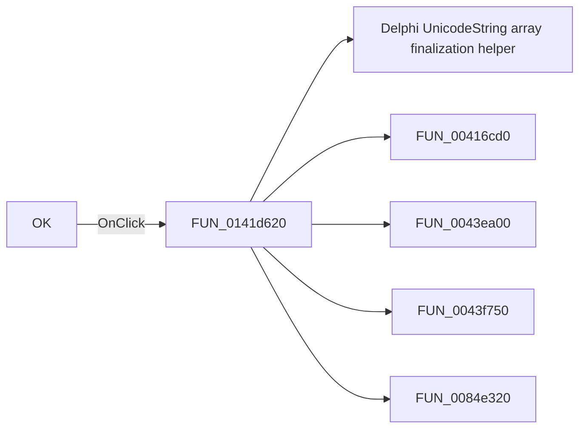

# OK

> Analysis status: Pending individual source review.

## Control

| Property | Recovered value |
| --- | --- |
| Form | ExtraAttrsEditorDlg |
| Component path | ExtraAttrsEditorDlg.OKBtn |
| Control class | TBitBtn |
| Caption | OK |
| Hint | Not present in the recovered resource. |
| Text | Not present in the recovered resource. |
| Handler name | OKBtnClick |
| Handler address | 0141d620 |
| Graph node | `resource:dfm:ExtraAttrsEditorDlg/ExtraAttrsEditorDlg.OKBtn` |
| Handler node | `function:0141d620` |
| Graph layer | UI |

## What happens when clicked

Pending individual analysis. An agent must read the recovered handler source and its relevant callees before it replaces this text.

## Click flow

## Handler evidence

- Source: [DecompiledSources/Tina16/functions/000000000141D620__FUN_0141d620.c](../../../DecompiledSources/Tina16/functions/000000000141D620__FUN_0141d620.c)
- Recovered role: Not present in the recovered resource.
- Current graph summary: Handles 1 Delphi UI event: ExtraAttrsEditorDlg.OKBtn.OnClick.
- Current graph behavior: Not present in the recovered resource.
- Current graph evidence: Not present in the recovered resource.
- Complexity: complex
- Distinct outgoing calls: 5

## Direct calls

- `function:00414560` — Delphi UnicodeString array finalization helper
- `function:00416cd0` — FUN_00416cd0
- `function:0043ea00` — FUN_0043ea00
- `function:0043f750` — FUN_0043f750
- `function:0084e320` — FUN_0084e320

## Resource evidence

- Kind: Not present in the recovered resource.
- Modal result: Not present in the recovered resource.
- Checked state: Not present in the recovered resource.
- List items: Not present in the recovered resource.
- Image reference: Not present in the recovered resource.
- Extracted glyph: [`0147_ExtraAttrsEditorDlg_ExtraAttrsEditorDlg_OKBtn_Glyph_Data.png`](../../../glyph/0147_ExtraAttrsEditorDlg_ExtraAttrsEditorDlg_OKBtn_Glyph_Data.png)

## Nearby label candidates

Nearby labels are layout candidates only. They are not proof of behavior.

- No same-parent label candidate is available.

## Analysis limits

- Do not infer behavior from the control class, caption, hint, glyph, or nearby label alone.
- Do not replace the pending status until the handler source and relevant call path provide enough evidence.
