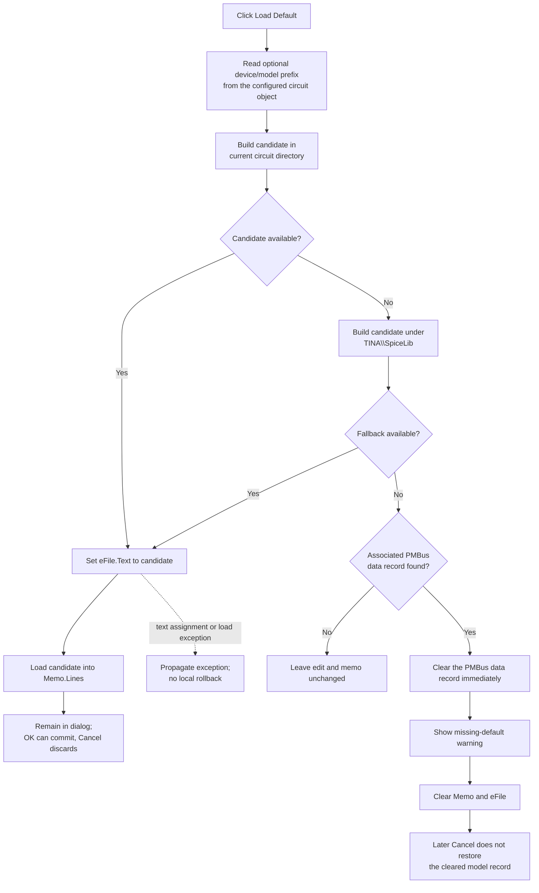

# Load the device's default PMBus data file

> Analysis status: Reviewed from recovered source, caller, form, and PMBus data-record evidence.

## Control

| Property | Recovered value |
| --- | --- |
| Form | `FileSelect` (`TFileSelect`) |
| Component path | `FileSelect.bDefault` |
| Control class | `TButton` |
| Caption | `Load Default` |
| Hint | Not present in the recovered resource. |
| Handler name | `bDefaultClick` |
| Handler address | `0142a7b0` |
| Graph node | `resource:dfm:FileSelect/FileSelect.bDefault` |
| Handler node | `function:0142a7b0` |
| Graph layer | UI |

The resource has no glyph, image, action, or hint. The nearby `File` label identifies the edit beside the button, but the handler's path construction and PMBus calls establish the default-file behavior.

## What happens when clicked

`FUN_0142a7b0` searches for a device-specific `_default_data_file.txt`, then loads the first available file into the dialog. It does not open `OpenDialog` or ask the user for a path.

The handler first derives an optional filename prefix from the configured circuit/device object at form field `+0x710`. If `FUN_01d3f2a0` reports that the object has the recovered attached-data feature, the handler copies the nested string at `object.+0x1a8 -> +0x38`. Other recovered consumers compare that string with PMBus-related device identifiers such as `IR3806`, `IR3826`, `TDA3864`, and `TPS546D24`. If the feature is absent, the prefix remains empty.

It then constructs and tests these candidates in order:

1. `<current circuit directory>\<device string>_default_data_file.txt`
2. `<TINA installation directory>\SpiceLib\<device string>_default_data_file.txt`

`FUN_00441640` extracts the directory from the global current circuit filename. The fallback root is the global TINA directory: other recovered paths use the same root for `TINA.CHM`, `Examples`, and `<TINADIR>\SpiceLib`. With no device string, the literal filename is `_default_data_file.txt`, including its leading underscore.

`FUN_00440a20(candidate, 1)` performs the availability test. The installation `SpiceLib` candidate is tested only when the circuit-directory candidate is unavailable.

## Successful load

When either candidate passes the test, the handler performs these operations in order:

1. It assigns the complete candidate path to `eFile` at form field `+0x6b8`.
2. It invokes `Memo.Lines.LoadFromFile(candidate)` through the strings object at `Memo.+0x4d8`.

This immediately reads and replaces the preview text in the dialog. It does not write the source file, update the associated PMBus record, close the form, or set a modal result.

The change is staged for the dialog's OK path. `OKClick` later validates a non-empty `eFile`, saves the memo to a temporary `pmbus` input, parses it, and publishes the selected path through form field `+0x730`. The caller accepts those outputs only when `ShowModal` returns `mrOK` and the published path is non-empty. Cancel therefore discards a successful default load from the caller's commit path.

## Both default files unavailable

If neither candidate passes the availability test, the handler calls `FUN_0160d750` to find the PMBus data-file record associated with the configured object. There are two distinct outcomes:

- If no record is found, the click is a silent no-op. Existing `eFile` and `Memo` content remain unchanged.
- If a record is found, `FUN_01773d60` clears it immediately. The handler then reports `PMBus data file cleared because file not found:` with the requested default filename, clears `Memo`, and clears `eFile`.

The record reset is not staged in the dialog. `FUN_01773d60` zeros the nested record flags and calls the shared reset routine, which restores name `noname` and clears the record-owned collections and payload. This mutation occurs before any OK or Cancel decision. Closing with Cancel cannot restore it through the recovered caller.

## Default-load flow

## Repeated, guard, and error behavior

- There is no unchanged-content or dirty-preview guard. A repeated click reloads the available default file and replaces any edits currently in `Memo`.
- There is no explicit empty current-circuit-path guard. The extracted directory can be empty, in which case the first constructed candidate is relative.
- An unavailable or inaccessible first candidate causes the fallback test. If both tests fail, the result depends only on whether the associated PMBus record can be found.
- The handler has no local exception handler or rollback. It assigns `eFile` before it loads `Memo.Lines`, so a load exception can leave the path edit changed while the resulting memo state is not established by this function.
- The record reset, warning, memo clear, and edit clear occur in that order. An exception after the reset can leave the model cleared while later UI cleanup is incomplete.
- The handler does not test for a null form control or strings object. Those references are expected to exist from DFM construction.

## Evidence

- [Default handler `FUN_0142a7b0`](../../../DecompiledSources/Tina16/functions/000000000142A7B0__FUN_0142a7b0.c) builds the two candidates, tests them in order, updates `eFile`, loads `Memo.Lines`, or runs the missing-file reset path.
- [Path-directory helper `FUN_00441640`](../../../DecompiledSources/Tina16/functions/0000000000441640__FUN_00441640.c) returns the directory portion used for the first candidate. Its recursive directory-creation callers use the same result as a parent path.
- [File availability helper `FUN_00440a20`](../../../DecompiledSources/Tina16/functions/0000000000440A20__FUN_00440a20.c) checks file attributes and, for the true flag used here, file openability.
- [Equation Editor Open handler `FUN_01463b00`](../../../DecompiledSources/Tina16/functions/0000000001463B00__FUN_01463b00.c) uses the same `TStrings` virtual slot `+0xd8` to load an accepted file, independently identifying the FileSelect call as `Memo.Lines.LoadFromFile`.
- [PMBus feature test `FUN_01d3f2a0`](../../../DecompiledSources/Tina16/functions/0000000001D3F2A0__FUN_01d3f2a0.c) checks the nested object and its feature byte before the handler reads the device string.
- [Device-name consumers `FUN_0160bff0`](../../../DecompiledSources/Tina16/functions/000000000160BFF0__FUN_0160bff0.c) and [`FUN_0160c160`](../../../DecompiledSources/Tina16/functions/000000000160C160__FUN_0160c160.c) use the same nested string for named device-family tests.
- [Associated-record locator `FUN_0160d750`](../../../DecompiledSources/Tina16/functions/000000000160D750__FUN_0160d750.c) uses key `ifsz_v` under the configured object's attached data and returns the record that FormShow and the missing-file branch consume.
- [Record clear helper `FUN_01773d60`](../../../DecompiledSources/Tina16/functions/0000000001773D60__FUN_01773d60.c) zeros the record flags and invokes its reset routine.
- [Record reset `FUN_010afec0`](../../../DecompiledSources/Tina16/functions/00000000010AFEC0__FUN_010afec0.c) restores `noname` and clears record-owned state. [Record publication `FUN_017738b0`](../../../DecompiledSources/Tina16/functions/00000000017738B0__FUN_017738b0.c) is the inverse path that resets, sets the present flag, and stores parsed data.
- [FormShow `FUN_0142a2f0`](../../../DecompiledSources/Tina16/functions/000000000142A2F0__FUN_0142a2f0.c) clears the memo, then fills the memo and `eFile` from an existing associated record. This confirms the dialog fields' roles.
- [`FUN_01197d10`](../../../DecompiledSources/Tina16/functions/0000000001197D10__FUN_01197d10.c) invokes control VMT slot `+0x298` before repopulating that control's lines, independently supporting the `Memo.Clear` identification.
- [OK handler `FUN_0142a3e0`](../../../DecompiledSources/Tina16/functions/000000000142A3E0__FUN_0142a3e0.c) parses non-empty staged text and publishes the path. [Caller `FUN_01432f40`](../../../DecompiledSources/Tina16/functions/0000000001432F40__FUN_01432f40.c) commits those outputs only after `mrOK` and a non-empty published path.
- [Cancel handler `FUN_0142a140`](../../../DecompiledSources/Tina16/functions/000000000142A140__FUN_0142a140.c) does not restore a cleared record. The canonical FileSelect lifecycle annotations belong to `TIARA-diz.6.7.497`.
- [Recovered UI evidence](../../../DecompiledSources/Tina16/resources/dfm/ui-evidence.json) supplies the form tree, caption, component classes, event binding, `eFile`, read-only `Memo`, dialogs, and lack of glyph or hint.

## Direct calls

- `function:00441640` - extracts the current circuit directory.
- `function:00440a20` - tests each candidate file.
- `function:0064de00` - assigns or clears `eFile` text.
- `function:0160d750` - finds the associated PMBus data record.
- `function:01773d60` - clears that record when both candidates are unavailable.
- `function:0072d440` - reports the missing-default warning.
- `function:01d3f2a0` - gates use of the optional device/model prefix.
- `Memo.Lines.LoadFromFile` and `Memo.Clear` - indirect VMT calls that load or clear the preview.
- `function:00414480`, `function:00414560`, `function:00414b50`, and `function:00416cd0` - Delphi string lifetime, assignment, and concatenation support.

## Persistence boundary

A successful click reads a file and changes only the live dialog controls. The caller changes the PMBus model only after OK; this handler does not save the circuit, write settings, or update the registry. The missing-file record reset is the exception: it mutates the live PMBus model immediately and survives Cancel, although no persistent file write occurs in this path.

## Annotation ownership

This Bead owns `FUN_0142a7b0` and its unique PMBus record-clear helper `FUN_01773d60`. The shared record locator, feature test, path and file helpers, warning/VCL methods, caller, OK path, and lifecycle functions are evidence-only and keep separate canonical ownership.

## Analysis limits

- The nested string is proven to form the filename prefix and to identify named device families. Its original Delphi field name is not recovered.
- The availability helper combines attribute and openability checks. The handler does not expose which specific filesystem failure rejected a candidate.
- No local catch surrounds `Memo.Lines.LoadFromFile`, so source alone does not establish the memo's exact contents after a mid-load exception.
