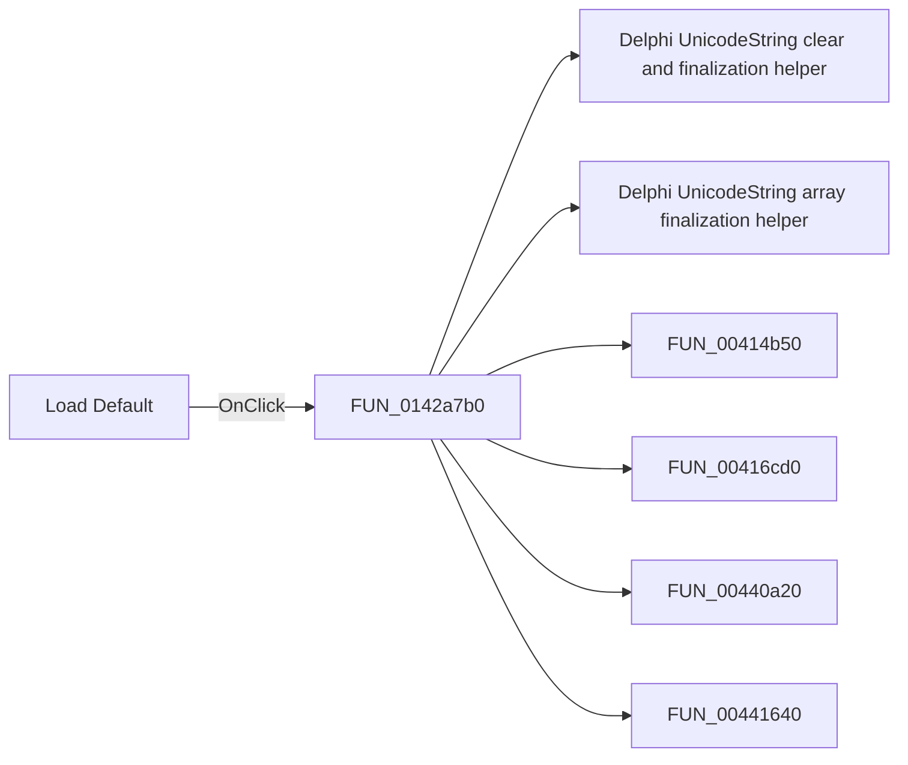

# Load Default

> Analysis status: Pending individual source review.

## Control

| Property | Recovered value |
| --- | --- |
| Form | FileSelect |
| Component path | FileSelect.bDefault |
| Control class | TButton |
| Caption | Load Default |
| Hint | Not present in the recovered resource. |
| Text | Not present in the recovered resource. |
| Handler name | bDefaultClick |
| Handler address | 0142a7b0 |
| Graph node | `resource:dfm:FileSelect/FileSelect.bDefault` |
| Handler node | `function:0142a7b0` |
| Graph layer | UI |

## What happens when clicked

Pending individual analysis. An agent must read the recovered handler source and its relevant callees before it replaces this text.

## Click flow

## Handler evidence

- Source: [DecompiledSources/Tina16/functions/000000000142A7B0__FUN_0142a7b0.c](../../../DecompiledSources/Tina16/functions/000000000142A7B0__FUN_0142a7b0.c)
- Recovered role: Not present in the recovered resource.
- Current graph summary: Handles 1 Delphi UI event: FileSelect.bDefault.OnClick.
- Current graph behavior: Not present in the recovered resource.
- Current graph evidence: Not present in the recovered resource.
- Complexity: complex
- Distinct outgoing calls: 11

## Direct calls

- `function:00414480` — Delphi UnicodeString clear and finalization helper
- `function:00414560` — Delphi UnicodeString array finalization helper
- `function:00414b50` — FUN_00414b50
- `function:00416cd0` — FUN_00416cd0
- `function:00440a20` — FUN_00440a20
- `function:00441640` — FUN_00441640
- `function:0064de00` — VCL control text setter with change suppression
- `function:0072d440` — FUN_0072d440
- `function:0160d750` — FUN_0160d750
- `function:01773d60` — FUN_01773d60
- `function:01d3f2a0` — FUN_01d3f2a0

## Resource evidence

- Kind: Not present in the recovered resource.
- Modal result: Not present in the recovered resource.
- Checked state: Not present in the recovered resource.
- List items: Not present in the recovered resource.
- Image reference: Not present in the recovered resource.
- Extracted glyph: None.

## Nearby label candidates

Nearby labels are layout candidates only. They are not proof of behavior.

- Rank 1: File at distance 56.

## Analysis limits

- Do not infer behavior from the control class, caption, hint, glyph, or nearby label alone.
- Do not replace the pending status until the handler source and relevant call path provide enough evidence.
