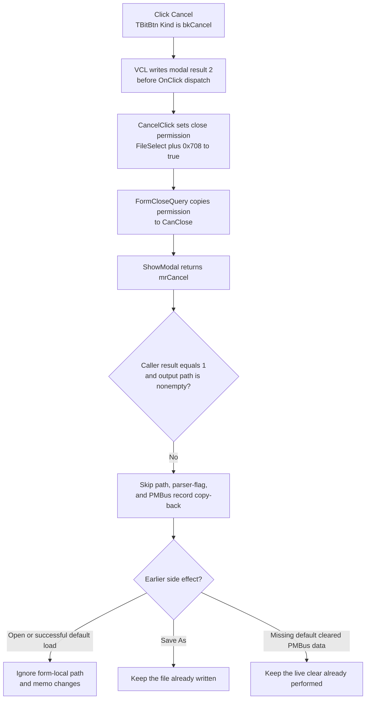

# Cancel without applying the staged file selection

> Analysis status: Complete. The recovered handler, VCL button path, close query, modal caller, and sibling file commands establish the result, staging, retained-side-effect, and ownership boundaries.

## Control

| Property | Recovered value |
| --- | --- |
| Form | FileSelect |
| Form caption | Select File |
| Component path | FileSelect.Cancel |
| Control class | TBitBtn |
| Button kind | bkCancel |
| Framework modal result | 2 (`mrCancel`) |
| Handler name | CancelClick |
| Handler address | 0142a140 |
| Graph node | `resource:dfm:FileSelect/FileSelect.Cancel` |
| Handler node | `function:0142a140` |
| Graph layer | UI |

## What happens when clicked

The recovered application handler performs one operation:

`FileSelect + 0x708 := true`

`FUN_0142a150`, the form's `OnCloseQuery` handler, copies this private byte to the VCL `CanClose` output. The Cancel click therefore permits the pending modal close. The handler does not read or clear the selected path, memo lines, source object, output path, or parsing flags.

The DFM gives the button `Kind = bkCancel`. The recovered VCL kind table maps `bkCancel` to modal result `2`, and the inherited button-click path writes that result to the parent form before it dispatches `CancelClick`. After the handler sets the close-permission byte, `FormCloseQuery` returns true and the modal interaction ends with `mrCancel`.

The handler does not call a close method itself. It relies on the nonzero result that the inherited `TBitBtn` path already placed on the form.

## Staged controls and output fields

`FileSelect` separates the visible working state from the values that its caller consumes:

- `eFile` contains the currently displayed source path.
- The read-only `Memo.Lines` contains the loaded data-file text.
- The private UnicodeString at `+0x730` is the accepted output path. `FormCreate` initializes it to empty, and only `OKClick` copies `eFile.Text` into it.
- The 32-bit values at `+0x728` and `+0x72c` are parser result flags. `FormCreate` initializes both to zero; the OK path supplies them to the PMBus-processing routine.

`FormShow` can seed `eFile` and `Memo.Lines` from the existing PMBus data object. The Open command can replace both controls from a selected file. A successful Load Default can also replace both controls from a discovered default file. These are form-local working changes unless another command performs an external side effect.

Cancel does not erase these controls or fields. It closes the modal session, and the caller does not consume them for modal result `2`. This is rejection by skipping the accepted copy-back path, not an inverse edit operation.

## Caller mutation boundary

`FUN_01432f40` creates `TFileSelect`, supplies its source object and selector, and calls `ShowModal`. After the modal call returns, it requires both conditions below before it applies a selection:

1. the modal result is `1` (`mrOK`); and
2. the private output path at `+0x730` is nonempty.

Only that accepted branch reads the two parser flags, copies the derived output path to its own field at `+0x78`, and updates the live PMBus data object with the selected path and flags. Result `2` fails the first test. Therefore, a normal Cancel does not replace the caller path, apply the staged memo contents, write the parser flags to the PMBus object, or call the accepted PMBus update functions.

The Cancel handler does not restore caller state because the caller-owned path and normal PMBus record have not yet been changed by the staged Open or successful-default paths.

## Side effects that Cancel does not roll back

Two sibling commands cross the staging boundary before the outer dialog closes:

- **Save As...** writes the current `Memo.Lines` immediately to the path accepted in `SaveDialog`. A later Cancel does not delete that file, restore an overwritten file, or roll back a partial write.
- **Load Default** searches a circuit-specific default and then a `SpiceLib` default. If neither file exists and a live PMBus data object is available, it calls `FUN_01773d60`, clears that object's data-present flags, resets its associated data containers, displays the message `PMBus data file cleared because file not found: ...`, and clears the visible path and memo. That live clear has already happened and survives a later Cancel.

The Open command only reads a selected file into the controls; Cancel does not modify that source file. The normal successful-default path also reads a file into the controls without applying it to the caller's PMBus object.

## Modal flow and retained effects

## Ownership and cleanup

The custom Cancel handler allocates and releases nothing. The modal caller creates `TFileSelect` with the application-global object as its Delphi owner. In the recovered FileSelect branch, the caller does not call the form destructor after `ShowModal` returns. Thus, Cancel ends the modal use but does not directly destroy or free the form; later lifetime management remains with its owner and the VCL.

The caller's local UnicodeStrings are finalized on both accepted and cancelled paths. That local cleanup does not apply the staged selection and does not undo prior disk or PMBus-object side effects.

## Source evidence

- Cancel handler: [FUN_0142a140](../../../DecompiledSources/Tina16/functions/000000000142A140__FUN_0142a140.c)
- Close-query handler: [FUN_0142a150](../../../DecompiledSources/Tina16/functions/000000000142A150__FUN_0142a150.c)
- Form-state initialization: [FUN_0142a160](../../../DecompiledSources/Tina16/functions/000000000142A160__FUN_0142a160.c)
- Initial control population: [FUN_0142a2f0](../../../DecompiledSources/Tina16/functions/000000000142A2F0__FUN_0142a2f0.c)
- Accepted OK staging: [FUN_0142a3e0](../../../DecompiledSources/Tina16/functions/000000000142A3E0__FUN_0142a3e0.c)
- Immediate Save As operation: [FUN_0142a620](../../../DecompiledSources/Tina16/functions/000000000142A620__FUN_0142a620.c)
- Open into working controls: [FUN_0142a6c0](../../../DecompiledSources/Tina16/functions/000000000142A6C0__FUN_0142a6c0.c)
- Default-file search and live missing-file clear: [FUN_0142a7b0](../../../DecompiledSources/Tina16/functions/000000000142A7B0__FUN_0142a7b0.c)
- PMBus data clear: [FUN_01773d60](../../../DecompiledSources/Tina16/functions/0000000001773D60__FUN_01773d60.c)
- Modal owner and accepted copy-back: [FUN_01432f40](../../../DecompiledSources/Tina16/functions/0000000001432F40__FUN_01432f40.c)
- VCL `TBitBtn.Click`: [FUN_0082b0e0](../../../DecompiledSources/Tina16/functions/000000000082B0E0__FUN_0082b0e0.c)
- VCL inherited modal-button click: [FUN_00687f30](../../../DecompiledSources/Tina16/functions/0000000000687F30__FUN_00687f30.c)
- Recovered form and controls: [ui-evidence.json](../../../DecompiledSources/Tina16/resources/dfm/ui-evidence.json)

## Direct calls

No direct call edge is present. `FUN_0142a140` contains only the close-permission byte write and `return`. The modal-result write occurs in the inherited VCL path before dispatch, and the VCL calls `FormCloseQuery` as part of ending the modal session.

## Resource evidence

- The form caption is `Select File`.
- `Cancel` is a 75 by 25 `TBitBtn` with `Kind = bkCancel` and `TabOrder = 2`.
- The kind supplies the standard Cancel caption, glyph, cancel state, and modal result. The DFM does not store a custom caption, hint, action, image reference, or embedded glyph for this control.
- The nearby `File` label describes `eFile`; it does not add behavior to Cancel.

## Repeated clicks, close alternatives, and errors

- The handler has no branch and writes the same true value on every invocation. A successful first click ends the modal session, so a second click is normally unavailable. If another path dispatches the handler again before exit, the write is idempotent.
- `FormCreate` already initializes the close-permission byte to true. Closing the window without dispatching `CancelClick` can therefore pass the same close query through the separate VCL modal-close path.
- The handler does not validate a path, parse memo text, access a file, show a message, allocate memory, or call code that reports an application error. Its byte write and the close-query copy have no recovered local failure branch.
- Cancel does not catch or recover from an earlier Open, Save As, default-load, or PMBus-update exception. Those sibling handlers have their own file and object failure boundaries.
- The recovered caller proves that result `2` skips normal copy-back. It does not prove when the application owner finally destroys this specific form instance.
