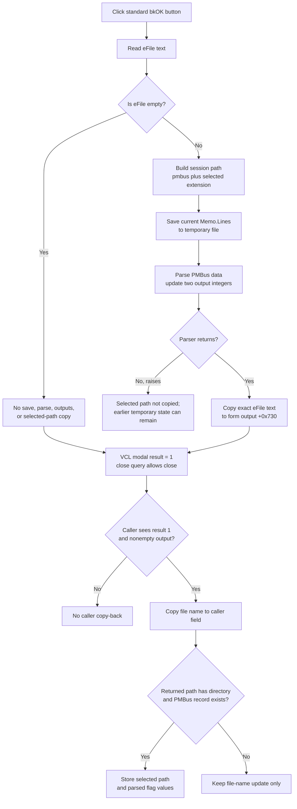

# Accept and parse a PMBus data-file selection

> Analysis status: Complete. The recovered handler, FileSelect lifecycle, file controls, PMBus parser, and only recovered caller establish the accepted-result and copy-back behavior.

## Control

| Property | Recovered value |
| --- | --- |
| Form | FileSelect |
| Form caption | Select File |
| Component path | FileSelect.OK |
| Control class | TBitBtn |
| Button kind | bkOK |
| Caption | Supplied by the standard button kind; not stored separately. |
| Hint | Not present in the recovered resource. |
| Handler name | OKClick |
| Handler address | 0142a3e0 |
| Graph node | `resource:dfm:FileSelect/FileSelect.OK` |
| Handler node | `function:0142a3e0` |
| Graph layer | UI |

## What happens when clicked

`FUN_0142a3e0` reads `FileSelect.eFile`. An empty edit is the handler's only explicit no-op condition. If it is empty, the handler does not save the memo, run the PMBus parser, set the two parse outputs, or copy a selected path to the form's output field.

For nonempty text, the handler prepares and validates the current read-only `Memo` content:

1. It extracts the extension from `eFile`. The standard dialog filters offer `.txt`, `.dat`, `.xsf`, and `.mic`, but OK does not restrict a manually entered extension to that list.
2. It obtains the current VHDL-session working directory.
3. It builds a temporary path from that directory, `\pmbus`, and the extracted extension. For example, a `.dat` selection produces the session's `pmbus.dat` working file. No extension produces a `pmbus` path without a suffix.
4. It saves all current `Memo.Lines` to that temporary path.
5. It initializes the first parse output at form offset `+0x728` to `1` and calls the shared PMBus data-file parser with pointers to outputs `+0x728` and `+0x72c`.
6. Only after the parser returns does it copy the exact current `eFile` text into the form's output string at `+0x730`.

This is a data-file acceptance command, not a folder selector. It does not return the temporary session path. Its path output is the user-facing `eFile` text; the temporary file is an intermediate parser input.

## Path and content validation

OK does not open `eFile`, call a file-existence predicate for it, or compare it with the memo's source. The **Open** speed button owns the normal file-selection path: after an accepted `TOpenDialog`, it copies the chosen file name to `eFile` and loads that file into `Memo.Lines`. The Default command can also load a recovered default file into the same memo.

Because `eFile` is an editable `TEdit`, the user can change it after content was loaded. OK then uses the edited text only as the returned identity and as the source of the temporary file extension. It validates the current memo contents, not the file currently named by the edit. A nonexistent manually typed path can therefore reach parsing if the memo can be saved to the session path. Conversely, an existing source file is not sufficient if the memo is empty, stale, or malformed.

The Save As speed button writes `Memo.Lines` to its own accepted destination but does not update `eFile`. It therefore does not change which path OK returns unless the user also changes the edit.

## Parser result and errors

The shared parser creates a VHDL session, invokes `_PMBUS_ParseDataFile` for the temporary file, and passes the two form fields as output parameters. If parsing fails, it decodes the parser error and raises a localized exception headed **PMBUS Data File:**. The error can identify invalid number format, wrong parameter count, memory exhaustion, a missing image, or another parser error.

The OK handler does not inspect a Boolean parser result because normal failure is raised by that shared path. It has no local catch, validation message, retry, cleanup, or rollback. The temporary file is already written before parsing. A save failure leaves the old form output string unchanged. A parse failure can leave the temporary file and partially written output integers; the exact selected-path copy at `+0x730` has not yet occurred.

There is also no atomic relationship between the temporary-file save, parse outputs, and selected-path copy. An exception after one operation does not restore earlier state.

## Modal result and close query

`OK` is a standard `bkOK` button. Its VCL modal result is `1`, which is the value tested by the recovered caller. The custom handler does not set or clear the modal result.

The `.497`-owned lifecycle initializes the form's close-query byte at `+0x708` to true. `FormCloseQuery` returns that byte, and all recovered writes in this form, including OK and Cancel, set it to true. No recovered path sets it false. Thus, the custom close query does not veto OK, Cancel, or a window close.

This has an important empty-input result: clicking OK with an empty `eFile` can still end the modal dialog with result `1`, but the handler leaves its output path empty. The caller treats that as an accepted no-op because it requires both modal result `1` and a nonempty output string before copy-back.

Cancel is a standard `bkCancel` button with result `2`. Its handler only sets the already-true close-query byte. The caller does not copy any FileSelect outputs for result `2`.

## Caller copy-back and mode boundary

The only recovered caller is `FUN_01432f40`. It has two modes:

| Caller mode | Selection UI | Result use |
| --- | --- | --- |
| `0` | Creates and shows `FileSelect` for a PMBus data file. | Processes FileSelect output only for modal result `1` and a nonempty selected-path string. |
| `1` | Bypasses FileSelect and creates a separate JPEG `TOpenDialog`. | Loads the accepted `.jpg` path directly into the caller's image state. |

There is no folder mode in FileSelect. Mode `1` is also a file selection, but it uses another dialog and does not call this OK handler.

For mode `0`, the caller supplies the target object and VHDL-session directory before `ShowModal`. After accepted nonempty output, it:

1. reads the two PMBus parse outputs;
2. extracts the file name from the returned path and assigns it to the caller's displayed/stored file-name field;
3. extracts the directory from the returned path; and
4. if that directory is nonempty and the target PMBus record exists, writes the selected path and the two parsed flag values into that record.

A relative path with no directory can therefore update the caller's file-name field but skip the PMBus-record update. This is a proven partial copy-back boundary. The caller does not copy the read-only memo or the temporary session path.

## Click flow

## Source evidence

- OK handler: [FUN_0142a3e0](../../../DecompiledSources/Tina16/functions/000000000142A3E0__FUN_0142a3e0.c)
- FileSelect form initialization: [FUN_0142a160](../../../DecompiledSources/Tina16/functions/000000000142A160__FUN_0142a160.c)
- FileSelect close query: [FUN_0142a150](../../../DecompiledSources/Tina16/functions/000000000142A150__FUN_0142a150.c)
- Cancel handler: [FUN_0142a140](../../../DecompiledSources/Tina16/functions/000000000142A140__FUN_0142a140.c)
- VCL `TBitBtn.Click`: [FUN_0082b0e0](../../../DecompiledSources/Tina16/functions/000000000082B0E0__FUN_0082b0e0.c)
- VCL inherited modal-button click: [FUN_00687f30](../../../DecompiledSources/Tina16/functions/0000000000687F30__FUN_00687f30.c)
- Open-file control: [FUN_0142a6c0](../../../DecompiledSources/Tina16/functions/000000000142A6C0__FUN_0142a6c0.c)
- Save As control: [FUN_0142a620](../../../DecompiledSources/Tina16/functions/000000000142A620__FUN_0142a620.c)
- Default-file control: [FUN_0142a7b0](../../../DecompiledSources/Tina16/functions/000000000142A7B0__FUN_0142a7b0.c)
- File-extension extractor: [FUN_00441a10](../../../DecompiledSources/Tina16/functions/0000000000441A10__FUN_00441a10.c)
- VHDL-session working-directory builder: [FUN_015fcb30](../../../DecompiledSources/Tina16/functions/00000000015FCB30__FUN_015fcb30.c)
- Shared PMBus parser: [FUN_0160c650](../../../DecompiledSources/Tina16/functions/000000000160C650__FUN_0160c650.c)
- Mode switch and accepted-result copy-back: [FUN_01432f40](../../../DecompiledSources/Tina16/functions/0000000001432F40__FUN_01432f40.c)
- File-name extractor: [FUN_00441920](../../../DecompiledSources/Tina16/functions/0000000000441920__FUN_00441920.c)
- Directory extractor: [FUN_00441710](../../../DecompiledSources/Tina16/functions/0000000000441710__FUN_00441710.c)
- PMBus-record path writer: [FUN_017738b0](../../../DecompiledSources/Tina16/functions/00000000017738B0__FUN_017738b0.c)
- PMBus-record flag writer: [FUN_01773b00](../../../DecompiledSources/Tina16/functions/0000000001773B00__FUN_01773b00.c)
- Recovered form and controls: [ui-evidence.json](../../../DecompiledSources/Tina16/resources/dfm/ui-evidence.json)

## Resource evidence

- `FileSelect` is captioned **Select File**. Its `eFile` edit is labeled **File**.
- `OK` has `Kind = bkOK`, two standard glyph states, no custom caption, and no extracted custom glyph.
- The form contains `TOpenDialog` and `TSaveDialog` components. It contains no directory-list, shell-tree, or folder-picker component.
- Both dialogs are initialized with the filter `Text File (*.txt)|*.txt|Dat File (*.dat)|*.dat|XSF File (*.xsf)|*.xsf|MIC File (*.mic)|*.mic`.
- `Memo` is read-only. Its content is loaded by OnShow, Open, or Default and is the data serialized and parsed by OK.

## Limits

- The original Delphi field names at offsets `+0x708`, `+0x728`, `+0x72c`, and `+0x730` are not recovered. Their close-query, parser-output, and selected-path roles follow from all writes and readers.
- The recovered C does not expose the exact text encoding selected by the memo's one-argument `SaveToFile` virtual call. It uses the line collection's current or runtime-default encoding.
- The shared parser is used outside this form and is evidence-only here. Bead `.497` owns the FileSelect lifecycle. Beads `.499`, `.500`, and `.501` own Default, Save As, and Open. This fragment owns only `FUN_0142a3e0`.
