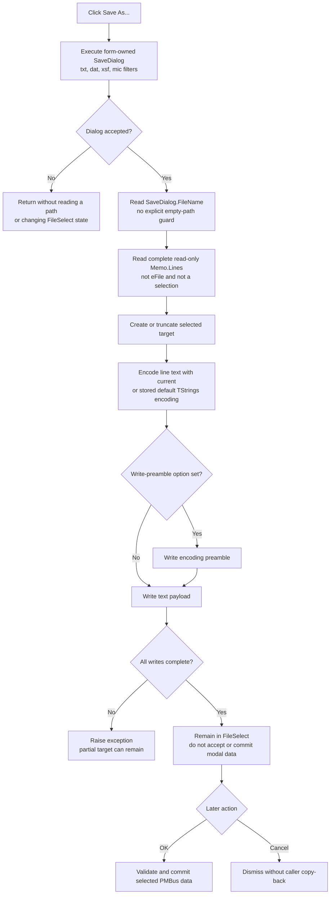

# Save As...

> Analysis status: Complete. The recovered handler, form setup, memo-loading paths, VCL text serializer, and modal caller support this explanation.

## Control

| Property | Recovered value |
| --- | --- |
| Form | FileSelect |
| Form caption | Select File |
| Component path | FileSelect.sbSaveAs |
| Control class | TSpeedButton |
| Caption | Not present in the recovered resource. |
| Hint | Save As... |
| Handler name | sbSaveAsClick |
| Handler address | 0142a620 |
| Graph node | `resource:dfm:FileSelect/FileSelect.sbSaveAs` |
| Handler node | `function:0142a620` |
| Graph layer | UI |

## What happens when clicked

`FUN_0142a620` executes the form-owned `TSaveDialog`. If the user accepts, it reads `SaveDialog.FileName` and immediately passes that path to the one-argument `SaveToFile` method of `FileSelect.Memo.Lines`.

The command saves the complete text currently displayed in the read-only memo. It does not save only a selected range, copy the source file byte for byte, or serialize the `File` edit's path. The memo can contain data loaded from three paths:

- the current PMBus data object when the form is shown;
- a file selected with the neighboring Open speed button;
- a resolved `_default_data_file.txt` loaded with the neighboring Load Default button.

The Save As handler does not care which source populated the memo. It writes the memo's current line collection as it exists when the user clicks the button.

## Save-dialog defaults

The FileSelect creation handler, canonically owned by Bead `.497`, configures both the Open and Save dialogs. The Save dialog receives these values:

| Setting | Recovered value |
| --- | --- |
| Default extension | `txt` |
| Filter 1 | `Text File (*.txt)` |
| Filter 2 | `Dat File (*.dat)` |
| Filter 3 | `XSF File (*.xsf)` |
| Filter 4 | `MIC File (*.mic)` |
| Suggested file name | Not assigned by the DFM, creation handler, or click handler. |
| Initial directory | Not assigned by the DFM, creation handler, or click handler. |
| Options | Not assigned by the DFM or recovered FileSelect setup. |

The click handler does not reset `FileName`, `FilterIndex`, `DefaultExt`, or `InitialDir` before each execution. The form-owned dialog can therefore keep its in-memory filename or filter state between invocations. The handler does not copy that state to an application setting.

Selecting TXT, DAT, XSF, or MIC does not choose a different application writer. The handler never reads `FilterIndex` or the output extension. All four choices use the same `Memo.Lines.SaveToFile` call. The filter changes the dialog's file choice; it does not prove a format conversion.

## Text format and encoding

The recovered VCL path for the one-argument `TStrings.SaveToFile` call provides the byte behavior:

1. `FUN_004b4900` forwards the line collection's current encoding object.
2. `FUN_004b4920` creates or truncates the selected path with stream mode `0xFF00`.
3. `FUN_004b49c0` gets the complete memo-line text and encodes it. If the current encoding is null, it uses the line collection's stored default encoding.
4. If the line collection requests a preamble, the serializer writes the encoding preamble before the text payload.
5. The stream writer continues short writes and raises if writing fails or stops making progress.

The FileSelect handler does not force UTF-8, UTF-16, an ANSI code page, a byte-order mark, or a different encoding for DAT, XSF, or MIC. A prior `Memo.Lines.LoadFromFile` can affect the line collection's current encoding through the paired VCL load path. Therefore, the exact output encoding and preamble depend on the live memo-line state.

An empty memo is valid input to this handler. Acceptance can create an empty file or a file that contains only the selected encoding's preamble.

## Cancel, overwrite, and partial-file behavior

- Cancel skips the filename read and `SaveToFile`. It creates no output and changes no FileSelect selection or caller data.
- The handler does not test whether the accepted `FileName` is empty. A normally accepted Save dialog supplies a path, but an empty value would still be passed to `SaveToFile` and can raise a file-open error.
- The DFM and setup code do not establish `SaveDialog.Options`. The application has no separate file-existence test or overwrite question, so a native overwrite prompt is not proven.
- After acceptance, the stream create mode creates the target or truncates an existing target before text extraction and encoding finish.
- There is no temporary file, backup, atomic rename, retry, rollback, or partial-file deletion.
- A failure after stream creation can leave an empty or truncated file. A failure after the optional preamble or part of the payload can leave a preamble-only or partial file.
- File-open, encoding, allocation, disk-full, and write errors propagate through the Delphi runtime. The click handler has no local exception handler, error message, success message, or returned status.

## FileSelect and caller state

Save As is an export from the current preview. It is not the form's acceptance action:

- It does not change the `File` edit, reload the memo, select the exported path as the new source, or parse the output.
- It does not set the FileSelect close-query flag, the PMBus parse-result fields, the accepted path field at form offset `+0x730`, or a modal result.
- It does not close or hide the modal form. After a successful save, the user remains in FileSelect.
- The modal caller reads the accepted path and parsed values only after the user later completes the form with OK. Save As alone does not update the caller-owned PMBus data object.
- The selected output path remains only in the form-owned Save dialog unless another component consumes that dialog state. No INI, registry, recent-file list, source edit, project setting, or PMBus object write occurs in this click path.

## Click flow

## Source evidence

- Save As handler: [FUN_0142a620](../../../DecompiledSources/Tina16/functions/000000000142A620__FUN_0142a620.c)
- FileSelect setup and dialog filters, owned by `.497`: [FUN_0142a160](../../../DecompiledSources/Tina16/functions/000000000142A160__FUN_0142a160.c)
- Initial current-data preview: [FUN_0142a2f0](../../../DecompiledSources/Tina16/functions/000000000142A2F0__FUN_0142a2f0.c)
- Neighboring Open and Load Default paths: [FUN_0142a6c0](../../../DecompiledSources/Tina16/functions/000000000142A6C0__FUN_0142a6c0.c) and [FUN_0142a7b0](../../../DecompiledSources/Tina16/functions/000000000142A7B0__FUN_0142a7b0.c)
- FileSelect OK validation and staged result setup: [FUN_0142a3e0](../../../DecompiledSources/Tina16/functions/000000000142A3E0__FUN_0142a3e0.c)
- Modal caller and accepted-only PMBus copy-back: [FUN_01432f40](../../../DecompiledSources/Tina16/functions/0000000001432F40__FUN_01432f40.c)
- Dialog filename getter: [FUN_00724270](../../../DecompiledSources/Tina16/functions/0000000000724270__FUN_00724270.c)
- One-argument and stream-based `TStrings.SaveToFile`: [FUN_004b4900](../../../DecompiledSources/Tina16/functions/00000000004B4900__FUN_004b4900.c) and [FUN_004b4920](../../../DecompiledSources/Tina16/functions/00000000004B4920__FUN_004b4920.c)
- Encoding and optional-preamble serializer: [FUN_004b49c0](../../../DecompiledSources/Tina16/functions/00000000004B49C0__FUN_004b49c0.c)
- Complete stream-write helper: [FUN_004b8aa0](../../../DecompiledSources/Tina16/functions/00000000004B8AA0__FUN_004b8aa0.c)
- Recovered form, memo, controls, dialogs, and properties: [ui-evidence.json](../../../DecompiledSources/Tina16/resources/dfm/ui-evidence.json)

## Resource and glyph evidence

- `Memo` is a read-only `TMemo`; `eFile` is a separate `TEdit` above it.
- The Save As control is a 23 by 22 `TSpeedButton` with hint `Save As...`, two embedded glyph states, and no caption, action, modal result, or checked state.
- Extracted glyph: [`0149_FileSelect_FileSelect_sbSaveAs_Glyph_Data.png`](../../../glyph/0149_FileSelect_FileSelect_sbSaveAs_Glyph_Data.png). The image contains two floppy-disk states. It supports the save meaning, while the handler and VCL call establish the exported content.
- The nearby `File` label describes the source-path edit. Distance alone does not make that edit the Save As payload; the handler directly reads `Memo.Lines` instead.

## Analysis limits

- The VCL save call is virtual in the click handler. The recovered `TStrings` functions establish its create, encoding, preamble, and write behavior, but the live memo's exact encoding object is not named here.
- No FileSelect source establishes a filter-specific DAT, XSF, or MIC encoder. These extensions can still have meaning to later consumers, but this click writes the same current memo text for every filter.
- The native Save dialog can apply operating-system behavior not represented in the recovered DFM. An overwrite prompt and automatic extension choice beyond the fixed `txt` default are not guaranteed by this evidence.
- Lifecycle handler `FUN_0142a160` remains owned by `.497`; `.500` annotates only the unique Save As handler.
