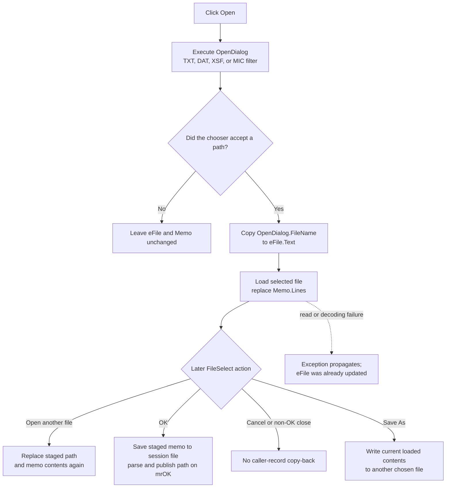

# Choose and load a staged PMBus data file

> Analysis status: Corrected and complete. Cross-tracing the same `TStrings` virtual slot in EquEditor Open and FileSelect Load Default proves that accepted selection replaces `Memo.Lines` with the selected file's contents.

> Correction note: The earlier analysis identified `TStrings` VMT slot `+0xD8` as `Add` and described the selected path as a new memo line. That was incorrect. The slot is `LoadFromFile`; the accepted path is written to `eFile`, then its file contents replace the memo.

## Control

| Property | Recovered value |
| --- | --- |
| Form | FileSelect |
| Form caption | Select File |
| Component path | FileSelect.sbSelect |
| Control class | TSpeedButton |
| Caption | Not present in the recovered resource. |
| Hint | Open |
| Handler name | sbSelectClick |
| Handler address | 0142a6c0 |
| Graph node | `resource:dfm:FileSelect/FileSelect.sbSelect` |
| Handler node | `function:0142a6c0` |
| Graph layer | UI |

## What happens when clicked

`FUN_0142a6c0` executes `FileSelect.OpenDialog`. `FormCreate` configures this dialog with four file filters:

- Text File (`*.txt`)
- Dat File (`*.dat`)
- XSF File (`*.xsf`)
- MIC File (`*.mic`)

The handler does not seed the dialog from the current `eFile` text, set a custom title or initial directory, or change the current filter index. The chooser uses its retained or VCL-default state.

If `Execute` returns false, the handler changes neither `eFile` nor `Memo`. If it returns true, the handler:

1. reads `OpenDialog.FileName`;
2. writes that complete path to `eFile.Text`;
3. reads the edit text back; and
4. calls `Memo.Lines.LoadFromFile` with that path.

The selected file contents replace the read-only memo's prior lines. The handler does not append the path as text, merge the selected file with existing lines, or preserve the earlier memo contents after a successful load.

## Why VMT slot `+0xD8` is LoadFromFile

Three independent call sites establish the virtual method:

- FileSelect Open calls slot `+0xD8` with the accepted `OpenDialog.FileName`.
- FileSelect Load Default calls the same slot with a discovered `_default_data_file.txt` path after an explicit existence check.
- EquEditor Open calls the same slot with an accepted `.teq` path and immediately renders the newly loaded equation.

Each call passes a file-system path to a `TStrings` object. The subsequent behavior requires file contents, not a path stored as one line. By contrast, recovered line-add and line-replacement operations use other virtual slots. This cross-trace corrects the earlier `Add` interpretation.

## Staged path and content

The successful click makes two related form-local changes:

- `eFile.Text` holds the selected source path.
- `Memo.Lines` holds the complete text loaded from that file.

The memo is read-only to keyboard entry, but program code can replace its `Lines` content. A later accepted Open selection replaces both the path and memo contents again. It does not add a duplicate entry or build a multi-file list.

`FormShow` also clears the memo and can populate it from the existing PMBus record before the user selects another file. A successful Open replaces that staged initial content. It does not modify the caller-owned PMBus record directly.

## OK, Cancel, and Save As boundaries

FileSelect is modal. The Open click does not set a modal result or close the form.

- **OK:** For nonempty `eFile`, the `.498`-owned handler writes the current `Memo.Lines` to a VHDL-session `pmbus` working file, parses that staged copy, and stores `eFile` as the selected output path. The owner applies the selected path and parser flags only after modal result `1` and a nonempty output.
- **Cancel:** The standard `bkCancel` result skips the owner's accepted copy-back branch. The loaded source file is not changed, and the newly staged path and memo contents are not applied to the caller-owned PMBus record.
- **Save As:** The `.500`-owned handler can write the current loaded memo contents to a separate accepted destination before the outer modal result. That file-system side effect remains even if FileSelect is later cancelled.
- **Window close:** The `.497`-owned close-query state allows closing. A non-OK modal result does not publish the staged selection.

The Open handler performs a file read but no file write. Its source file remains unchanged.

## Click and later-result flow

## Guards, repeated actions, and errors

- A false `OpenDialog.Execute` result is a normal no-selection path and leaves both controls unchanged.
- After acceptance, the handler has no separate empty-path, extension, existence, size, or encoding validation. The file-dialog configuration and `LoadFromFile` own those checks.
- An accepted path that cannot be opened or read raises through the VCL/Delphi exception path. The handler has no local message, retry, alternate encoding, or rollback.
- `eFile.Text` is updated before `LoadFromFile`. If loading raises, the edit can show the new path while the memo retains old content, is cleared, or is partly updated. The recovered path does not establish an atomic restoration guarantee.
- A successful repeated selection replaces the memo with the newly selected file. Selecting the same file again reloads it; it does not append another path line.
- The handler does not parse PMBus syntax. Syntax and semantic validation occur only in the later OK path.
- The one-argument `LoadFromFile` call does not pass an explicit text encoding. The exact decoding follows the recovered VCL `TStrings` default behavior.

## Evidence

- [Open click handler `FUN_0142a6c0`](../../../DecompiledSources/Tina16/functions/000000000142A6C0__FUN_0142a6c0.c) executes `OpenDialog`, updates `eFile`, and calls `Memo.Lines` VMT slot `+0xD8` with the chosen path.
- [EquEditor Open `FUN_01463b00`](../../../DecompiledSources/Tina16/functions/0000000001463B00__FUN_01463b00.c) calls the same `TStrings` slot with an accepted `.teq` path and then renders the loaded equation.
- [FileSelect Load Default `FUN_0142a7b0`](../../../DecompiledSources/Tina16/functions/000000000142A7B0__FUN_0142a7b0.c) calls the same slot with an existing `_default_data_file.txt` path.
- [Common dialog file-name getter `FUN_00724270`](../../../DecompiledSources/Tina16/functions/0000000000724270__FUN_00724270.c) returns the accepted path.
- [Form initialization `FUN_0142a160`](../../../DecompiledSources/Tina16/functions/000000000142A160__FUN_0142a160.c) applies the TXT, DAT, XSF, and MIC filters. Bead `.497` owns its canonical lifecycle annotation.
- [FileSelect FormShow `FUN_0142a2f0`](../../../DecompiledSources/Tina16/functions/000000000142A2F0__FUN_0142a2f0.c) clears the memo and restores existing PMBus text and path when available.
- [OK handler `FUN_0142a3e0`](../../../DecompiledSources/Tina16/functions/000000000142A3E0__FUN_0142a3e0.c) validates the staged memo and prepares accepted outputs. Bead `.498` owns it.
- [Cancel handler `FUN_0142a140`](../../../DecompiledSources/Tina16/functions/000000000142A140__FUN_0142a140.c) permits the cancel close path. Bead `.497` owns its lifecycle context.
- [Save As handler `FUN_0142a620`](../../../DecompiledSources/Tina16/functions/000000000142A620__FUN_0142a620.c) writes current memo contents to the accepted destination. Bead `.500` owns it.
- [Modal owner `FUN_01432f40`](../../../DecompiledSources/Tina16/functions/0000000001432F40__FUN_01432f40.c) copies outputs only after result `1` and a nonempty selected path.
- [Recovered form and control properties](../../../DecompiledSources/Tina16/resources/dfm/ui-evidence.json) identify the Open dialog, path edit, read-only memo, hint, and event binding.

## Direct calls and annotation ownership

- `function:00724270` reads the accepted file name from the shared VCL dialog.
- `function:0064de00` writes the chosen path to `eFile.Text`.
- `function:0064dd90` reads that displayed path back for `LoadFromFile`.
- The final indirect `TStrings` call at VMT slot `+0xD8` is `LoadFromFile`, as proven by the independent EquEditor Open and FileSelect Default call sites.
- This fragment owns only `FUN_0142a6c0`. Shared dialog, string-list, lifecycle, OK, Cancel, Save As, and PMBus helpers remain evidence-only.

## Resource and glyph evidence

- `sbSelect` is a 23 by 22 `TSpeedButton` with hint **Open**, `ShowHint` enabled, and no caption.
- Its embedded Delphi BMP contains two 16 by 16 button-state frames. It was extracted as a 32 by 16 PNG: [`0148_FileSelect_FileSelect_sbSelect_Glyph_Data.png`](../../../glyph/0148_FileSelect_FileSelect_sbSelect_Glyph_Data.png).
- The glyph depicts an open-folder action. It supports the resource hint; the dialog execution and `LoadFromFile` cross-trace establish the behavior.
- The `File` label identifies the adjacent `eFile` edit. It is not proof of the file-load implementation.

## Analysis limits

- The recovered source does not establish the chooser's current directory at each click. Neither FormCreate nor this handler assigns a custom initial directory.
- A false `Execute` result does not distinguish user cancellation from another non-exception false outcome.
- The recovered VCL body behind the indirect `LoadFromFile` slot is not directly named. Its role is established by three path-taking call sites and their consumers.
- This analysis follows the one recovered modal owner of FileSelect. No folder-selection mode or second FileSelect owner is present in the call graph.
