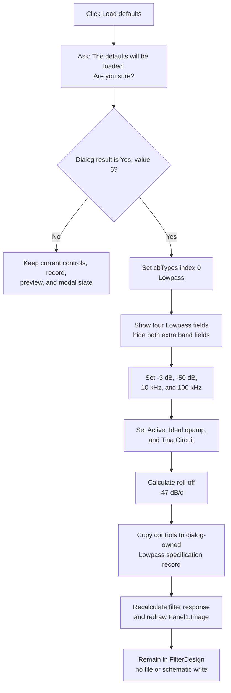

# Confirm and load the Lowpass filter defaults

> Analysis status: Complete. The recovered confirmation handler, type-aware default loader, numeric-editor metadata, dialog-owned specification record, preview path, modal callers, and UI resource support this explanation.

## Control

| Property | Recovered value |
| --- | --- |
| Form | `FilterDesign` (`TFilterDesign`) |
| Form caption | Filter Design |
| Component path | `FilterDesign.bDefaults` |
| Control class | `TButton` |
| Caption | `Load defaults` |
| Hint | Not present in the recovered resource. |
| Handler name | `bDefaultsClick` |
| Handler address | `019d4f40` |
| Graph node | `resource:dfm:FilterDesign/FilterDesign.bDefaults` |
| Handler node | `function:019d4f40` |
| Graph layer | UI |

The button has no glyph, image, action, built-in modal result, or default/cancel state. Its behavior comes from its explicit OnClick handler.

## Confirmation and exact type change

[`FUN_019d4f40`](../../../DecompiledSources/Tina16/functions/00000000019D4F40__FUN_019d4f40.c) first shows this confirmation text:

> The defaults will be loaded. Are you sure?

The dialog returns `6` for **Yes**. Only this result continues. **No**, **Cancel**, closing the question, and every other result leave the type, numeric controls, selector controls, internal record, and preview unchanged.

After **Yes**, the handler sets `cbTypes.ItemIndex` to `0`. The DFM items establish this exact map:

| Index | Filter type |
| ---: | --- |
| 0 | Lowpass |
| 1 | Highpass |
| 2 | Bandpass |
| 3 | Bandstop |

Thus, **Load defaults always changes the dialog to Lowpass**. It does not load the defaults for the type that was selected before the click.

## Values loaded by this button

The handler calls the shared type-aware helper [`FUN_019d5d90`](../../../DecompiledSources/Tina16/functions/00000000019D5D90__FUN_019d5d90.c) with its `load defaults` flag set. Because the handler has already selected index 0, the effective values are:

| Control meaning | Loaded value |
| --- | ---: |
| Passband gain | `-3 dB` |
| Stopband gain | `-50 dB` |
| Passband frequency | `10,000 Hz` |
| Stopband frequency | `100,000 Hz` |
| Active/passive filter | `Active` (index 0) |
| OPAMP type | `Ideal opamp` (index 0) |
| Build target | `Tina Circuit` (index 0) |
| Approximation | Unchanged; the recovered list contains only `Butterworth`. |

The helper installs the Lowpass labels for these four numeric editors and hides and disables the two extra band-frequency editors, their labels, their spin buttons, and the second roll-off-rate display. It does not clear those hidden controls, so values from a prior Bandpass or Bandstop view can remain hidden. They are not copied into the Lowpass specification record.

The helper also configures the current numeric editor metadata:

- passband gain range: `-30` through `-3 dB`;
- stopband gain range: `-300` through `-3 dB`; and
- each visible frequency range: `100` through `1,000,000 Hz`.

The initialized form enables automatic ratio calculation through byte `+0x812`. Therefore, the default load recalculates the visible roll-off value as:

`(-50 - (-3)) / log10(100000 / 10000) = -47 dB/d`

The handler does not validate this value through a separate dialog. The built-in default frequencies are positive and inside their configured ranges.

## Defaults supported by the shared helper

The same helper supports all four type indexes. Type changes call it directly with the default-loading flag, but the **Load defaults** button reaches only the first row because it first forces Lowpass.

| Type | Gain and frequency defaults | Derived rate displays |
| --- | --- | --- |
| Lowpass | Pass `-3 dB`; stop `-50 dB`; pass `10,000 Hz`; stop `100,000 Hz` | Rate 1: `-47 dB/d`; Rate 2 hidden |
| Highpass | Stop `-50 dB`; pass `-3 dB`; stop `10,000 Hz`; pass `100,000 Hz` | Rate 1: `47 dB/d`; Rate 2 hidden |
| Bandpass | Stop `-50 dB`; pass `-3 dB`; stop 1 `1,000 Hz`; pass 1 `20,000 Hz`; pass 2 `40,000 Hz`; stop 2 `100,000 Hz` | Rate 1: `47 / log10(20)`, approximately `36.13 dB/d`; Rate 2: `47 / log10(5)`, approximately `67.24 dB/d` |
| Bandstop | Pass `-3 dB`; stop `-50 dB`; pass 1 `1,000 Hz`; stop 1 `20,000 Hz`; stop 2 `40,000 Hz`; pass 2 `100,000 Hz` | Rate 1: `47 / log10(20)`, approximately `36.13 dB/d`; Rate 2: `47 / log10(5)`, approximately `67.24 dB/d` |

The recovered band-rate code uses the first inner edge and the final outer edge in its second ratio. In Bandpass it divides stop frequency 2 by pass frequency 1; in Bandstop it divides pass frequency 2 by stop frequency 1. It reads the other inner edge but does not use it in that second calculation. The table reports this actual recovered behavior.

The four constant blocks at runtime addresses `01f2bc50`, `01f2bc70`, `01f2bc90`, and `01f2bcc0` contain these IEEE-754 values. [`FUN_0123aad0`](../../../DecompiledSources/Tina16/functions/000000000123AAD0__FUN_0123aad0.c) independently maps the same blocks to type codes `L`, `H`, `P`, and `S` when it initializes a filter specification.

## Dialog-owned model and preview update

After the controls are reset, the click handler calls [`FUN_019d62c0`](../../../DecompiledSources/Tina16/functions/00000000019D62C0__FUN_019d62c0.c). This makes the change more than a visual edit:

1. [`FUN_019d6510`](../../../DecompiledSources/Tina16/functions/00000000019D6510__FUN_019d6510.c) copies the current controls into the dialog-owned specification record at form offset `+0x14c8`. It writes Lowpass type code `L`, the four default values, and the three selector states.
2. [`FUN_019d6380`](../../../DecompiledSources/Tina16/functions/00000000019D6380__FUN_019d6380.c) copies that record into the dialog's filter-calculation object, uses the `Panel1.Image` canvas and dimensions, recalculates the response, and calls the preview drawing path.
3. [`FUN_019d4b00`](../../../DecompiledSources/Tina16/functions/00000000019D4B00__FUN_019d4b00.c) recalculates the roll-off display again from the visible gains and frequencies.

The preview path draws passband and stopband response information. The defaults handler does not modify a schematic, generate the final filter, or write an output file at this point.

## OK, Cancel, and persistence boundary

The reset values are staged inside the modal `TFilterDesign` instance.

- **OK:** the separate `bOK` handler copies the current controls to the same dialog record. The modal caller proceeds only for result `1`, then uses that record to generate the filter. The new-filter workflow can also write `filter_settings.xml` after OK.
- **Cancel:** `bCancel` is a `bkCancel` button with no custom handler. The modal caller does not run filter generation or the settings-file writer. Destruction releases the dialog record and preview object, so the defaults do not replace caller-owned filter data.
- **Load defaults itself:** it does not close the form, assign a modal result, write XML, call Save, change a project dirty flag, or persist a user preference.

The Save button is a separate command. A later explicit Save can persist the then-current values even if the user later cancels the main dialog; that is not an effect of this click.

## Error and partial-state behavior

- The confirmation is the only guard. There is no check for unsaved edits before the question.
- The built-in values do not use the numeric editors' text parser. The handler writes doubles directly through their setters, so the normal `OnError` text-validation route is not expected for these constants.
- The handler does not catch exceptions or test results from the type setter, numeric setters, record copy, filter calculation, or preview drawing.
- Changes are sequential, not transactional. A failure after the type is set can leave Lowpass selected with only some controls reset. A failure after the record copy can leave the dialog record changed without a completed preview.
- A preview or drawing failure has no recovered rollback to the prior values or image. Delphi's outer UI exception handling receives the exception.
- The separate numeric-error flag and `FormCloseQuery` veto still apply to later manual edits and OK. This defaults handler does not set or clear that error flag.

## Click flow

## Evidence

- [Defaults handler `FUN_019d4f40`](../../../DecompiledSources/Tina16/functions/00000000019D4F40__FUN_019d4f40.c) contains the confirmation, exact result-6 guard, forced type index 0, default-loader call with true, and preview-update call.
- [Type-aware UI/default helper `FUN_019d5d90`](../../../DecompiledSources/Tina16/functions/00000000019D5D90__FUN_019d5d90.c) maps indexes 0 through 3 to four or six default fields, resets the three selectors when requested, configures numeric metadata, and recalculates rates.
- [Label and band-control helper `FUN_019d55e0`](../../../DecompiledSources/Tina16/functions/00000000019D55E0__FUN_019d55e0.c) supplies the exact Lowpass, Highpass, Bandpass, and Bandstop labels and controls the extra fields' enabled and visible states.
- [Numeric metadata helper `FUN_019d5b20`](../../../DecompiledSources/Tina16/functions/00000000019D5B20__FUN_019d5b20.c) maps the visible fields to pass-gain, stop-gain, and frequency ranges.
- [Rate calculator `FUN_019d4b00`](../../../DecompiledSources/Tina16/functions/00000000019D4B00__FUN_019d4b00.c) contains the exact per-type gain and frequency formulas. [`FUN_00f12170`](../../../DecompiledSources/Tina16/functions/0000000000F12170__FUN_00f12170.c) fixes the logarithm base at 10.
- [Record copy `FUN_019d6510`](../../../DecompiledSources/Tina16/functions/00000000019D6510__FUN_019d6510.c), [preview coordinator `FUN_019d6380`](../../../DecompiledSources/Tina16/functions/00000000019D6380__FUN_019d6380.c), and [preview renderer `FUN_019d2380`](../../../DecompiledSources/Tina16/functions/00000000019D2380__FUN_019d2380.c) establish staged record mutation and preview regeneration.
- [Form creation `FUN_019d53b0`](../../../DecompiledSources/Tina16/functions/00000000019D53B0__FUN_019d53b0.c) allocates the dialog-owned record and preview object, registers all six numeric controls, loads initial defaults, and enables later automatic rate recalculation.
- [New-filter modal caller `FUN_01c98bf0`](../../../DecompiledSources/Tina16/functions/0000000001C98BF0__FUN_01c98bf0.c) and [existing-filter modal caller `FUN_01a527c0`](../../../DecompiledSources/Tina16/functions/0000000001A527C0__FUN_01a527c0.c) act on the dialog record only after modal result 1. [Form destruction `FUN_019d54a0`](../../../DecompiledSources/Tina16/functions/00000000019D54A0__FUN_019d54a0.c) releases the dialog-owned state.
- [Recovered UI evidence](../../../DecompiledSources/Tina16/resources/dfm/ui-evidence.json) supplies the form, button, four type names, selector items, hidden band controls, preview image, built-in OK and Cancel kinds, and event bindings.

## Annotation ownership

This Bead owns `FUN_019d4f40`, the type-aware defaults/UI helper `FUN_019d5d90`, and the shared staged-record/live-preview refresh wrapper `FUN_019d62c0`. The Load article owns its file reader. The OK article owns the controls-to-record helper. The lower preview calculation, rate, modal-caller, and XML-writer functions are evidence-only here and retain their separate or future canonical ownership.
