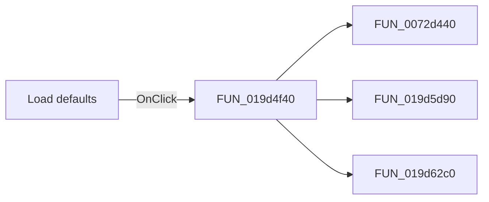

# Load defaults

> Analysis status: Pending individual source review.

## Control

| Property | Recovered value |
| --- | --- |
| Form | FilterDesign |
| Component path | FilterDesign.bDefaults |
| Control class | TButton |
| Caption | Load defaults |
| Hint | Not present in the recovered resource. |
| Text | Not present in the recovered resource. |
| Handler name | bDefaultsClick |
| Handler address | 019d4f40 |
| Graph node | `resource:dfm:FilterDesign/FilterDesign.bDefaults` |
| Handler node | `function:019d4f40` |
| Graph layer | UI |

## What happens when clicked

Pending individual analysis. An agent must read the recovered handler source and its relevant callees before it replaces this text.

## Click flow

## Handler evidence

- Source: [DecompiledSources/Tina16/functions/00000000019D4F40__FUN_019d4f40.c](../../../DecompiledSources/Tina16/functions/00000000019D4F40__FUN_019d4f40.c)
- Recovered role: Not present in the recovered resource.
- Current graph summary: Handles 1 Delphi UI event: FilterDesign.bDefaults.OnClick.
- Current graph behavior: Not present in the recovered resource.
- Current graph evidence: Not present in the recovered resource.
- Complexity: complex
- Distinct outgoing calls: 3

## Direct calls

- `function:0072d440` — FUN_0072d440
- `function:019d5d90` — FUN_019d5d90
- `function:019d62c0` — FUN_019d62c0

## Resource evidence

- Kind: Not present in the recovered resource.
- Modal result: Not present in the recovered resource.
- Checked state: Not present in the recovered resource.
- List items: Not present in the recovered resource.
- Image reference: Not present in the recovered resource.
- Extracted glyph: None.

## Nearby label candidates

Nearby labels are layout candidates only. They are not proof of behavior.

- Rank 1: Label1 at distance 908.
- Rank 2: Approximation: at distance 926.
- Rank 3: Label1 at distance 938.

## Analysis limits

- Do not infer behavior from the control class, caption, hint, glyph, or nearby label alone.
- Do not replace the pending status until the handler source and relevant call path provide enough evidence.
