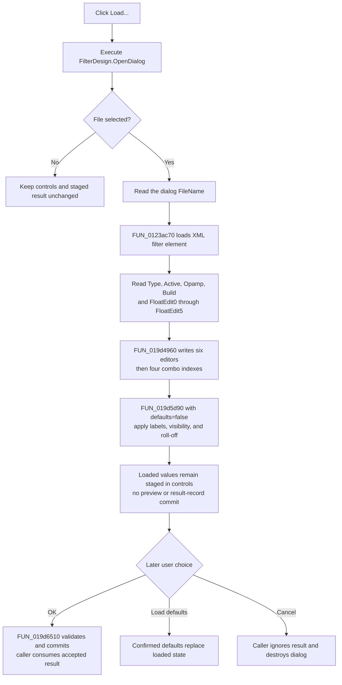

# Load filter settings

> Analysis status: Complete. The recovered Open dialog handler, XML reader, control loader, inverse Save writer, default path, OK path, and modal callers support this explanation.

## Control

| Property | Recovered value |
| --- | --- |
| Form | FilterDesign |
| Component path | FilterDesign.bLoad |
| Control class | TButton |
| Caption | Load... |
| Hint | Not present in the recovered resource. |
| Handler name | bLoadClick |
| Handler address | 019d5000 |
| Graph node | `resource:dfm:FilterDesign/FilterDesign.bLoad` |
| Handler node | `function:019d5000` |
| Graph layer | UI |

## What happens when clicked

`FUN_019d5000` executes the form's `TOpenDialog` at field `+0x798`. Cancel is a no-op. When the user accepts, the handler reads the dialog's complete `FileName` and passes that path unchanged to `FUN_019d4960`.

The handler does not set a file name, initial directory, title, filter, default extension, or overwrite option before it opens the dialog. The recovered DFM evidence identifies the `TOpenDialog`, but it does not expose these optional properties. The selected path can therefore be documented only as the path returned by this dialog. The handler does not normalize it, copy it into a separate FilterDesign field, write it to the registry, or write another file. The `TOpenDialog` itself can keep its accepted `FileName` while the form remains alive.

## File format and parser

The selected file is an XML filter-settings document. `FUN_0123ac70` loads the file, obtains its `filter` element, and reads these attributes into a temporary filter record:

| Attribute | Loaded value |
| --- | --- |
| `Type` | Filter type index: 0 Lowpass, 1 Highpass, 2 Bandpass, or 3 Bandstop. |
| `Active` | Active/passive combo index: 0 Active or 1 Passive. |
| `Opamp` | OPAMP combo index: 0 Ideal opamp or 1 Standard opamp. |
| `Build` | Build-target combo index: 0 Tina Circuit or 1 Tina Macro. |
| `FloatEdit0` through `FloatEdit5` | Up to six gain or frequency values in the form's display order. |

The inverse Save writer, `FUN_019d45b0`, creates the same `filter` element and attribute names. This confirms the format independently of the Load caption. It stores the numeric editor text. The reader converts each nonempty `FloatEditN` attribute to a number with the same engineering-number parser that accepts supported scale suffixes. Loading writes the numeric values back through the `TFloatEdit` value setter, so the controls can reformat the original text.

The parser maps the six displayed values into the type-specific fields of its temporary filter record. The Load helper uses the six parsed display-order values for the six editors. It does not load an approximation choice, roll-off result, preview image, file version, or schema identifier because these are not present in the recovered writer or reader.

Missing or invalid integer attributes use index 0. A missing or empty numeric attribute becomes `0`. The parser has no explicit type-range, combo-range, frequency-order, or gain-range validation. A malformed XML document, missing `filter` element, unreadable file, or numeric-conversion failure can raise through the Delphi XML, file, or conversion code because this path has no local exception handler.

## Changes to the form

Parsing completes into stack-local storage before `FUN_019d4960` changes the form. If file loading or parsing fails before it returns, this helper has not yet changed the controls.

After parsing, `FUN_019d4960` performs these changes in order:

1. It writes `FloatEdit0` through `FloatEdit5` to FilterDesign's six numeric editors.
2. It writes `Type`, `Active`, `Opamp`, and `Build` to the four combo boxes.
3. It calls the `.502`-owned shared mode/default helper with its load-defaults flag set to false.

That final call does not replace the loaded values with defaults. It applies the selected filter type to labels and to the visibility and enabled state of the fifth and sixth numeric inputs. It then recalculates the displayed roll-off rate when the loaded frequencies are usable. Bandpass and Bandstop use all six editors; Lowpass and Highpass hide the last two.

The Load click does not call the filter-model builder or redraw the preview. The controls show the loaded settings, but the dialog-owned filter result at `+0x14c8` still contains its previous value. Thus the controls are the staged state for this modal dialog, not a committed caller result.

## Defaults, OK, and Cancel

- **Load defaults** is separate. After confirmation, it calls the same shared helper with the flag set to true, replaces numeric values with built-in defaults, resets the option combos, updates the dialog-owned filter record, and redraws the preview. It can overwrite values loaded by this button.
- **OK** calls the `.504`-owned commit helper. It reads the current controls, performs the `TFloatEdit` parsing and validation path, maps the values to the selected filter type, and writes the dialog-owned filter result. The built-in OK result then lets the caller use that record.
- **Cancel** has the built-in Cancel behavior and no custom handler. The two recovered modal callers use the FilterDesign result only when `ShowModal` returns 1, then destroy the form. A successful Load followed by Cancel therefore does not transfer the loaded settings to the caller.

The Load button itself has no modal result and does not close the dialog. It also does not save the loaded values as a default or persistent preference.

## Click flow

## Failure and partial-state boundaries

- Open-dialog Cancel performs no read and changes no control.
- The XML parser does not change form controls while it builds its temporary record. A parse failure at this stage preserves the previous controls.
- After parsing, the helper writes six numeric controls before the four combo indexes. It has no rollback. A later setter or mode-update failure can leave a prefix of the loaded state visible.
- Missing integer attributes silently select index 0, and missing numeric attributes load `0`. These defaults can make an incomplete file look like a Lowpass, Active, Ideal-opamp, Tina-Circuit configuration.
- The roll-off calculation skips its update when required frequency values are below its `1e-6` guard. It leaves the earlier displayed roll-off value in place rather than rejecting the load.
- An unsupported type index reaches later combo and mode logic without an explicit Load-side range check. The exact lower-level combo behavior is not recovered; an exception is not caught here.
- The click does not create a backup, keep the previous controls for rollback, or make an atomic application-level transaction.

## Source evidence

- Load button handler: [FUN_019d5000](../../../DecompiledSources/Tina16/functions/00000000019D5000__FUN_019d5000.c)
- Parsed-record to control loader: [FUN_019d4960](../../../DecompiledSources/Tina16/functions/00000000019D4960__FUN_019d4960.c)
- XML filter reader: [FUN_0123ac70](../../../DecompiledSources/Tina16/functions/000000000123AC70__FUN_0123ac70.c)
- Inverse XML writer: [FUN_019d45b0](../../../DecompiledSources/Tina16/functions/00000000019D45B0__FUN_019d45b0.c)
- Shared type/default and label updater: [FUN_019d5d90](../../../DecompiledSources/Tina16/functions/00000000019D5D90__FUN_019d5d90.c)
- Derived roll-off updater: [FUN_019d4b00](../../../DecompiledSources/Tina16/functions/00000000019D4B00__FUN_019d4b00.c)
- OK handler: [FUN_019d6360](../../../DecompiledSources/Tina16/functions/00000000019D6360__FUN_019d6360.c)
- OK commit helper: [FUN_019d6510](../../../DecompiledSources/Tina16/functions/00000000019D6510__FUN_019d6510.c)
- Modal caller with input parameters: [FUN_01a527c0](../../../DecompiledSources/Tina16/functions/0000000001A527C0__FUN_01a527c0.c)
- Modal caller with default parameters: [FUN_01c98bf0](../../../DecompiledSources/Tina16/functions/0000000001C98BF0__FUN_01c98bf0.c)

## Resource evidence

- Caption: **Load...**.
- Dialog component: `FilterDesign.OpenDialog`, class `TOpenDialog`.
- The DFM has no glyph, hint, action, checked state, or modal result for this button.
- The four option combo item lists establish the integer-index meanings in the table above.

## Analysis limits

- The recovered UI evidence does not retain the Open dialog's optional Filter, DefaultExt, InitialDir, Title, or Options properties. This article does not claim an extension restriction that the handler itself does not enforce.
- `.503` owns the annotations for the Load handler, control loader, and XML reader. `.502` owns the shared default/type helper, `.504` owns the OK commit helper, and `.505` owns the inverse XML writer.
