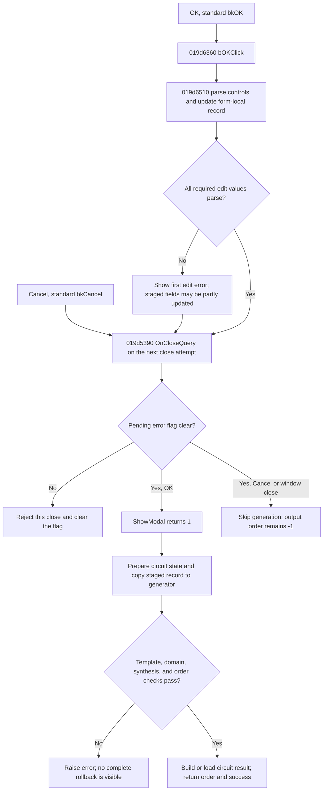

# OK

> Analysis status: Complete. The handler stages the visible filter specification. The modal caller starts filter synthesis only after the form accepts the close request.

## Control

| Property | Recovered value |
| --- | --- |
| Form | `FilterDesign` (`Filter Design`) |
| Component path | `FilterDesign.bOK` |
| Control class | `TBitBtn` |
| Kind | `bkOK` |
| Handler | `TFilterDesign.bOKClick` at `019d6360` |
| Graph nodes | `resource:dfm:FilterDesign/FilterDesign.bOK`, `function:019d6360` |
| Glyph evidence | No extracted glyph. `Kind = bkOK` is the only recovered button-image evidence. |

The DFM does not store a caption, hint, or explicit `ModalResult` for this button. Its standard button kind identifies the OK role, and the recovered event connects it to the application handler.

## Immediate click behavior

`FUN_019d6360` makes one call. It passes the form and its dialog-owned filter record at form offset `+0x14c8` to `FUN_019d6510`. The handler does not run synthesis, copy this record back to the caller, write a settings file, or set `ModalResult` itself.

The collector maps the controls into that staged record as follows:

| Type | Stored type | Gain and frequency mapping |
| --- | --- | --- |
| Lowpass (index 0) | `L` | FloatEdit1/2 are passband/stopband gain; FloatEdit3/4 are passband/stopband frequency. |
| Highpass (index 1) | `H` | FloatEdit2/1 are passband/stopband gain; FloatEdit4/3 are passband/stopband frequency. |
| Bandpass (index 2) | `P` | FloatEdit2 is passband gain; FloatEdit1 is copied to both stopband-gain slots; FloatEdit4/5 are the two passband frequencies; FloatEdit3/6 are the two stopband frequencies. |
| Bandstop (index 3) | `S` | FloatEdit1 is copied to both passband-gain slots; FloatEdit2 is stopband gain; FloatEdit3/6 are the two passband frequencies; FloatEdit4/5 are the two stopband frequencies. |

It also stores the Opamp and Build indexes. Build index 1 selects the macro flag; the other normal choice selects the circuit flag. Active index 0 selects the active flag. The collector then forces Active for Highpass, Bandpass, and Bandstop, so the Passive choice is effective only for Lowpass. It does not read Approximation because the recovered list has only `Butterworth`. The two roll-off controls are derived displays and are not copied by OK.

The record is local to this form. Form creation allocates it, dialog setup copies the caller's specification into it, and form destruction frees it. Field exit handlers can already refresh the same staged record and preview before OK.

## Validation and close decision

Each required `TFloatEdit` getter parses its text as a number. The common edit control rejects values outside `-1e50` through `1e50` and can call an installed validation callback. If parsing or validation raises an exception, `FUN_019d6510` has no catch or rollback. Earlier assignments in the same collection pass can remain in the staged record.

The six FilterDesign error handlers show the first pending edit error and set the form error flag. `FilterDesign.OnCloseQuery` uses that flag. A set flag rejects one close request, including OK, Cancel, or the window close button, and then clears the flag. If the flag is clear, standard `bkOK` processing can return modal result 1. The application click handler does not explicitly close the form.

The OK path does not itself apply the filter-domain limits. Those checks run after modal acceptance in the synthesis engine. For Lowpass and Highpass, the recovered checks accept passband gain from -3.0103 through -0.01 dB, stopband gain from -600 through -3.0103 dB, and frequencies from 1 through 10,000,000,000 Hz. Lowpass rejects a stopband frequency below its passband frequency. Highpass rejects a stopband frequency above its passband frequency. Equality is accepted by these comparisons. The recovered validation function has no equivalent explicit bound block for Bandpass or Bandstop before synthesis; this does not prove that every such specification succeeds.

## Work after modal acceptance

The caller initializes the output filter order to `-1`, opens this dialog, and tests `ShowModal`. Only result 1 enters the design path. The accepted path prepares application circuit state, creates the filter generator, copies the staged dialog record into it, and verifies that the required template is installed. It then converts the generator's frequency copy to angular frequency, calculates the filter, realizes the circuit, writes the filter log, checks the maximum order of 20, and builds or loads the requested TINA circuit or macro result. On success, the caller returns true and copies the generated order to its output value.

This order is important: acceptance commits nothing back to the original input record. It authorizes downstream generation from the dialog-owned copy. The broad circuit-state preparation runs before template and synthesis validation. The order check runs after synthesis and log output but before final circuit export. The visible code has no transaction that restores all earlier work if a later step raises an exception.

## Cancel, errors, and persistence

Cancel is a standard `bkCancel` button with no application click handler. If `OnCloseQuery` allows it, `ShowModal` returns a value other than 1. The caller skips synthesis, leaves the output order at `-1`, and returns false. The form-local edits and preview are then discarded. A pending edit error can veto Cancel once by the same close-query rule.

The recovered downstream errors include a missing filter template, invalid Lowpass or Highpass gains or frequencies, an unsupported implementation marker, synthesis failure, and an order above 20. These errors propagate from the design path. Since work can start before the error, the source does not prove atomic failure or removal of a partial log or circuit result.

OK does not save the specification. It does not call the separate XML settings writer, write preferences, or overwrite the caller's input record. A successful design creates the requested circuit result and returns its order; that is result generation, not settings persistence.

## Control flow

## Evidence

- [OK handler](../../../DecompiledSources/Tina16/functions/00000000019D6360__FUN_019d6360.c) passes the dialog-owned record to the collector.
- [Control-to-record collector](../../../DecompiledSources/Tina16/functions/00000000019D6510__FUN_019d6510.c) proves the type-specific numeric mapping and selector flags.
- [Close query](../../../DecompiledSources/Tina16/functions/00000000019D5390__FUN_019d5390.c) proves the one-attempt error veto and flag reset.
- [Modal caller](../../../DecompiledSources/Tina16/functions/0000000001A527C0__FUN_01a527c0.c) proves the result-1 gate, output-order default, staged-record transfer, and success output.
- [Generator parameter copy](../../../DecompiledSources/Tina16/functions/000000000123BA50__FUN_0123ba50.c) proves the template check and transfer into the synthesis object.
- [Domain and calculation checks](../../../DecompiledSources/Tina16/functions/000000000123BF30__FUN_0123bf30.c) prove the Lowpass and Highpass limits and synthesis-error boundary.
- [Generation coordinator](../../../DecompiledSources/Tina16/functions/000000000123BC40__FUN_0123bc40.c) proves the log, maximum-order check, and final circuit-generation call order.
- [UI evidence](../../../DecompiledSources/Tina16/resources/dfm/ui-evidence.json) provides the form, control kinds, selector items, and event bindings.

## Analysis limits and ownership

- The source does not prove atomic cleanup of downstream log or circuit output after an exception.
- The standard VCL button behavior supplies the modal result; the application handler does not write it.
- TIARA-diz.6.7.502 owns the shared type/default and preview-refresh helpers. TIARA-diz.6.7.503 owns the settings-load path. TIARA-diz.6.7.505 owns the XML settings writer. This analysis cites these boundaries without duplicating their function annotations.
