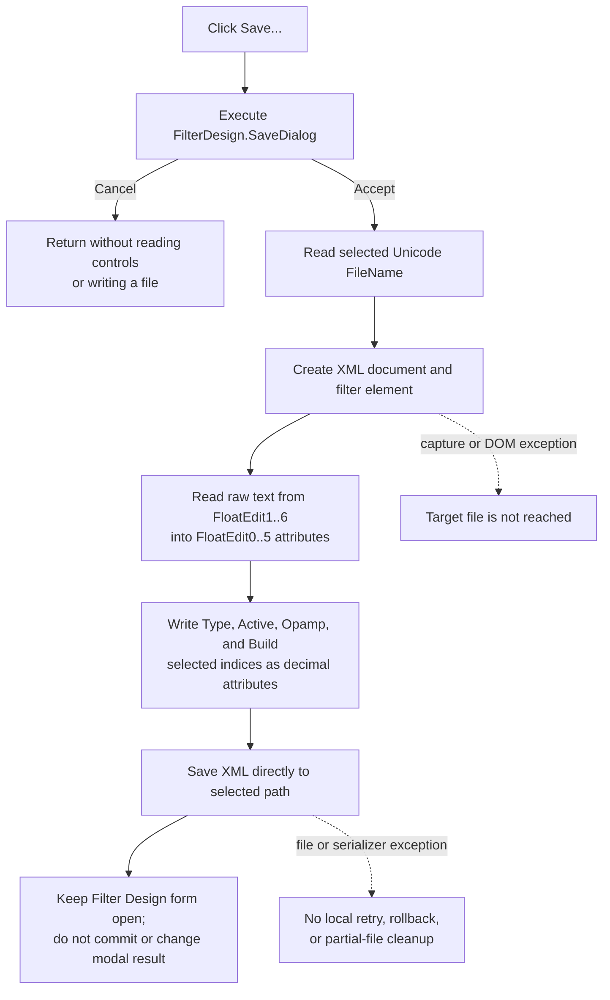

# Save the current Filter Design settings as XML

> Analysis status: Reviewed from recovered source, call-tree, form, and paired load/OK evidence.

## Control

| Property | Recovered value |
| --- | --- |
| Form | `FilterDesign` (`TFilterDesign`) |
| Component path | `FilterDesign.bSave` |
| Control class | `TButton` |
| Caption | `Save...` |
| Handler name | `bSaveClick` |
| Handler address | `019d5090` |
| Graph node | `resource:dfm:FilterDesign/FilterDesign.bSave` |
| Handler node | `function:019d5090` |
| Graph layer | UI |

The control has no hint, action, image reference, or embedded glyph. Its caption identifies a Save command, while the handler and shared writer establish the selected path, XML structure, and saved fields.

## What happens when clicked

[`FUN_019d5090`](../../../DecompiledSources/Tina16/functions/00000000019D5090__FUN_019d5090.c) executes the `TSaveDialog` stored at form offset `+0x7a0`.

- If the user cancels, the handler finalizes its empty path string and returns. It does not read the filter controls, create an XML document, write a file, close the form, or commit the filter.
- If the user accepts, the handler reads `SaveDialog.FileName` and passes that exact Unicode path to shared writer [`FUN_019d45b0`](../../../DecompiledSources/Tina16/functions/00000000019D45B0__FUN_019d45b0.c).

Neither the DFM nor the handler supplies a title, initial directory, default file name, filter, default extension, or explicit Save-dialog options. The handler does not normalize the accepted path or append `.xml`. The standard dialog can retain its component state between executions, but no separate Filter Design path field is read or written.

## XML content

`FUN_019d45b0` builds an in-memory XML document with one `filter` element. It writes ten attributes to that element and then calls the XML document's file-save method with the selected path.

| XML attribute | Saved source |
| --- | --- |
| `FloatEdit0` through `FloatEdit5` | Current window text from `FloatEdit1` through `FloatEdit6`, in that order. |
| `Type` | Decimal selected index of `cbTypes`: 0 Lowpass, 1 Highpass, 2 Bandpass, or 3 Bandstop. |
| `Active` | Decimal selected index of `cbActivePassive`: 0 Active or 1 Passive. |
| `Opamp` | Decimal selected index of `cbOpamp`: 0 Ideal opamp or 1 Standard opamp. |
| `Build` | Decimal selected index of `cbBuild`: 0 Tina Circuit or 1 Tina Macro. |

The six generic `FloatEdit` attributes change meaning with the selected filter type. [`FUN_019d55e0`](../../../DecompiledSources/Tina16/functions/00000000019D55E0__FUN_019d55e0.c) supplies the visible labels:

| Type | `FloatEdit0` to `FloatEdit5` meaning |
| --- | --- |
| Lowpass | Passband gain; stopband gain; passband frequency; stopband frequency; two hidden retained values. |
| Highpass | Stopband gain; passband gain; stopband frequency; passband frequency; two hidden retained values. |
| Bandpass | Stopband gain; passband gain; stopband frequency 1; passband frequency 1; passband frequency 2; stopband frequency 2. |
| Bandstop | Passband gain; stopband gain; passband frequency 1; stopband frequency 1; stopband frequency 2; passband frequency 2. |

The writer always serializes all six controls. For Lowpass and Highpass, `FloatEdit5` and `FloatEdit6` are hidden and disabled, but their retained text is still written as `FloatEdit4` and `FloatEdit5`.

The file does not include `cbApproximation`, `eRate1`, `eRate2`, the dynamically calculated roll-off display, dialog geometry, or an OK/Cancel result. The current resource contains only the Butterworth approximation item, but the omission is established by the writer's fixed attribute list, not by that resource value.

## Text, validation, and encoding

The save writer uses [`FUN_0064dd90`](../../../DecompiledSources/Tina16/functions/000000000064DD90__FUN_0064dd90.c), the VCL window-text reader, for each numeric edit. It therefore stores the displayed text verbatim rather than parsing each value to a `double` and formatting it again.

This differs from the separate OK commit path. [`FUN_019d6510`](../../../DecompiledSources/Tina16/functions/00000000019D6510__FUN_019d6510.c) reads active numeric fields through [`FUN_00b90090`](../../../DecompiledSources/Tina16/functions/0000000000B90090__FUN_00b90090.c), which parses the text, applies the `TFloatEdit` validation callback, and raises for an out-of-range or rejected value. Save does not call that numeric getter or the OK coordinator. Invalid, incomplete, or otherwise uncommittable edit text can therefore be serialized if the XML layer accepts the string.

The writer constructs an XML DOM and uses its file-save method, so the logical format is XML. It does not explicitly create an XML declaration, select an encoding, pass an encoding object, or call an encoding setter in this recovered path. The physical character encoding and any serializer-generated declaration are therefore not proven. The selected path remains a Delphi UnicodeString.

## Save flow

## Overwrite, failures, and partial state

- The handler has no application-level overwrite check. Any prompt depends on the `TSaveDialog` implementation and its unrecovered/default options.
- The complete XML DOM is built before the final file-save call. A failure while reading controls or building attributes occurs before this function reaches the target path.
- The save call writes directly to the selected path. There is no temporary file, atomic rename, backup, post-write verification, result test, retry, or rollback. If the serializer truncates or partly writes an existing file before raising, the application does not repair it.
- No local exception handler or error dialog is present. Dialog, control, XML, and filesystem exceptions follow the normal Delphi exception path.
- The handler does not reject an empty path after an accepted dialog. Normal `TSaveDialog` behavior usually supplies a path, but this wrapper has no independent guard.
- A repeated successful click rebuilds and writes a new XML document from the controls' then-current text and indices. It does not compare the file or settings with the previous save.

## OK, Cancel, and persistence boundary

Save is independent of the form's OK and Cancel buttons. It does not set a modal result, close the form, or write the staged controls into the caller-owned filter record at form offset `+0x14c8`. OK uses the separate commit path, while Cancel can later dismiss the dialog without undoing a file that Save already wrote.

The accepted file is the only durable state created by this click. Save does not update a current-settings path, recent-file list, application preference, registry value, or in-memory committed filter model. Shared caller [`FUN_01c98bf0`](../../../DecompiledSources/Tina16/functions/0000000001C98BF0__FUN_01c98bf0.c) separately invokes the same writer after a successful modal Filter Design session and supplies a path ending in `filter_settings.xml`; this confirms the writer's settings-XML role but is not part of the button-click path.

## Evidence

- [Save handler `FUN_019d5090`](../../../DecompiledSources/Tina16/functions/00000000019D5090__FUN_019d5090.c) executes form field `+0x7a0`, reads its FileName only after acceptance, and then calls the shared writer.
- [Filter settings XML writer `FUN_019d45b0`](../../../DecompiledSources/Tina16/functions/00000000019D45B0__FUN_019d45b0.c) creates the `filter` element, reads six control texts, writes the four combo indices, and invokes the XML file-save method with the supplied path and flag zero.
- [Filter Design constructor `FUN_019d53b0`](../../../DecompiledSources/Tina16/functions/00000000019D53B0__FUN_019d53b0.c) establishes the six-control collection order as `FloatEdit1` through `FloatEdit6`.
- [Dynamic label and visibility helper `FUN_019d55e0`](../../../DecompiledSources/Tina16/functions/00000000019D55E0__FUN_019d55e0.c) proves the six fields' meaning for each type and hides the last two for Lowpass and Highpass.
- [Paired XML parser `FUN_0123ac70`](../../../DecompiledSources/Tina16/functions/000000000123AC70__FUN_0123ac70.c) reads the same `filter`, `FloatEdit0..5`, `Type`, `Active`, `Opamp`, and `Build` schema. Its canonical annotation belongs to `TIARA-diz.6.7.503`.
- [OK commit helper `FUN_019d6510`](../../../DecompiledSources/Tina16/functions/00000000019D6510__FUN_019d6510.c) converts type-dependent numeric controls into the caller record and demonstrates that Save does not perform that commit.
- [Recovered UI evidence](../../../DecompiledSources/Tina16/resources/dfm/ui-evidence.json) supplies the button caption and event, combo item mappings, six edit controls, hidden last two fields, and unconfigured `TSaveDialog` resource.

## Annotation ownership and analysis limits

This Bead owns `FUN_019d5090` and shared XML writer `FUN_019d45b0`. `TIARA-diz.6.7.503` owns load wrapper `FUN_019d5000`, loader `FUN_019d4960`, and parser `FUN_0123ac70`; `TIARA-diz.6.7.504` owns the OK commit. The XML DOM implementation, VCL dialog and text helpers, field-label helper, and automatic caller remain evidence-only.

The source proves the XML attribute schema and the direct final save call. It does not expose the XML implementation's physical encoding, declaration policy, overwrite mechanics, or exact state after a failed low-level write. Those details remain explicit limits.
