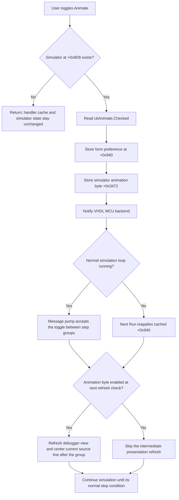

# Animate

> Analysis status: Complete. The recovered handler, debugger initialization, Run, Step, Stop, and simulator-loop paths establish the behavior below.

## Control

| Property | Recovered value |
| --- | --- |
| Form | FlowChartMainForm |
| Component path | FlowChartMainForm.pnEditStatus.cbAnimate |
| Control class | TCheckBox |
| Caption | Animate |
| Hint | Not present in the recovered resource. |
| Text | Not present in the recovered resource. |
| Handler name | cbAnimateClick |
| Handler address | 01053d10 |
| Graph node | `resource:dfm:FlowChartMainForm/FlowChartMainForm.pnEditStatus.cbAnimate` |
| Handler node | `function:01053d10` |
| Graph layer | UI |

## What happens when clicked

`FUN_01053d10` first tests the FlowChartMainForm simulator/debugger field at `+0x9D8`.

- If no simulator exists, it returns immediately. It does not read `Checked`, update the form cache, create a simulator, or undo the VCL checkbox's visible toggle.
- If a simulator exists, it reads the checkbox's `Checked` property from control field `+0x858`, stores the Boolean in form byte `+0x940`, and calls the canonical simulator animation setter `FUN_00f8d160`.
- The setter stores the same Boolean in simulator byte `+0x3472`, then calls `VHDL_DLL2._MCU_SetAnimate` with the simulator's MCU handle. The recovered import does not take a separate Boolean argument, so the exact backend transfer mechanism is not visible; the local flag is stored before the notification call.

The handler does not start, stop, step, or reset the simulation. It changes whether debugger presentation is refreshed during later or already-running simulation work.

## Click and consumption flow

## Run-loop and UI effects

The normal simulator loop `FUN_00f8daa0` pumps application messages before and after each outer simulation group. This allows a checkbox click to run while the loop is active. After the MCU advances and its status is captured, the loop always updates internal status state. It calls intermediate debugger-view refresh `FUN_00f8d840` only when simulator byte `+0x3472` is nonzero.

That intermediate refresh invokes the debugger view's refresh method and centers the current source line in the editor. Therefore:

- Checked Animate enables presentation refreshes after each outer instruction or selected-label group.
- Unchecked Animate skips those intermediate presentation refreshes. It does not skip `_step_simulation_new`, change the simulated time step, disable breakpoints, or stop message pumping.
- The recovered path contains no animation delay, timer interval, or sleep setting. Extra refresh work can affect wall-clock execution cost, but no specific frame rate or delay is established.
- Normal loop completion has a separate final status/view refresh path in most completion cases. Animate primarily controls intermediate updates, not whether final state can ever be shown.

The handler does not directly redraw the flowchart canvas or change the current-node marker. Flowchart highlighting and canvas rebuilds are performed by the coordinated Run and Step paths after they obtain the current selected label.

## Startup, Run, Step, and Stop coordination

- The DFM has no `Checked` property, so it does not supply a persisted design-time true value.
- Debugger-session initialization `FUN_01051c30` creates the simulator and evaluates `FUN_01053d50`. This availability predicate requires a simulator and applies an additional page restriction for simulator kind `2`. When available, initialization sets the checkbox to checked and explicitly invokes this click handler, so supported sessions start with animation enabled. It then makes the checkbox enabled and visible according to the same predicate.
- Reset/view setup `FUN_0104e320` also writes form byte `+0x940` as true, checks the control, and applies the value when a simulator exists.
- Run handler `FUN_01052a70`, owned by the Run control analysis, reapplies cached form byte `+0x940` to the simulator before the normal backend run. A preference changed before Run therefore controls the next normal run.
- The shared Step dispatcher `FUN_01052800` can force simulator animation off during its low-level step, run a deliberate refresh, and then force animation on. It does not update form cache `+0x940`. The checkbox preference can therefore differ temporarily from the simulator flag after Step; the next normal Run or checkbox click reapplies the cache.
- Trace Stop handler `FUN_01052d50`, owned by the Stop control analysis, forces simulator animation on before requesting the stop. This supports stop-state presentation but also leaves form byte `+0x940` unchanged.

These execution controls establish why both a form cache and a simulator flag exist. The checkbox owns the user's cached preference, while Step and Stop can override the live simulator flag for a specific operation.

## Persistence and repeated clicks

- The click handler performs no file, registry, INI, or settings-service call. The value is not persisted by this path across application launches.
- Session initialization and reset paths establish animation as enabled for supported debugger sessions instead of loading a recovered saved preference.
- With a simulator present, every handler invocation reads and stores the current value and calls the backend setter. There is no equality or unchanged-state guard.
- Without a simulator, repeated invocations remain handler no-ops. The VCL control can still display its toggled state, but form byte `+0x940` is not synchronized by this handler until a later invocation with a simulator.

## Error and partial-state behavior

The handler has no local exception handler, result check, retry, or rollback. The checkbox value and form cache are updated before `FUN_00f8d160`; that setter updates simulator byte `+0x3472` before it calls the external MCU function. If the external notification raises an error, the visible checkbox, form cache, and local simulator flag can already contain the new value while the backend notification is incomplete. A failure before the form-cache write leaves later state unchanged.

## Handler evidence

- Handler source: [FUN_01053d10](../../../DecompiledSources/Tina16/functions/0000000001053D10__FUN_01053d10.c)
- Canonical animation setter: [FUN_00f8d160](../../../DecompiledSources/Tina16/functions/0000000000F8D160__FUN_00f8d160.c)
- Debugger-session initialization: [FUN_01051c30](../../../DecompiledSources/Tina16/functions/0000000001051C30__FUN_01051c30.c)
- Availability predicate: [FUN_01053d50](../../../DecompiledSources/Tina16/functions/0000000001053D50__FUN_01053d50.c)
- Normal simulator loop: [FUN_00f8daa0](../../../DecompiledSources/Tina16/functions/0000000000F8DAA0__FUN_00f8daa0.c)
- Run handler: [FUN_01052a70](../../../DecompiledSources/Tina16/functions/0000000001052A70__FUN_01052a70.c)
- Shared Step dispatcher: [FUN_01052800](../../../DecompiledSources/Tina16/functions/0000000001052800__FUN_01052800.c)
- Trace Stop handler: [FUN_01052d50](../../../DecompiledSources/Tina16/functions/0000000001052D50__FUN_01052d50.c)
- Complexity: simple
- Distinct outgoing calls: 1

## Direct calls and ownership

- `function:00f8d160` — Canonical Flowchart simulator animation-mode setter. Its existing graph annotation owns this shared role and is cited, not duplicated, in this control fragment.
- `function:01052a70` — Run coordinator, owned by `TIARA-diz.6.7.507`; cited as a consumer of form byte `+0x940`.
- `function:01052d50` — Trace Stop handler, owned by `TIARA-diz.6.7.511`; cited as an operational override of simulator byte `+0x3472`.

Only `FUN_00f8d160` is a direct call from the checkbox handler. The Run, Step, Stop, initialization, and simulator-loop functions are field-mediated consumers and writers that establish the downstream meaning.

## Resource evidence

- The DFM binds `FlowChartMainForm.pnEditStatus.cbAnimate.OnClick` to `cbAnimateClick` at `01053d10`.
- The `TCheckBox` caption is `Animate`; its DFM resource has no hint, text, image, explicit checked state, or modal result.
- `Line: 1` and `Time: 0 s` are same-panel nearby-label candidates only. Proximity does not prove that this checkbox directly controls either label, and the handler does not reference them.

## Analysis limits

- The original Delphi names for form byte `+0x940` and simulator byte `+0x3472` are not present. Their roles are established by the checkbox, startup, Run, Step, Stop, and loop call sites.
- The imported `_MCU_SetAnimate` body is outside the executable. This analysis does not claim its internal backend storage or callback behavior.
- The recovered code establishes gated UI refresh work but not a fixed animation frame rate or deliberate time delay.
