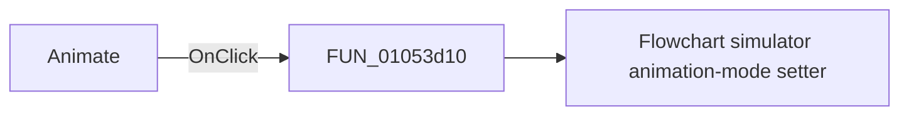

# Animate

> Analysis status: Pending individual source review.

## Control

| Property | Recovered value |
| --- | --- |
| Form | FlowChartMainForm |
| Component path | FlowChartMainForm.pnEditStatus.cbAnimate |
| Control class | TCheckBox |
| Caption | Animate |
| Hint | Not present in the recovered resource. |
| Text | Not present in the recovered resource. |
| Handler name | cbAnimateClick |
| Handler address | 01053d10 |
| Graph node | `resource:dfm:FlowChartMainForm/FlowChartMainForm.pnEditStatus.cbAnimate` |
| Handler node | `function:01053d10` |
| Graph layer | UI |

## What happens when clicked

Pending individual analysis. An agent must read the recovered handler source and its relevant callees before it replaces this text.

## Click flow

## Handler evidence

- Source: [DecompiledSources/Tina16/functions/0000000001053D10__FUN_01053d10.c](../../../DecompiledSources/Tina16/functions/0000000001053D10__FUN_01053d10.c)
- Recovered role: Flowchart debugger animation checkbox handler
- Current graph summary: When the simulator exists, it reads the Animate checkbox, caches the state in the form, and applies it to the simulator. Handles 1 Delphi UI event: FlowChartMainForm.pnEditStatus.cbAnimate.OnClick.
- Current graph behavior: When the simulator exists, it reads the Animate checkbox, caches the state in the form, and applies it to the simulator.
- Current graph evidence: cbAnimate has caption Animate and resolves here. The handler reads form control 0x858, stores form byte 0x940, and calls FUN_00f8d160.
- Complexity: simple
- Distinct outgoing calls: 1

## Direct calls

- `function:00f8d160` — Flowchart simulator animation-mode setter

## Resource evidence

- Kind: Not present in the recovered resource.
- Modal result: Not present in the recovered resource.
- Checked state: Not present in the recovered resource.
- List items: Not present in the recovered resource.
- Image reference: Not present in the recovered resource.
- Extracted glyph: None.

## Nearby label candidates

Nearby labels are layout candidates only. They are not proof of behavior.

- Rank 1: Line: 1 at distance 167.
- Rank 2: Time: 0 s  at distance 382.

## Analysis limits

- Do not infer behavior from the control class, caption, hint, glyph, or nearby label alone.
- Do not replace the pending status until the handler source and relevant call path provide enough evidence.
