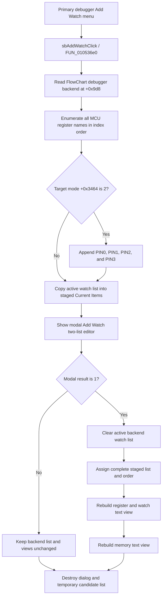

# Open Add Watch from the primary debugger register menu

> Analysis status: Source-reviewed. The menu wrapper, shared Add Watch controller, modal dialog handlers, active watch-list consumers, and debugger refresh path establish the behavior below.

## Control

| Property | Recovered value |
| --- | --- |
| Form | FlowChartMainForm |
| Component path | FlowChartMainForm.pcMain.tsCode.Debugger.mnPopupRegisters.mnAddWatch |
| Control class | TMenuItem |
| Caption | Not present in the recovered resource. |
| Hint | Not present in the recovered resource. |
| Text | Not present in the recovered resource. |
| Handler name | sbAddWatchClick |
| Handler address | 010536e0 |
| Graph node | `resource:dfm:FlowChartMainForm/FlowChartMainForm.pcMain.tsCode.Debugger.mnPopupRegisters.mnAddWatch` |
| Handler node | `function:010536e0` |
| Graph layer | UI |

## What happens when clicked

`FUN_010536e0` reads the active Flowchart debugger backend from form offset `+0x9d8` and passes it to the shared Add Watch controller, `FUN_00f8f630`.

Despite this item's position in the register popup menu, the handler does not read the popup's current row, the sender, a selected register, or text at the cursor. It does not add one watch immediately. It always opens the complete **Add Watch** list editor. The second debugger panel contains another menu item bound to the same handler and therefore uses the same backend and behavior.

## Available watch candidates

Before it opens the dialog, the controller creates a temporary **All Items** string list. It asks the MCU runtime for the register count and appends every register name in index order from zero through `count - 1`.

When debugger target mode `+0x3464` is exactly `2`, the controller appends four additional candidates after the register names: `PIN0`, `PIN1`, `PIN2`, and `PIN3`. Other recovered target modes do not get these four extra entries in this path.

The dialog has no edit box. A user can choose only from the generated **All Items** list. This path does not enumerate program variables or general symbols and does not accept a free-form expression.

## Dialog staging and duplicate handling

The controller creates the modal `AddWatch` form and supplies two lists:

- form field `+0x708` receives the temporary all-register candidate list;
- the private **Current Items** list at `+0x710` receives a copy of the debugger backend's current watch list at `+0x3448`.

`FormShow` displays these collections in `lbAll` and `lbCurrent`. Inside the dialog:

- **Add** requires a selected `lbAll` row. A negative index is a no-op.
- **Add** uses the current list's recovered `IndexOf` operation and does not add the same text when that operation finds it.
- A new item is appended to the end of the staged list. It is not removed from **All Items**.
- **Delete**, **Move Up**, and **Move Down** change the staged current list and its displayed order.

The duplicate comparison settings, including case sensitivity, are not recovered. The dialog prevents a new duplicate through its Add button, but the controller does not scan or remove duplicates that already exist in the copied current list. There is no separate validation message or close-query.

## OK commit and debugger refresh

The built-in `bkOK` button returns modal result `1`. Only for this result, the controller:

1. clears the active debugger watch list at `+0x3448`;
2. assigns the complete staged **Current Items** collection to that list, including its order; and
3. calls `FUN_00f8a700` to refresh the debugger display.

This is a full-list replacement, not an append of one selected popup row. The watch list pointer at backend `+0x3448` comes from offset `+0xe8` of the active recovered debugger or target record. Acceptance therefore changes that record's in-memory watch-list object.

The refresh dispatcher rebuilds the register and watch text view through `FUN_00f8ae10`. That function clears the view, reads each accepted watch name, resolves and formats its current MCU value, and appends the display line. The same dispatcher also rebuilds the memory text view through `FUN_00f8a840`, even though this command does not change MCU memory.

The command does not write a register or pin value, compile or run the Flowchart, change the active target, or change the numeric display radix.

## Cancel and persistence boundary

The built-in `bkCancel` button returns a result other than `1`. On Cancel or another non-accepting modal result, the controller does not clear or assign the backend watch list and does not call the view refresh. Changes made with Add, Delete, or Move remain private to the dialog and are discarded when the temporary dialog is destroyed.

On either normal result, the controller destroys the dialog and its temporary all-items list after handling the result.

Acceptance changes the active debugger record in memory. This click path contains no INI, registry, project-file, Flowchart-file, or other serializer call. Immediate disk persistence and reuse in a later application session are not proven. A later owner save can consume the record, but that boundary is outside this handler.

## Error and partial-failure behavior

- The menu wrapper does not test the backend pointer at `FlowChartMainForm +0x9d8`. The controller immediately reads backend fields. An unexpected null or invalid backend is not a normal no-op.
- MCU register enumeration, list allocation, dialog construction, and modal display have no recovered local error handler.
- On OK, the active watch list is cleared before the staged list is assigned. If assignment fails, the old list has already been removed and the recovered path has no rollback.
- The list commit occurs before either debugger view is refreshed. A refresh exception can leave the new in-memory list committed while one or both views are stale or partly rebuilt.
- Normal destruction calls occur after the commit and refresh. An exception before those calls can bypass this controller's normal temporary-object cleanup.

## Click flow

## Source evidence

- [FUN_010536e0](../../../DecompiledSources/Tina16/functions/00000000010536E0__FUN_010536e0.c) contains only the read of form backend `+0x9d8` and the call to the shared controller.
- [FUN_00f8f630](../../../DecompiledSources/Tina16/functions/0000000000F8F630__FUN_00f8f630.c) enumerates MCU register names, conditionally adds the four pin names, copies the current list into the modal form, commits only result `1`, refreshes the debugger, and destroys the temporary objects.
- [FUN_00f85e30](../../../DecompiledSources/Tina16/functions/0000000000F85E30__FUN_00f85e30.c) displays the supplied All Items and Current Items collections.
- [FUN_00f85f10](../../../DecompiledSources/Tina16/functions/0000000000F85F10__FUN_00f85f10.c) implements selection and duplicate checks before it stages an added candidate.
- [FUN_00f85eb0](../../../DecompiledSources/Tina16/functions/0000000000F85EB0__FUN_00f85eb0.c), [FUN_00f86000](../../../DecompiledSources/Tina16/functions/0000000000F86000__FUN_00f86000.c), and [FUN_00f86070](../../../DecompiledSources/Tina16/functions/0000000000F86070__FUN_00f86070.c) remove and reorder staged current items.
- [FUN_00f8edf0](../../../DecompiledSources/Tina16/functions/0000000000F8EDF0__FUN_00f8edf0.c) links backend watch-list field `+0x3448` to the active record's list at `+0xe8`.
- [FUN_00f8a700](../../../DecompiledSources/Tina16/functions/0000000000F8A700__FUN_00f8a700.c), [FUN_00f8ae10](../../../DecompiledSources/Tina16/functions/0000000000F8AE10__FUN_00f8ae10.c), and [FUN_00f8a840](../../../DecompiledSources/Tina16/functions/0000000000F8A840__FUN_00f8a840.c) rebuild the register/watch and memory text views.

## Resource evidence

- Both recovered FlowChart debugger panels bind `mnAddWatch.OnClick` to `sbAddWatchClick` at `010536e0`.
- The popup menu items have no recovered caption, hint, action, image, checked state, or extracted glyph.
- The modal form caption is **Add Watch**. Its list labels are **Current Items:** and **All Items:**.
- Its Add, Delete, Move Up, and Move Down speed buttons have matching hints and extracted glyphs. Their recovered handlers, not the images alone, prove the list operations.
- Its OK and Cancel controls are built-in `bkOK` and `bkCancel` buttons.

## Analysis limits and ownership

- This Bead owns the canonical annotations for the shared wrapper `FUN_010536e0` and Add Watch controller `FUN_00f8f630`.
- Duplicate Bead `.532` uses the same wrapper. It must copy the complete `FUN_010536e0` annotation exactly and cite, not redefine, `FUN_00f8f630`.
- The Add Watch button articles own their dialog-handler annotations. This article cites them to explain staging but does not redefine them.
- The broad debugger refresh, MCU accessor, Delphi list, and VCL modal functions remain evidence only.
- The recovered code does not name backend field `+0x3448` or active-record field `+0xe8`. Their watch-list role is established by the dialog copy, accepted assignment, and value-display consumer.
