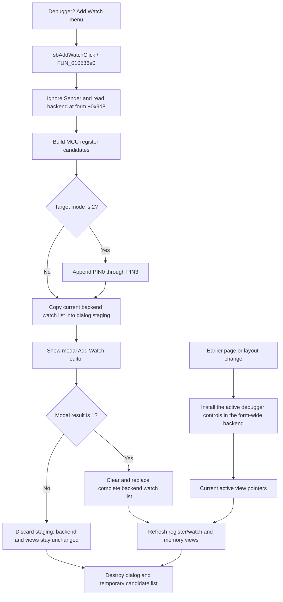

# Open Add Watch from the combined editor debugger

> Analysis status: Source-reviewed. The shared menu wrapper, form-wide debugger backend, earlier layout selection, modal Add Watch controller, and view refresh path establish the behavior below.

## Control

| Property | Recovered value |
| --- | --- |
| Form | FlowChartMainForm |
| Component path | FlowChartMainForm.pcMain.tsEditorAndCode.pnDebugger2.Debugger2.mnPopupRegisters.mnAddWatch |
| Control class | TMenuItem |
| Caption | Not present in the recovered resource. |
| Hint | Not present in the recovered resource. |
| Text | Not present in the recovered resource. |
| Handler name | sbAddWatchClick |
| Handler address | 010536e0 |
| Graph node | `resource:dfm:FlowChartMainForm/FlowChartMainForm.pcMain.tsEditorAndCode.pnDebugger2.Debugger2.mnPopupRegisters.mnAddWatch` |
| Handler node | `function:010536e0` |
| Graph layer | UI |

## What happens when clicked

`FUN_010536e0` reads the Flowchart debugger backend from form offset `+0x9d8` and passes it to the shared Add Watch controller, `FUN_00f8f630`. The handler does not read `Sender`, the owning popup menu, `Debugger2`, the selected register row, or text at the cursor. It therefore does not derive a different target from this second menu item's context.

The primary debugger menu item on `pcMain.tsCode.Debugger` uses the same handler. Both items open the same complete **Add Watch** editor against the same form-wide backend. Neither item adds the popup's current row directly.

## Active debugger view selection

The form owns one recovered debugger controller at `+0x9d8`. Page and layout switching performs the instance-specific work before this click. `FUN_0104e100` selects one set of debugger controls or the other, and `FUN_00f8fbb0` installs those controls as the backend's active view pointers. The menu click does not repeat that selection.

For a normal click from `Debugger2`, the controller has already been retargeted to the active combined editor-and-code layout. After an accepted edit, the shared refresh uses the controller's currently installed view pointers. If code invokes this handler while another layout remains active, the handler still uses that current backend state; the `Debugger2` sender cannot override it.

## Candidate list and staged edits

The shared controller creates an **All Items** list from every MCU register name in index order. If debugger target mode `+0x3464` is exactly `2`, it appends `PIN0`, `PIN1`, `PIN2`, and `PIN3`. Other recovered modes do not receive these four extra candidates in this path.

The controller opens the modal **Add Watch** form and copies the backend watch list at `+0x3448` into the dialog's private **Current Items** list. The dialog has two lists, not a free-form expression editor. Its Add operation requires an **All Items** selection and skips text already found in the staged current list. Delete and move operations also change only the staged list while the dialog remains open.

## OK, Cancel, and refresh

Only modal result `1`, produced by the built-in OK button, commits the edit. The controller then:

1. clears the backend watch list;
2. assigns the complete staged list and its order to the backend; and
3. calls the debugger refresh dispatcher.

The refresh rebuilds the register and watch text view from the accepted names and current MCU values. It also rebuilds the memory text view through the same dispatcher. This command does not write an MCU register or pin, compile or run the Flowchart, change the active target, or change the display radix.

Cancel or any other modal result skips the clear, assignment, and refresh. The dialog's staged Add, Delete, and reorder operations are then discarded with the dialog.

## Persistence and failure boundaries

The accepted list changes the active debugger record in memory. This path has no project-file, Flowchart-file, INI, registry, or other persistence call. Later serialization of the owner is outside this handler.

- The wrapper does not test the backend pointer at form `+0x9d8`. An unexpected null or invalid backend is not a normal no-op.
- An empty MCU register enumeration still permits the dialog to open. In target mode `2`, the four pin candidates are still appended.
- Register enumeration, allocation, dialog construction, and modal display have no recovered local error handler.
- On OK, the backend list is cleared before the staged assignment. An assignment failure can therefore leave the previous list removed, with no recovered rollback.
- The list commit occurs before the view refresh. A refresh failure can leave the new list committed while one or both active views are stale or partly rebuilt.
- Normal destruction of the dialog and temporary candidate list occurs after modal handling. An exception before those calls can bypass this controller's normal cleanup.

## Click flow

## Source evidence

- [FUN_010536e0](../../../DecompiledSources/Tina16/functions/00000000010536E0__FUN_010536e0.c) contains only the read of form backend `+0x9d8` and the call to the shared Add Watch controller. Its recovered parameter use gives no sender-dependent branch.
- [FUN_0104e100](../../../DecompiledSources/Tina16/functions/000000000104E100__FUN_0104e100.c) selects the debugger controls for the current form layout.
- [FUN_0104eb00](../../../DecompiledSources/Tina16/functions/000000000104EB00__FUN_0104eb00.c) performs layout switching and passes the selected controls to the backend retargeting function.
- [FUN_00f8fbb0](../../../DecompiledSources/Tina16/functions/0000000000F8FBB0__FUN_00f8fbb0.c) stores the selected active view pointers in the shared debugger backend.
- [FUN_00f8f630](../../../DecompiledSources/Tina16/functions/0000000000F8F630__FUN_00f8f630.c) enumerates candidates, stages the current list, commits only modal result `1`, refreshes the debugger, and destroys its temporary objects.
- [FUN_00f85e30](../../../DecompiledSources/Tina16/functions/0000000000F85E30__FUN_00f85e30.c) displays the supplied **All Items** and **Current Items** collections.
- [FUN_00f85f10](../../../DecompiledSources/Tina16/functions/0000000000F85F10__FUN_00f85f10.c) requires a candidate selection and checks the staged list before adding an item.
- [FUN_00f85eb0](../../../DecompiledSources/Tina16/functions/0000000000F85EB0__FUN_00f85eb0.c), [FUN_00f86000](../../../DecompiledSources/Tina16/functions/0000000000F86000__FUN_00f86000.c), and [FUN_00f86070](../../../DecompiledSources/Tina16/functions/0000000000F86070__FUN_00f86070.c) delete and reorder staged current items.
- [FUN_00f8a700](../../../DecompiledSources/Tina16/functions/0000000000F8A700__FUN_00f8a700.c), [FUN_00f8ae10](../../../DecompiledSources/Tina16/functions/0000000000F8AE10__FUN_00f8ae10.c), and [FUN_00f8a840](../../../DecompiledSources/Tina16/functions/0000000000F8A840__FUN_00f8a840.c) rebuild the active register/watch and memory text views.

## Resource evidence

- Both recovered Flowchart debugger panels bind `mnAddWatch.OnClick` to `sbAddWatchClick` at `010536e0`.
- This inherited popup menu item has no recovered caption, hint, action, image, checked state, or extracted glyph in the form resource.
- The modal form caption is **Add Watch**. Its list labels are **Current Items:** and **All Items:**.
- Its Add, Delete, Move Up, and Move Down controls have matching hints and extracted glyphs. The dialog handlers, not the images alone, prove their effects.
- Its OK and Cancel controls are built-in `bkOK` and `bkCancel` buttons.

## Analysis ownership

- Bead `.529` owns the canonical annotations for the shared wrapper `FUN_010536e0` and shared Add Watch controller `FUN_00f8f630`.
- This duplicate Bead copies the complete `FUN_010536e0` annotation exactly. It cites but does not redefine `FUN_00f8f630` or the shared dialog and refresh helpers.
- The recovered code does not name backend field `+0x3448`. Its watch-list role is established by the dialog copy, accepted assignment, and display consumer.
