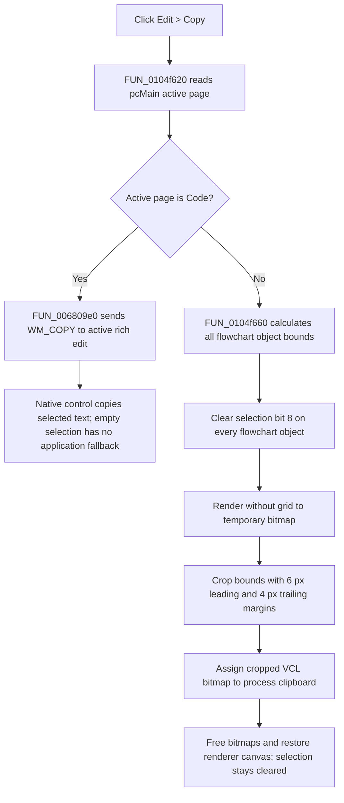

# Copy code text or the complete flowchart as a bitmap

> Analysis status: Complete. The recovered page test, native edit-copy wrapper, flowchart renderer, object-bound calculation, selection-bit updates, and VCL clipboard assignment support this explanation.

## Control

| Property | Recovered value |
| --- | --- |
| Form | FlowChartMainForm |
| Component path | FlowChartMainForm.MainMenu.mnEdit.mnCopy |
| Control class | TMenuItem |
| Parent menu | Edit |
| Caption | &Copy |
| Hint | Not present in the recovered resource. |
| Shortcut | Not present in the recovered resource. |
| Handler name | mnCopyClick |
| Handler address | 0104f620 |
| Graph node | `resource:dfm:FlowChartMainForm/FlowChartMainForm.MainMenu.mnEdit.mnCopy` |
| Handler node | `function:0104f620` |
| Graph layer | UI |

## What happens when clicked

`FUN_0104f620` reads the active index of `FlowChartMainForm.pcMain`. The form has four recovered pages in this order: **Flowchart**, **Code**, **Flowchart+Code**, and **Graph**. The runtime page-index builder associates `DAT_0202f414` with the second visible page, **Code**. The click handler uses this value to select one of two copy routes.

### Code page: copy the native text selection

On the **Code** page, the handler passes the active code editor at form offset `+0x958` to `FUN_006809e0`. This canonical VCL wrapper gets the editor's native window handle and sends `WM_COPY` (`0x0301`). The native Unicode rich-edit control owns the clipboard text format and copies its current selection without deleting it.

The application does not inspect the selection length or the message result. An empty text selection therefore follows the native control's no-copy behavior. The recovered application code does not call `SetClipboardData` directly and does not prove one fixed text format.

### Other pages: render the complete flowchart

On **Flowchart**, **Flowchart+Code**, and **Graph**, the handler calls `FUN_0104f660` with selector `1`. This is a picture copy, not editable flowchart-object serialization:

1. It walks the complete flowchart object list and calculates the union of every object's bounds. It does not query which objects are selected.
2. It allocates two VCL bitmap objects. The first is a temporary render target. The second is the cropped clipboard image.
3. It redirects the flowchart renderer to the first bitmap, selects `Courier New` at size `7`, and clears object-state bit `8` on every flowchart object. The paired Select All handler sets this same bit, so this step clears the current flowchart selection before rendering.
4. It renders the flowchart with the normal grid temporarily disabled. It then copies the bounds from `(minimum X - 6, minimum Y - 6)` through `(maximum X + 4, maximum Y + 4)` into a bitmap whose width and height are the object-bound spans plus `10` pixels.
5. The helper compares selector `1` with form field `+0x91c`. Normal FlowChart initialization sets that field to `2`, so this click gets the process-wide VCL clipboard object and assigns the cropped bitmap to it. The VCL graphic/clipboard implementation chooses the native bitmap representations; this function does not register or publish a private TINA flowchart format.
6. It frees both temporary bitmaps, enables the grid flag again, and restores the renderer's canvas references from the active editor frame.

The same renderer supports the separate **Save Flowchart Picture As...** command. That command passes the current `+0x91c` value, which guarantees equality and opens its JPEG/BMP save dialog. This Copy click passes `1`, which selects the clipboard branch in the recovered normal state.

## Selection, document, and interoperability effects

- Code text is copied through the native editor. Copy does not delete or edit that text.
- The picture route copies all flowchart objects inside the calculated bounds, even when only some objects were selected or no object was selected.
- The picture route clears selection bit `8` on every flowchart object. It does not restore those selection bits. Thus Copy changes the in-memory selection state, although it does not add, remove, move, or edit flowchart objects.
- The recovered path does not mark the flowchart as modified and does not call a document serializer, project save, undo recorder, or redraw of the on-screen editor.
- Other applications can consume the native text or VCL bitmap clipboard data. They do not receive editable TINA flowchart objects from this handler.
- Copy replaces clipboard content through the selected native/VCL route. It does not keep an application-side clipboard history.

## Empty and error paths

- An empty Code selection is delegated to `WM_COPY`; there is no application prompt or fallback to a bitmap.
- The picture route has no selected-object guard because it deliberately renders the complete object list.
- The bound calculator writes no defaults when the flowchart object list is empty. `FUN_0104f660` nevertheless uses the returned stack values for bitmap dimensions. The recovered source therefore does not establish safe output for a truly empty object list.
- The helper selects file export when its selector equals form field `+0x91c`. Normal FlowChart initialization sets the field to `2`, while Copy passes `1`. If an unexpected state changed `+0x91c` to `1`, the recovered comparison would open the Save Picture dialog instead of writing the clipboard.
- Neither route checks clipboard success. `FUN_0104f660` also has no local exception handler or recovered `try/finally`. Allocation, rendering, bitmap-copy, or clipboard failures propagate through the Delphi runtime and can bypass its normal object, renderer, or grid-state restoration.

## Copy flow

## Source evidence

- Copy handler and active-page branch: [FUN_0104f620](../../../DecompiledSources/Tina16/functions/000000000104F620__FUN_0104f620.c)
- Shared flowchart render, clipboard, and file-export coordinator: [FUN_0104f660](../../../DecompiledSources/Tina16/functions/000000000104F660__FUN_0104f660.c)
- Dynamic visible-page index mapping: [FUN_01051600](../../../DecompiledSources/Tina16/functions/0000000001051600__FUN_01051600.c)
- Native VCL edit-copy wrapper: [FUN_006809e0](../../../DecompiledSources/Tina16/functions/00000000006809E0__FUN_006809e0.c)
- Complete object-bound calculation: [FUN_00f74dc0](../../../DecompiledSources/Tina16/functions/0000000000F74DC0__FUN_00f74dc0.c)
- Clear bit `8` from all flowchart objects: [FUN_00f74f10](../../../DecompiledSources/Tina16/functions/0000000000F74F10__FUN_00f74f10.c) and [FUN_00f6f910](../../../DecompiledSources/Tina16/functions/0000000000F6F910__FUN_00f6f910.c)
- Paired Select All bit-set path: [FUN_0104f5a0](../../../DecompiledSources/Tina16/functions/000000000104F5A0__FUN_0104f5a0.c), [FUN_00f74eb0](../../../DecompiledSources/Tina16/functions/0000000000F74EB0__FUN_00f74eb0.c), and [FUN_00f6f900](../../../DecompiledSources/Tina16/functions/0000000000F6F900__FUN_00f6f900.c)
- VCL clipboard singleton used by the bitmap route: [FUN_006a6030](../../../DecompiledSources/Tina16/functions/00000000006A6030__FUN_006a6030.c)
- Save Picture wrapper that selects the file-export branch: [FUN_0104f600](../../../DecompiledSources/Tina16/functions/000000000104F600__FUN_0104f600.c)
- Normal FlowChart setup that sets selector field `+0x91c` to `2`: [FUN_01051710](../../../DecompiledSources/Tina16/functions/0000000001051710__FUN_01051710.c)

## Resource evidence

- The DFM binds `FlowChartMainForm.MainMenu.mnEdit.mnCopy.OnClick` to `mnCopyClick` at `0104f620`.
- `pcMain` is a `TPageControl`. Its recovered children are **Flowchart**, **Code**, **Flowchart+Code**, and **Graph**.
- The **Code** and **Flowchart+Code** resources contain `TMyRichEdit` code editors. The form updates offset `+0x958` to the active editor instance when it changes the active editor/debugger layout.
- The menu item has no recovered hint, shortcut, action, checked state, image reference, or extracted glyph.
- Nearby label candidate: None.

## Analysis limits and annotation ownership

- `TIARA-diz.6.7.143` canonically owns the VCL `WM_COPY` wrapper `FUN_006809e0`. `TIARA-diz.6.7.274` canonically owns the VCL clipboard singleton `FUN_006a6030`. This article cites both without redefining them.
- This article owns `FUN_0104f620` and shared renderer `FUN_0104f660`. The later Save Picture article cites the shared renderer and owns only its menu wrapper.
- `FUN_006d5120` is generic VCL `TPageControl` infrastructure and remains evidence-only.
- The recovered source does not name form offsets `+0x958`, `+0x980`, or `+0x928`. Their descriptions here come from the DFM component tree and repeated data flow.
