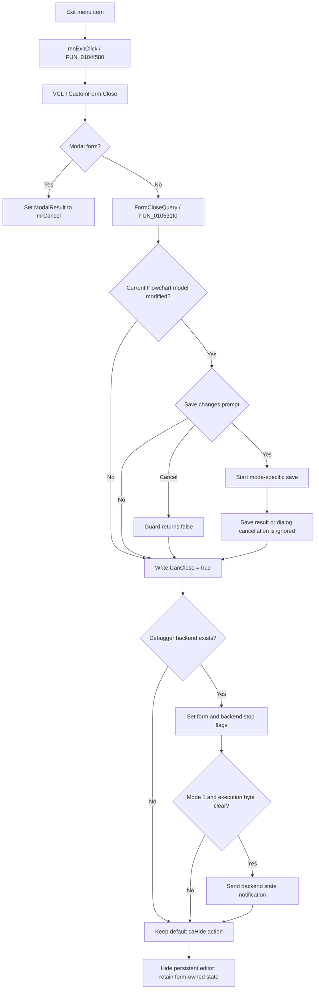

# E&xit

> Analysis status: Source-reviewed. The direct handler, VCL close path, form close-query, and form close event establish the behavior below.

## Control

| Property | Recovered value |
| --- | --- |
| Form | FlowChartMainForm |
| Component path | FlowChartMainForm.MainMenu.mnFile.mnExit |
| Control class | TMenuItem |
| Caption | E&xit |
| Hint | Not present in the recovered resource. |
| Text | Not present in the recovered resource. |
| Handler name | mnExitClick |
| Handler address | 0104f580 |
| Graph node | `resource:dfm:FlowChartMainForm/FlowChartMainForm.MainMenu.mnFile.mnExit` |
| Handler node | `function:0104f580` |
| Graph layer | UI |

## What happens when clicked

`FUN_0104f580` delegates the command to the common VCL form-close routine. The normal application path creates `FlowChartMainForm` as a persistent secondary form and shows it modelessly. In this path, VCL runs the form's close-query and close event. The close event does not replace the default close action. The default action is `caHide`, so Exit hides the Flowchart Editor. It does not free the form or terminate TINA.

The handler has no direct save, prompt, application-shutdown, settings-write, or cleanup operation. Those effects depend on the form lifecycle handlers described below.

## Modified-document prompt and the ignored result

`FormCloseQuery` calls the shared Flowchart modified-document guard. That guard examines only the current Flowchart model at form offset `+0x980`. It does not scan other TINA documents or the current project.

For a modified model, the guard shows a localized Yes, No, or Cancel prompt. Its result has these effects:

| Selection | Guard behavior | Actual Exit result |
| --- | --- | --- |
| Yes | Starts Save-to-Macro in mode zero, or Save As in the other mode. | Exit continues even if that operation reports failure or its file dialog is canceled. |
| No | Returns permission without saving. | Exit continues and hides the editor. The in-memory model remains in the hidden form. |
| Cancel | Returns false. | Exit still continues and hides the editor. |
| Model not modified | Returns true without a prompt. | Exit continues and hides the editor. |

The last column differs from the guard result because `FUN_010531f0` ignores the Boolean returned by the guard and then writes true to the VCL `CanClose` output. Therefore, Cancel does not prevent the modeless form from closing. Canceling the Save As dialog also does not prevent it. This path does not destroy the unsaved model because `caHide` retains the form instance, but it also does not persist that model.

The normal Save and Save As controls have separate analyses. Their helpers are followed here only far enough to establish that their outcome cannot block Exit.

## Debugger stop request

After the close-query permits closure, `FUN_0104e4c0`, the form's `OnClose` handler, checks the debugger or emulator backend at form offset `+0x9d8`. If the backend is absent, the handler does nothing.

If the backend exists, the handler:

1. Sets the form's closing or stop-state byte at `+0x8ea`.
2. Clears the animation or continuation byte at `+0x941`.
3. Sets backend stop fields at `+0x34fc` and `+0x3475` through two small adapters.
4. In backend mode `1`, while form byte `+0x8eb` is clear, sends the recovered backend state notification through `FUN_00f8f400`.

The same flags and backend calls occur in the Flowchart execution-stop paths. This establishes a debugger stop request. The recovered close handler has no wait, thread join, confirmation, backend destruction, or rollback. It requests the stop before VCL hides the form.

## Form lifetime and persistence

The normal Exit route ends with `caHide`. The hidden form keeps its current model, document path, debugger object, simulator object, and other form-owned objects. The form's `OnDestroy` handler is not part of this route. A later owner-driven destruction can free the model, simulator, lists, and the mode-specific debugger backend. That cleanup is sequential and has no recovered local rollback.

No INI, registry, project-settings, window-position, or application-settings writer occurs in the Exit, close-query, or close-event path. The only possible file write is the document save selected from the modified-document prompt. Exit does not close other documents and does not terminate the application in the recovered normal modeless route.

One recovered caller also creates `FlowChartMainForm` for a modal editing session. On that path, the common VCL Close routine sets modal result `2` (`mrCancel`) and returns without running its modeless close-query and close-action branch at this call. The modal owner later destroys its local form. This modal use does not change the normal application Exit behavior described above.

## Failure and no-op boundaries

- If no debugger backend exists, the close event has no debugger-side effect.
- Repeating Exit after the persistent modeless form is already hidden leaves it hidden if the command can still be invoked programmatically.
- An exception from the prompt, a selected save route, or a debugger-stop helper can interrupt the close path before the hide operation. No local handler restores earlier file or stop-state changes.
- A selected save can have partial external file effects before an exception. The Exit handler adds no transaction or cleanup around that save.
- The recovered code does not prove that the stop request has completed when the form becomes hidden.

## Click flow

## Handler evidence

- [FUN_0104f580](../../../DecompiledSources/Tina16/functions/000000000104F580__FUN_0104f580.c) contains only the call to the common VCL form-close routine.
- [FUN_010531f0](../../../DecompiledSources/Tina16/functions/00000000010531F0__FUN_010531f0.c) calls the shared guard and then unconditionally writes `1` to `CanClose`.
- [FUN_01053000](../../../DecompiledSources/Tina16/functions/0000000001053000__FUN_01053000.c) tests the current model's modified state, prompts with Yes, No, or Cancel, calls one of two save routes for Yes, and returns false only for Cancel.
- [FUN_0104f2e0](../../../DecompiledSources/Tina16/functions/000000000104F2E0__FUN_0104f2e0.c) is the Save As handler owned by the separate Save As control analysis. A canceled file dialog returns without saving.
- [FUN_0104fb30](../../../DecompiledSources/Tina16/functions/000000000104FB30__FUN_0104fb30.c) is the alternate mode-zero save path. The modified-document guard does not consume its success result.
- [FUN_0104e4c0](../../../DecompiledSources/Tina16/functions/000000000104E4C0__FUN_0104e4c0.c) sets the recovered form and backend stop fields and conditionally sends the mode-specific backend notification.
- [FUN_0104e3a0](../../../DecompiledSources/Tina16/functions/000000000104E3A0__FUN_0104e3a0.c) frees form-owned objects only during form destruction. The normal `caHide` route does not call it.
- [FUN_01c99d60](../../../DecompiledSources/Tina16/functions/0000000001C99D60__FUN_01c99d60.c) constructs the application-owned Flowchart form, stores it globally, and shows it modelessly.
- [FUN_01419510](../../../DecompiledSources/Tina16/functions/0000000001419510__FUN_01419510.c) proves the separate local modal use and destroys that local form after `ShowModal` returns.

## Resource evidence

- The recovered DFM binds `mnExit.OnClick` to `mnExitClick` at `0104f580`.
- The form binds `OnCloseQuery` to `010531f0`, `OnClose` to `0104e4c0`, and `OnDestroy` to `0104e3a0`.
- The menu caption is `E&xit` and the form caption is `TINA Flowchart Editor`.
- The menu item has no recovered hint, action, image, built-in modal result, or extracted glyph.

## Analysis limits and ownership

- This control owns the annotations for `FUN_0104f580`, `FUN_010531f0`, and `FUN_0104e4c0`.
- The New control owns the shared modified-document guard `FUN_01053000`.
- Beads `.517` and `.519`, the Save and Save As controls, own their document persistence helpers. This article does not redefine their serialization details.
- The VCL control article owns the common `TCustomForm.Close` annotation. This article uses its recovered close-action behavior without duplicating that annotation.
- Names for form fields at `+0x8ea`, `+0x8eb`, and `+0x941` are not recovered. Their stop and execution roles are based on repeated use in the traced execution paths; no invented Delphi field names are assigned.
