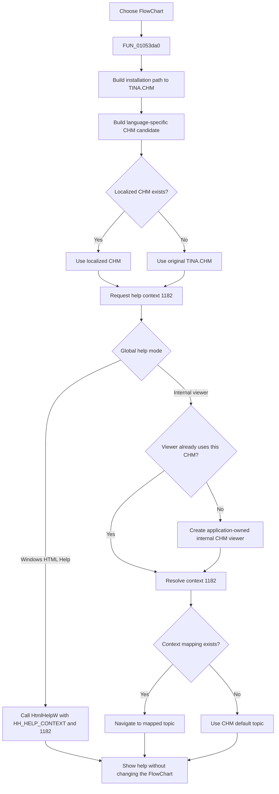

# Open FlowChart help

> Analysis status: Reviewed from recovered handler, component-resource, localized CHM, and shared help-dispatch evidence.

## Control

| Property | Recovered value |
| --- | --- |
| Form | FlowChartMainForm |
| Component path | FlowChartMainForm.MainMenu.mnHelp.mnFlowChart |
| Control class | TMenuItem |
| Caption | &FlowChart |
| Hint | Not present in the recovered resource. |
| Text | Not present in the recovered resource. |
| Handler name | mnFlowChartClick |
| Handler address | 01053da0 |
| Graph node | `resource:dfm:FlowChartMainForm/FlowChartMainForm.MainMenu.mnHelp.mnFlowChart` |
| Handler node | `function:01053da0` |
| Graph layer | UI |

## What happens when clicked

`TFlowChartMainForm.mnFlowChartClick` builds this help-file path:

`<TINA installation folder>\TINA.CHM`

It passes the path to the shared localized-help resolver. It then asks the
application's global help system to show numeric help context `1182` (`0x49e`)
from the selected CHM file.

The `&FlowChart` resource caption and the `mnFlowChartClick` binding identify
this as the FlowChart help command. The source does not recover the final CHM
topic title or HTML file for context `1182`. The click does not open a
FlowChart document and does not start a web URL.

## Localized CHM selection

The shared resolver builds a language-specific candidate as follows:

`ChangeFileExt(original, "") + "_" + current-language-marker + ExtractFileExt(original)`

For this control, the candidate stays in the TINA installation directory and
adds an underscore plus the current language marker before `.CHM`.

- If the candidate exists, the resolver returns it.
- If it does not exist, the resolver returns the original `TINA.CHM` path.

A missing localized file is therefore a normal fallback. The handler does not
show an error for it.

## Help-viewer routing

The global help-context dispatcher selects one of two application-wide viewer
paths.

### Windows HTML Help mode

The dispatcher initializes Windows HTML Help, resolves `HtmlHelpW`, and gets
the registered application help-window handle. It associates or opens the
selected CHM and calls `HtmlHelpW` with `HH_HELP_CONTEXT` (`0x0f`) and context
value `1182`. A nonzero returned window handle is shown. The FlowChart form
does not supply or store that handle.

### Internal CHM viewer mode

The dispatcher reuses the process-global internal viewer when it already uses
the selected CHM. If no viewer exists, or its stored CHM path differs, the
dispatcher creates a viewer for the selected file and stores it in the global
viewer slot. The internal viewer form is created through the global VCL
`Application`, not as a child of `FlowChartMainForm`.

For context `1182`, the internal viewer starts with the CHM default topic and
replaces it only when the CHM context map contains that numeric ID. It then
navigates the internal browser to the selected topic.

## Click flow

## Guards, missing help, and errors

- The handler does not inspect the active page, current document, selection,
  editor contents, license state, or network state. It always sends the help
  request.
- If the localized CHM is absent, resolution falls back to the original
  `TINA.CHM` file.
- In Windows HTML Help mode, failure to load HTML Help, resolve `HtmlHelpW`,
  open the CHM, or show the context produces no control-specific message or
  retry in this handler.
- In internal-viewer mode, the viewer constructor checks the selected CHM. A
  missing file raises an error whose recovered text ends with
  ` does not exist.`. The handler has no alternate-file branch after this
  failure.
- If context `1182` has no internal mapping, the viewer keeps the CHM default
  topic. If that topic cannot be resolved, the internal navigation path does
  not load a new page.
- The handler has no local exception handler, return-value test, retry,
  status-message, or rollback path.

## State and persistence

The handler does not read or write a `FlowChartMainForm` field. It does not
change FlowChart objects, code text, the active page, selection, zoom, Undo or
modified state, project data, or application preferences. It also does not
call the macro recorder used by some other TINA help commands.

The delegated help system can create, replace, or reuse the process-global
internal viewer, or show a Windows HTML Help window. Repeated clicks can reuse
the internal viewer when its CHM path matches. These are application help UI
effects, not FlowChart-document changes. The handler calls no project,
settings, registry, or file writer.

## Handler evidence

- [Click handler `FUN_01053da0`](../../../DecompiledSources/Tina16/functions/0000000001053DA0__FUN_01053da0.c) concatenates the installation folder, path separator, and `TINA.CHM`; resolves the localized path; and calls the global help-context method with `0x49e`.
- [Localized-help resolver `FUN_01b1def0`](../../../DecompiledSources/Tina16/functions/0000000001B1DEF0__FUN_01b1def0.c) constructs the language-specific candidate, checks it, and falls back to the original path.
- [Help-context dispatcher `FUN_01d46890`](../../../DecompiledSources/Tina16/functions/0000000001D46890__FUN_01d46890.c) selects Windows `HtmlHelpW` or the process-global internal viewer. Its canonical annotation belongs to the Diagram Window help analysis.
- [Windows HTML Help loader `FUN_0042a4a0`](../../../DecompiledSources/Tina16/functions/000000000042A4A0__FUN_0042a4a0.c) loads `hhctrl.ocx` and resolves the ANSI and Unicode HTML Help functions.
- [`HtmlHelpW` wrapper `FUN_0042a560`](../../../DecompiledSources/Tina16/functions/000000000042A560__FUN_0042a560.c) returns the help-window handle or zero.
- [Internal viewer constructor `FUN_00b02f00`](../../../DecompiledSources/Tina16/functions/0000000000B02F00__FUN_00b02f00.c) verifies and extracts the CHM, then builds its topic and context indexes.
- [Internal context navigation `FUN_00b046f0`](../../../DecompiledSources/Tina16/functions/0000000000B046F0__FUN_00b046f0.c) creates or shows the viewer form, resolves the numeric context, and requests navigation.
- [Context resolver `FUN_00b04480`](../../../DecompiledSources/Tina16/functions/0000000000B04480__FUN_00b04480.c) keeps the default topic unless it finds the requested numeric context in the CHM map.
- [Recovered component tree](../../../DecompiledSources/Tina16/resources/dfm/ui-evidence.json) supplies the `&FlowChart` caption and the `mnFlowChartClick` event binding.
- The graph records three direct outgoing calls: the UnicodeString concatenation helper, the localized-help resolver, and the UnicodeString-array finalizer. The help-context call is virtual and is therefore not a direct graph edge from this recovered handler.

## Resource evidence

- `mnFlowChart` is a `TMenuItem` below the FlowChart form's Help menu.
- Its caption is `&FlowChart`.
- Its sibling `MCU Debugger` help command uses the same CHM route with a
  different numeric context (`0x49b`). This supports the control-specific
  context split but does not reveal either final topic file.
- The control has no hint, text, action, image reference, or glyph.

## Analysis limits

- The recovered source proves the CHM name, localization fallback, and numeric
  context. It does not contain the final title or HTML path mapped to context
  `1182`.
- The recovered name of the global help-mode flag is not available. Its two
  branches are explicit in the shared dispatcher.
- The handler receives no success or failure result from the help system.
- Shared resolver `FUN_01b1def0` and dispatcher `FUN_01d46890` are described by
  the canonical annotations in Bead `TIARA-diz.6.7.291`; this control adds no
  duplicate annotations for them.
