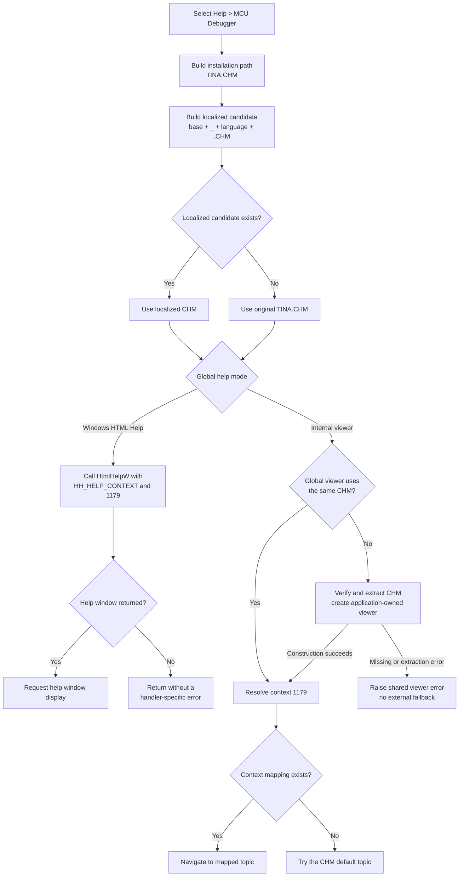

# Open MCU Debugger help

> Analysis status: Complete. The recovered menu resource, handler, localized-help resolver, and shared internal and external help paths support this explanation.

## Control

| Property | Recovered value |
| --- | --- |
| Form | FlowChartMainForm |
| Component path | FlowChartMainForm.MainMenu.mnHelp.mnMCUDebugger |
| Control class | TMenuItem |
| Caption | MCU Debugger |
| Hint | Not present in the recovered resource. |
| Handler name | mnMCUDebuggerClick |
| Handler address | 010543e0 |
| Graph node | `resource:dfm:FlowChartMainForm/FlowChartMainForm.MainMenu.mnHelp.mnMCUDebugger` |
| Handler node | `function:010543e0` |
| Graph layer | UI |

The menu item has no recovered action, image reference, or glyph. Its caption identifies the intended subject, while the handler supplies the exact help file and numeric context.

## What happens when selected

`FUN_010543e0` builds this base path:

`<TINA installation folder>\TINA.CHM`

It passes the path to the `.291`-owned localized-help resolver. It then calls the application's global help-context interface with the resolved CHM path and numeric context `0x49B`, which is decimal `1179`.

The handler does not open an MCU debugger window, create a debugger session, or inspect the current MCU. It requests the **MCU Debugger** help topic from TINA's compiled HTML Help file. The recovered CHM content is not present in this repository, so the final topic title and internal HTML file name for context 1179 are not available for independent confirmation.

Unlike the `.291` Diagram Window help wrapper, this handler does not record a macro command. Its only application-specific work is path construction, localization, and help-context dispatch.

## Localized CHM selection

The shared resolver constructs a language-specific candidate with this formula:

`ChangeFileExt(original, "") + "_" + current-language-marker + ExtractFileExt(original)`

For `TINA.CHM`, the candidate remains in the installation folder and has an underscore plus the current language marker before `.CHM`.

- If the candidate exists, the resolver returns it.
- If the candidate does not exist, the resolver silently returns the original `<TINA installation folder>\TINA.CHM` path.

A missing localized file is therefore a normal fallback. The resolver does not test whether the original file exists before it returns that path.

## External Windows HTML Help path

The `.291`-owned global dispatcher selects the external path when its help-mode flag is clear. It initializes `hhctrl.ocx` once, resolves `HtmlHelpW`, obtains the registered application help-window handle, associates or opens the resolved CHM, and calls `HtmlHelpW` with:

- command `0x0F` (`HH_HELP_CONTEXT`);
- data value `1179`;
- the resolved `TINA.CHM` path;
- the registered application help window as owner.

If `HtmlHelpW` returns a nonzero help-window handle, the dispatcher requests that window be shown. `FUN_010543e0` does not pass a `FlowChartMainForm` window handle, keep the returned handle, or wait for a modal result.

If `hhctrl.ocx` cannot load, `HtmlHelpW` cannot be resolved, or the help request returns zero, the shared wrapper returns zero. Neither the dispatcher nor this menu handler displays a command-specific error, retries another help file, or changes to the internal viewer.

## Internal CHM viewer path

When the global help-mode flag selects the internal viewer, the dispatcher compares the requested CHM path with the process-global viewer's stored path.

- If a viewer for the same resolved CHM exists, it is reused.
- If no viewer exists, or its stored CHM path differs, the dispatcher constructs a viewer for the requested file and replaces the global viewer slot.

The internal viewer creates its display form through the global VCL `Application` object and shows it when necessary. It is application-owned and modeless from this handler's point of view; it is not owned by `FlowChartMainForm`.

For context 1179, the viewer searches the CHM context map. A matching entry replaces the initial default topic. If no mapping exists, the viewer keeps the CHM's recovered default topic and tries to navigate there. If the final topic file is unavailable, the navigation helper does not load a new page.

## Missing files, errors, and repeated selection

- A missing localized CHM falls back to the original `TINA.CHM` without a message.
- In the external path, a missing or unusable original CHM can make the HTML Help calls return zero. This handler discards that result, so it has no local error message or fallback.
- The internal-viewer constructor explicitly tests the resolved CHM. If it does not exist, it raises an error whose recovered text ends with ` does not exist.`. It can also raise an extraction error whose text ends with ` could not extract help file.`. This handler has no local exception handler or cleanup branch.
- If internal viewer construction fails, the recovered dispatcher does not continue to the Windows HTML Help path.
- Repeated selections reuse the internal global viewer when its CHM path is unchanged. Windows HTML Help owns external-window reuse; this handler stores no per-form viewer state.

## State and persistence

The handler does not read or change the flowchart model, debugger state, current MCU, selection, breakpoint set, project dirty state, undo history, or application preferences. It has no file writer, registry writer, settings writer, or project serializer.

The shared help system can mutate process-wide help state:

- the external help manager records that HTML Help initialization was attempted;
- the internal path creates or replaces the process-global viewer and can create and show its application-owned form;
- both paths can change the topic displayed in an existing help window.

These are help-session effects, not project persistence. The menu handler keeps no result and has no rollback if a later help operation fails.

## Click flow

## Source evidence

- MCU Debugger help handler: [FUN_010543e0](../../../DecompiledSources/Tina16/functions/00000000010543E0__FUN_010543e0.c)
- `.291`-owned localized-help resolver: [FUN_01b1def0](../../../DecompiledSources/Tina16/functions/0000000001B1DEF0__FUN_01b1def0.c)
- `.291`-owned help-context dispatcher: [FUN_01d46890](../../../DecompiledSources/Tina16/functions/0000000001D46890__FUN_01d46890.c)
- External HTML Help initialization and context wrapper: [FUN_01d461d0](../../../DecompiledSources/Tina16/functions/0000000001D461D0__FUN_01d461d0.c), [FUN_01d46f70](../../../DecompiledSources/Tina16/functions/0000000001D46F70__FUN_01d46f70.c), and [FUN_0042a560](../../../DecompiledSources/Tina16/functions/000000000042A560__FUN_0042a560.c)
- Internal viewer construction and missing-file checks: [FUN_00b02f00](../../../DecompiledSources/Tina16/functions/0000000000B02F00__FUN_00b02f00.c)
- Internal viewer form creation and context navigation: [FUN_00b02670](../../../DecompiledSources/Tina16/functions/0000000000B02670__FUN_00b02670.c) and [FUN_00b046f0](../../../DecompiledSources/Tina16/functions/0000000000B046F0__FUN_00b046f0.c)
- Context map and default-topic fallback: [FUN_00b04480](../../../DecompiledSources/Tina16/functions/0000000000B04480__FUN_00b04480.c)
- Recovered menu caption and event binding: [ui-evidence.json](../../../DecompiledSources/Tina16/resources/dfm/ui-evidence.json)
- Canonical shared help analysis owned by `.291`: [Open Diagram Window help](../../ui-controls/dfwindow/dfdiagramviewermnu-f73de731f7.md)

## Analysis limits and ownership

- The exact text stored in the current-language marker is runtime state and is not read by this handler.
- The repository does not contain the selected `TINA.CHM`, so this analysis cannot map context 1179 to an internal HTML file or verify the displayed topic text.
- The global help-mode flag and registered owner object's Delphi field names are not recovered.
- External HTML Help can provide its own user-visible behavior after a failed request. The recovered application code proves only that this wrapper does not report or retry the zero result.
- `.524` owns only `FUN_010543e0`. `.291` owns the canonical localized resolver `FUN_01b1def0` and help-context dispatcher `FUN_01d46890`. Viewer construction, context mapping, `HtmlHelpW`, and VCL form helpers remain evidence-only here.
