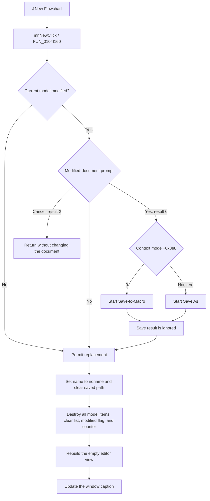

# &New Flowchart

> Analysis status: Source-reviewed. The direct handler, its modified-document guard, and its model-reset path establish the behavior below.

## Control

| Property | Recovered value |
| --- | --- |
| Form | FlowChartMainForm |
| Component path | FlowChartMainForm.MainMenu.mnFile.mnNew |
| Control class | TMenuItem |
| Caption | &New Flowchart |
| Hint | Not present in the recovered resource. |
| Handler name | mnNewClick |
| Handler address | 0104f160 |
| Graph node | `resource:dfm:FlowChartMainForm/FlowChartMainForm.MainMenu.mnFile.mnNew` |
| Handler node | `function:0104f160` |
| Graph layer | UI |

## What happens when clicked

`FUN_0104f160` first asks `FUN_01053000` whether the current document can be replaced. If the model is not modified, the guard permits New without a prompt. If it is modified, the guard shows a localized Yes, No, or Cancel prompt.

- Cancel is modal result `2`. It returns false and stops New before any document state changes.
- No is the other non-Yes result. It returns true, so New discards the unsaved in-memory document.
- Yes is modal result `6`. It starts one of two save routes. Mode byte `FlowChartMainForm + 0x8e8 == 0` uses the Save-to-Macro route. A nonzero mode uses Save As.

The Yes branch has a significant limit: the guard does not test the save function's result. Canceling Save As, or a false result from Save-to-Macro, still returns true from the guard. New then replaces the unsaved document. Only Cancel in the first modified-document prompt reliably stops the command.

When the guard permits New, the handler performs these changes in order:

1. It sets the document display name at `FlowChartMainForm + 0x8d0` to the literal `noname`.
2. It clears the saved path at `FlowChartMainForm + 0x8d8`.
3. `FUN_00f629d0` destroys every item in the flowchart model and clears its item list. It clears the modified flag at model offset `+0x18`, sets the recovered state byte at `+0x19` to `1`, and resets the counter at `+0x30` to zero.
4. `FUN_010508e0` rebuilds the editor view for the now-empty model.
5. `FUN_01051360` updates the window caption.

The reset creates a blank flowchart. It does not insert a default start block or another default model item.

## State that New preserves

New does not rerun the form initializer. It therefore preserves the selected MCU family, MCU text, clock value, editor colors, grid and view settings, and the flowchart context mode. It also does not explicitly destroy or recreate the debugger, simulator, or MCU backend objects.

Model items are destroyed, so item-owned state such as flags on the old blocks disappears with those items. The recovered code does not prove a full debugger-session reset. The title updater normally uses `noname` and the retained MCU family in editor mode. If New is invoked while the form is in its debugger-title mode, the updater can use the debugger-derived name instead; the New handler has no recovered mode guard.

## Persistence and later Save behavior

New does not write a new file, delete the old file, update a recent-file list, or write settings. The old saved file remains unchanged. The blank document exists only in memory and has an empty saved path. A later normal Save uses that empty path to enter the Save As route.

If the user selects Yes and the save succeeds, the old document is persisted before the reset. In the file-backed mode, Save As stores its accepted path and name, serializes the old model, clears its modified flag, and updates the caption. New immediately replaces that path and name with an empty path and `noname` after the guard returns.

## Cancellation and failure boundaries

- Cancel in the initial modified-document prompt is a clean no-op for New.
- No deliberately discards the current unsaved model without changing its existing file on disk.
- Yes followed by cancellation or a false save result still proceeds with New because the guard ignores that outcome.
- An exception from the prompt or save path propagates before New starts. A save operation can already have produced partial external effects before such an exception.
- The New reset is not transactional. It assigns the new name and clears the path before it destroys model items. It rebuilds the view and title only after the model reset. An exception in this sequence can therefore leave mixed name, path, model, view, or caption state. No rollback is recovered.

## Click flow

## Handler evidence

- [FUN_0104f160](../../../DecompiledSources/Tina16/functions/000000000104F160__FUN_0104f160.c) tests the guard result, assigns `noname`, clears the path, resets the model, rebuilds the view, and updates the title.
- [FUN_01053000](../../../DecompiledSources/Tina16/functions/0000000001053000__FUN_01053000.c) reads the model modified flag, shows the mode-specific localized prompt, blocks only result `2`, and calls a save route for result `6` without testing that route's outcome.
- [FUN_00f629d0](../../../DecompiledSources/Tina16/functions/0000000000F629D0__FUN_00f629d0.c) destroys the current model items, clears the list and modified flag, sets the recovered byte at `+0x19`, and resets the counter.
- [FUN_0104f2e0](../../../DecompiledSources/Tina16/functions/000000000104F2E0__FUN_0104f2e0.c) is the Save As route. It returns without writing when its dialog is canceled.
- [FUN_0104fb30](../../../DecompiledSources/Tina16/functions/000000000104FB30__FUN_0104fb30.c) is the mode-zero Save-to-Macro route. It returns a success value that the guard does not consume.
- [FUN_010508e0](../../../DecompiledSources/Tina16/functions/00000000010508E0__FUN_010508e0.c) delegates the editor rebuild to the shared flowchart drawing routine.
- [FUN_01051360](../../../DecompiledSources/Tina16/functions/0000000001051360__FUN_01051360.c) formats the form caption from the active name and MCU family, with a separate debugger-mode name branch.

## Resource evidence

- The recovered DFM binds `mnNew.OnClick` to `mnNewClick` at `0104f160`.
- The menu caption is `&New Flowchart`.
- The menu item has no recovered hint, action, image, built-in modal result, or extracted glyph.

## Analysis limits and ownership

- `FUN_0104f160`, `FUN_01053000`, and `FUN_00f629d0` are annotated with this control.
- The shared editor rebuild and caption functions are evidence only here. Their wider responsibilities are owned by their canonical graph annotations.
- The Exit, Open, normal Save, and Save As controls have separate articles. This article follows those paths only far enough to explain the New command's decision and persistence boundary.
- The semantic name of model byte `+0x19` is not recovered. This article records its value but does not assign an invented name.
