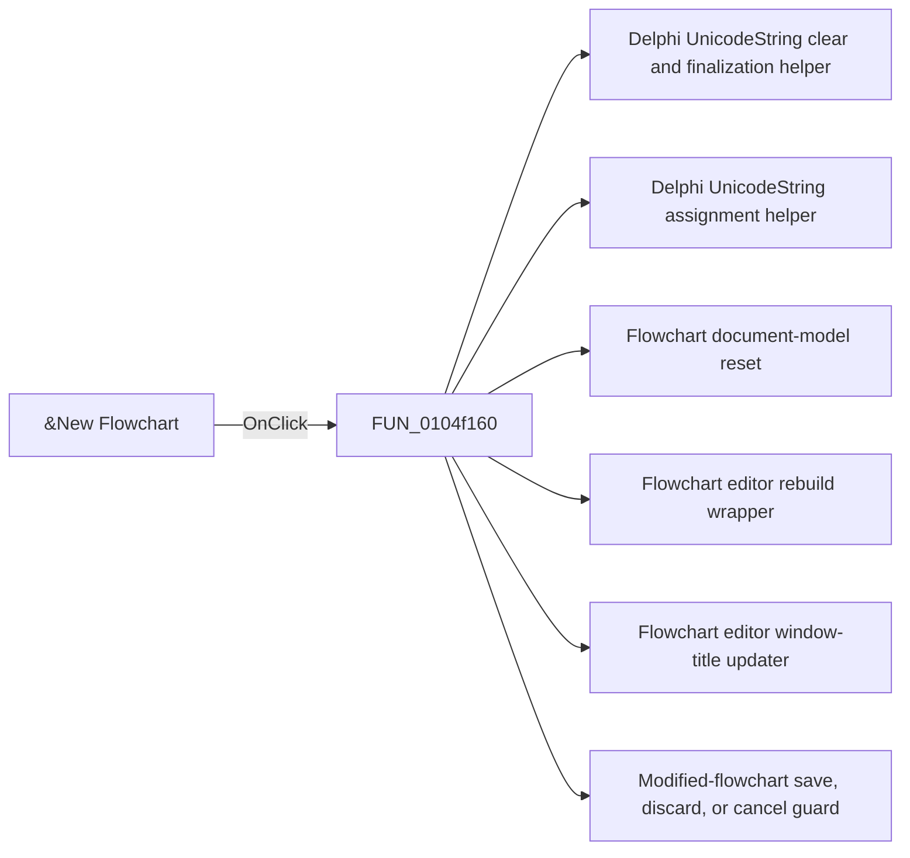

# &New Flowchart

> Analysis status: Pending individual source review.

## Control

| Property | Recovered value |
| --- | --- |
| Form | FlowChartMainForm |
| Component path | FlowChartMainForm.MainMenu.mnFile.mnNew |
| Control class | TMenuItem |
| Caption | &New Flowchart |
| Hint | Not present in the recovered resource. |
| Text | Not present in the recovered resource. |
| Handler name | mnNewClick |
| Handler address | 0104f160 |
| Graph node | `resource:dfm:FlowChartMainForm/FlowChartMainForm.MainMenu.mnFile.mnNew` |
| Handler node | `function:0104f160` |
| Graph layer | UI |

## What happens when clicked

Pending individual analysis. An agent must read the recovered handler source and its relevant callees before it replaces this text.

## Click flow

## Handler evidence

- Source: [DecompiledSources/Tina16/functions/000000000104F160__FUN_0104f160.c](../../../DecompiledSources/Tina16/functions/000000000104F160__FUN_0104f160.c)
- Recovered role: New flowchart command coordinator
- Current graph summary: After the unsaved-change guard permits it, creates a blank flowchart named noname, clears its file path and model, rebuilds the editor view, and updates the window title. Handles 1 Delphi UI event: FlowChartMainForm.MainMenu.mnFile.mnNew.OnClick.
- Current graph behavior: After the unsaved-change guard permits it, creates a blank flowchart named noname, clears its file path and model, rebuilds the editor view, and updates the window title.
- Current graph evidence: The main-menu New Flowchart item binds here. The function calls FUN_01053000, assigns noname, clears the saved path, resets the model, rebuilds the view, and updates the title.
- Complexity: complex
- Distinct outgoing calls: 6

## Direct calls

- `function:00414480` — Delphi UnicodeString clear and finalization helper
- `function:00414ad0` — Delphi UnicodeString assignment helper
- `function:00f629d0` — Flowchart document-model reset
- `function:010508e0` — Flowchart editor rebuild wrapper
- `function:01051360` — Flowchart editor window-title updater
- `function:01053000` — Modified-flowchart save, discard, or cancel guard

## Resource evidence

- Kind: Not present in the recovered resource.
- Modal result: Not present in the recovered resource.
- Checked state: Not present in the recovered resource.
- List items: Not present in the recovered resource.
- Image reference: Not present in the recovered resource.
- Extracted glyph: None.

## Nearby label candidates

Nearby labels are layout candidates only. They are not proof of behavior.

- No same-parent label candidate is available.

## Analysis limits

- Do not infer behavior from the control class, caption, hint, glyph, or nearby label alone.
- Do not replace the pending status until the handler source and relevant call path provide enough evidence.
