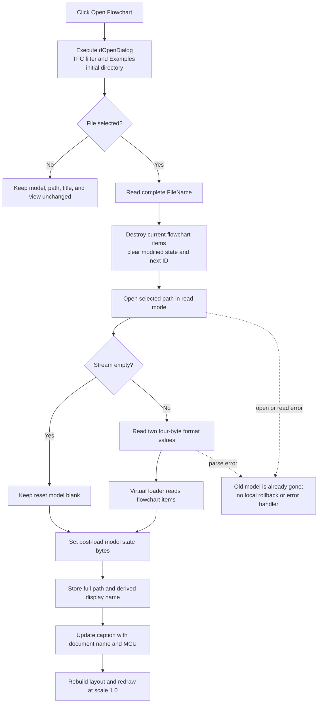

# &Open Flowchart

> Analysis status: Complete. The recovered menu handler, dialog initialization, file-load coordinator, binary stream reader, model reset, title updater, view rebuild, and unsaved-change guard support this explanation.

## Control

| Property | Recovered value |
| --- | --- |
| Form | FlowChartMainForm |
| Component path | FlowChartMainForm.MainMenu.mnFile.mnOpen |
| Control class | TMenuItem |
| Caption | &Open Flowchart |
| Hint | Not present in the recovered resource. |
| Text | Not present in the recovered resource. |
| Handler name | mnOpenClick |
| Handler address | 0104f1e0 |
| Graph node | `resource:dfm:FlowChartMainForm/FlowChartMainForm.MainMenu.mnFile.mnOpen` |
| Handler node | `function:0104f1e0` |
| Graph layer | UI |

## What happens when clicked

`FUN_0104f1e0` executes `FlowChartMainForm.dOpenDialog` at form field `+0x718`. If the user cancels the dialog, the handler only finalizes its empty local string. It does not change the current model, stored document path, title, modified state, editor, or debugger state.

When the user accepts, the handler reads the dialog's complete `FileName` through the VCL file-dialog accessor and passes that path unchanged to `FUN_01050790`. The handler does not check the extension and does not test whether the active flowchart is modified.

During form initialization, `FUN_0104fe00` configures this dialog with the filter `TINA Flowchart file (*.tfc)|*.tfc`. It selects the application's `Examples` directory when that directory exists; otherwise, it uses `Edison5\Examples`. It also clears the dialog's initial file name. This filter helps the user select a TFC file, but the click handler does not enforce it after the dialog returns.

## No unsaved-change prompt

The Open command does not call `FUN_01053000`, the shared modified-flowchart guard. New Flowchart and the form-close query use that guard to offer Yes, No, or Cancel, but Open bypasses it. Therefore, accepting a file can discard a modified flowchart without an application prompt. The `.515` analysis owns the guard, including its separate behavior when Yes starts a save.

The destructive boundary is dialog acceptance, not successful parsing. `FUN_01050790` resets the current document model before it creates the input file stream. Canceling the dialog preserves the document; accepting a missing, unreadable, truncated, or malformed file can destroy the old in-memory model before the load fails.

## TFC file loading

The accepted path enters this sequence:

1. `FUN_00f629d0` destroys and clears the current flowchart items, clears the model's modified byte, resets the next item ID, and resets an internal model-state byte.
2. The coordinator constructs a Delphi file stream for the selected path in read mode.
3. `FUN_01050690` tests the stream size. For a nonempty stream, it seeks to byte zero, reads two four-byte header values, stores those format values in the document and its contained flowchart object, and dispatches the rest of the stream to that object's virtual load method.
4. After the reader returns, the coordinator destroys the stream, clears the model byte at `+0x80`, and sets the byte at `+0x19` to one. The exact names of these two internal state fields are not recovered.
5. It stores the complete selected path in the form field at `+0x8d8`. It derives a display name from the selected path and stores that name at `+0x8d0`.
6. `FUN_01051360` formats the Flowchart editor caption from the display name and selected MCU family.
7. `FUN_010508e0` calls the editor rebuild path. That path resets view scale to `1.0`, reapplies drawing dimensions, visits the loaded flowchart items, and completes layout and redraw.

The reader is the inverse of the `.519`-owned `FUN_01050620` writer: both process two four-byte header values and then delegate the remaining document state to the contained flowchart object's virtual stream method. The recovered reader does not compare the first header value with a fixed signature and does not perform an explicit version or schema rejection before dispatch.

An empty file is a distinct case. Because `FUN_01050690` skips all reads when stream size is zero, the coordinator still records the selected path and derived name, updates the title, and rebuilds a blank editor. A nonempty file shorter than eight bytes reaches the complete-read helper, which raises when it cannot supply the requested bytes.

## Modified, debugger, and persistent state

- The model reset explicitly clears the flowchart modified byte before loading. The Open coordinator does not call the modified-state synchronizer afterward and does not explicitly mark the loaded document as modified.
- The optional secondary editor or debugger object at form field `+0x9d8` is not destroyed, recreated, or called by this Open path. No debugger execution reset is proven here. Only the document-model reset and editor-view rebuild are direct effects.
- A successful load retains the full selected path and the derived display name in the form. A later Save uses that stored path; Save As can replace it.
- This command does not add a recent-file entry, write a registry or INI value, save preferences, or write the TFC file. The only file operation in this path is the read-mode stream.
- The `TOpenDialog` can retain its accepted `FileName` while the form remains alive. This in-memory dialog state is not evidence of durable recent-file persistence.

## Click flow

## Failure and partial-state boundaries

- Dialog Cancel is the only proven no-op exit.
- The current model is reset before file-stream construction. If opening the selected path fails, the previous items are already destroyed, while the old stored path, display name, and title have not yet been replaced.
- If a complete-read or virtual-load operation fails, the new model can be blank or partly populated. The coordinator has no local exception handler and no saved model for rollback.
- The new path, display name, caption, and view rebuild occur only after the stream reader returns. An earlier exception can therefore leave the old document identity visible with a reset or partly loaded model.
- A zero-byte file does not raise in this reader. It becomes a successfully named blank document.
- The path has no explicit signature check, extension check, confirmation prompt, backup, or atomic temporary-model swap.

## Source evidence

- Open menu handler: [FUN_0104f1e0](../../../DecompiledSources/Tina16/functions/000000000104F1E0__FUN_0104f1e0.c)
- Flowchart dialog and model initialization: [FUN_0104fe00](../../../DecompiledSources/Tina16/functions/000000000104FE00__FUN_0104fe00.c)
- File-load coordinator: [FUN_01050790](../../../DecompiledSources/Tina16/functions/0000000001050790__FUN_01050790.c)
- TFC stream reader: [FUN_01050690](../../../DecompiledSources/Tina16/functions/0000000001050690__FUN_01050690.c)
- Document-model reset: [FUN_00f629d0](../../../DecompiledSources/Tina16/functions/0000000000F629D0__FUN_00f629d0.c)
- Complete-read helper: [FUN_004b84c0](../../../DecompiledSources/Tina16/functions/00000000004B84C0__FUN_004b84c0.c)
- Editor rebuild wrapper: [FUN_010508e0](../../../DecompiledSources/Tina16/functions/00000000010508E0__FUN_010508e0.c)
- Editor layout and redraw rebuild: [FUN_00f63b50](../../../DecompiledSources/Tina16/functions/0000000000F63B50__FUN_00f63b50.c)
- Window-title updater: [FUN_01051360](../../../DecompiledSources/Tina16/functions/0000000001051360__FUN_01051360.c)
- Unsaved-change guard used by New and Close, but not Open: [FUN_01053000](../../../DecompiledSources/Tina16/functions/0000000001053000__FUN_01053000.c)
- Inverse TFC stream writer: [FUN_01050620](../../../DecompiledSources/Tina16/functions/0000000001050620__FUN_01050620.c)

## Resource evidence

- Caption: **Open Flowchart**.
- Dialog component: `FlowChartMainForm.dOpenDialog`, class `TOpenDialog`.
- The DFM has no hint, glyph, action, checked state, or modal result for this menu item.
- The dialog filter and initial directory are assigned in form initialization, not stored in the recovered DFM property subset.

## Analysis limits

- The names of the two post-load model-state bytes are not recovered. This article records their values and does not label them as debugger flags.
- The contained flowchart object's virtual load method is recovered as an indirect call. The outer reader proves the two header reads and delegation boundary, but it does not expose every item-level field in this article.
- `.516` owns the annotations for the Open handler, file-load coordinator, and TFC stream reader. `.515` owns the shared unsaved-change guard, and `.519` owns the inverse TFC stream writer.
