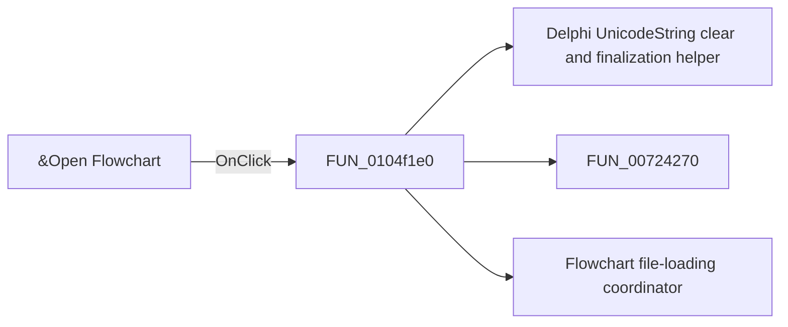

# &Open Flowchart

> Analysis status: Pending individual source review.

## Control

| Property | Recovered value |
| --- | --- |
| Form | FlowChartMainForm |
| Component path | FlowChartMainForm.MainMenu.mnFile.mnOpen |
| Control class | TMenuItem |
| Caption | &Open Flowchart |
| Hint | Not present in the recovered resource. |
| Text | Not present in the recovered resource. |
| Handler name | mnOpenClick |
| Handler address | 0104f1e0 |
| Graph node | `resource:dfm:FlowChartMainForm/FlowChartMainForm.MainMenu.mnFile.mnOpen` |
| Handler node | `function:0104f1e0` |
| Graph layer | UI |

## What happens when clicked

Pending individual analysis. An agent must read the recovered handler source and its relevant callees before it replaces this text.

## Click flow

## Handler evidence

- Source: [DecompiledSources/Tina16/functions/000000000104F1E0__FUN_0104f1e0.c](../../../DecompiledSources/Tina16/functions/000000000104F1E0__FUN_0104f1e0.c)
- Recovered role: Open Flowchart command handler
- Current graph summary: Shows the Flowchart file-open dialog and passes the selected path to the flowchart file loader. Handles 1 Delphi UI event: FlowChartMainForm.MainMenu.mnFile.mnOpen.OnClick.
- Current graph behavior: Shows the Flowchart file-open dialog and passes the selected path to the flowchart file loader.
- Current graph evidence: The menu caption is Open Flowchart. Form setup configures a TFC file filter. The handler checks dialog acceptance, reads the selected path, and calls FUN_01050790.
- Complexity: complex
- Distinct outgoing calls: 3

## Direct calls

- `function:00414480` — Delphi UnicodeString clear and finalization helper
- `function:00724270` — FUN_00724270
- `function:01050790` — Flowchart file-loading coordinator

## Resource evidence

- Kind: Not present in the recovered resource.
- Modal result: Not present in the recovered resource.
- Checked state: Not present in the recovered resource.
- List items: Not present in the recovered resource.
- Image reference: Not present in the recovered resource.
- Extracted glyph: None.

## Nearby label candidates

Nearby labels are layout candidates only. They are not proof of behavior.

- No same-parent label candidate is available.

## Analysis limits

- Do not infer behavior from the control class, caption, hint, glyph, or nearby label alone.
- Do not replace the pending status until the handler source and relevant call path provide enough evidence.
