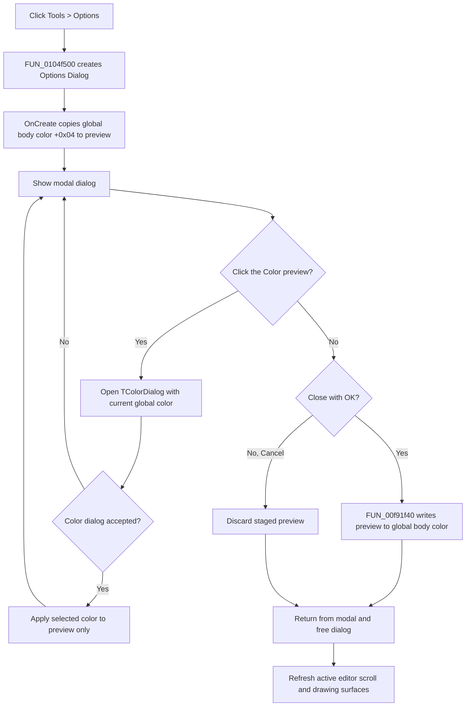

# Set the global flowchart body color

> Analysis status: Complete. The recovered menu handler, dedicated Options Dialog resource, staged color-preview path, OK-only global write, drawing consumers, and post-dialog editor refresh support this explanation.

## Control

| Property | Recovered value |
| --- | --- |
| Form | FlowChartMainForm |
| Component path | FlowChartMainForm.MainMenu.mnTools.mnOptions |
| Control class | TMenuItem |
| Parent menu | Tools |
| Caption | &Options |
| Hint | Not present in the recovered resource. |
| Shortcut | Not present in the recovered resource. |
| Handler name | mnOptionsClick |
| Handler address | 0104f500 |
| Graph node | `resource:dfm:FlowChartMainForm/FlowChartMainForm.MainMenu.mnTools.mnOptions` |
| Handler node | `function:0104f500` |
| Graph layer | UI |

## What happens when clicked

`FUN_0104f500` creates `TdlgFlowChartOptions` with the application as owner and displays it modally. The resource caption is **Options Dialog**. Despite the general menu caption, this recovered dialog contains only one option: the global flowchart **Body** color. It has no debugger, compiler, execution, grid, font, or other editor setting.

The menu handler does not pass a document or debugger object into the dialog. The dialog reads and writes the process-wide flowchart-rendering settings block at `PTR_DAT_02002068`.

## Staged body-color editing

When the dialog is created, `FUN_00f91f00` reads the current body color from global offset `+0x04` and applies it to the `lSetBodyColor` preview label. The same initialization assigns help context `0x49e` to the dialog.

The preview label has caption **Color** and hint **Click here to set the color**. Clicking it runs the separately owned handler `FUN_00f91eb0`:

1. It initializes the owned `TColorDialog` from the current global body color.
2. It executes the color dialog.
3. Only when that dialog is accepted, it applies the selected color to the preview label.

This is staged UI state. Selecting a color does not yet change the global setting or repaint the FlowChart editor. If the nested color dialog is cancelled, the preview is unchanged.

## OK commit and Cancel

The dialog's `BitBtn1` is a built-in `bkOK` button. Its handler `FUN_00f91f40` reads the preview label color and writes it to global flowchart setting offset `+0x04`. The write occurs in the OK click handler before the modal dialog returns.

`BitBtn2` is a built-in `bkCancel` button with no application OnClick handler. Cancel closes the dialog without calling the global-write function, so a staged preview color is discarded. The outer menu handler does not inspect the modal result; it relies on the OK handler for commit and on the lack of a Cancel handler for rollback-by-discard.

The dialog also has a built-in `bkHelp` button. No application OnClick handler was recovered for it.

## Editor refresh and downstream use

After the modal call returns for either OK or Cancel, `FUN_0104f500` frees the dialog. It then invokes the parameterless VCL refresh/invalidation virtual on the two drawing controls at offsets `+0x4c0` and `+0x4d8` of the active editor frame at form offset `+0x928`. Resource and render-path evidence identify these as the active FlowChart editor's scroll/drawing surface pair.

The refresh is unconditional. Cancel therefore schedules the same redraw even though the color did not change. On OK, the redraw makes the accepted global color visible. The flowchart renderers `FUN_00f63a50`, `FUN_00f63b50`, `FUN_00f64020`, and `FUN_00f64920` read global offset `+0x04` when they draw object bodies, so the new value affects subsequent rendering of all flowcharts in this process, not only one selected object.

## Document and persistence boundary

- The accepted color changes a process-wide runtime setting. It is not stored in a FlowChart object or the current `.tfc` document by this command.
- The command does not mark the current FlowChart as modified, create an undo item, rebuild code, restart debugging, or change compiler options.
- Startup initialization sets the body-color field to `0x00C6C68C`. No registry, INI, preference-file, project serializer, or document-save call is present in the menu, dialog, or commit path. Cross-session persistence is therefore not established.
- Existing flowchart objects are not edited. Renderers consume the global color when they next draw an object body.

## Validation and partial failures

- There is no text or numeric input to validate. `TColorDialog` supplies the staged color value.
- The menu handler does not check the modal result, the committed color, or either refresh result.
- `FUN_0104f500` has no recovered local exception handler or `try/finally`. If dialog construction or modal display fails, no refresh occurs. If modal display throws, the explicit object-free call can be bypassed.
- The OK handler commits the global color before the dialog closes and before the outer refresh calls. If dialog destruction or a refresh fails after OK, the new global color remains, while one or both active editor controls can remain stale until another repaint.
- The second refresh occurs only after the first returns. A failure in the first refresh can prevent the second refresh.

## Options flow

## Source evidence

- FlowChart Options opener and post-dialog refresh: [FUN_0104f500](../../../DecompiledSources/Tina16/functions/000000000104F500__FUN_0104f500.c)
- Dialog preview initialization: [FUN_00f91f00](../../../DecompiledSources/Tina16/functions/0000000000F91F00__FUN_00f91f00.c)
- Color-label click and nested color dialog: [FUN_00f91eb0](../../../DecompiledSources/Tina16/functions/0000000000F91EB0__FUN_00f91eb0.c) and [FUN_00f91e80](../../../DecompiledSources/Tina16/functions/0000000000F91E80__FUN_00f91e80.c)
- OK-only global commit: [FUN_00f91f40](../../../DecompiledSources/Tina16/functions/0000000000F91F40__FUN_00f91f40.c)
- Global FlowChart defaults, including body color: [FUN_0104fe00](../../../DecompiledSources/Tina16/functions/000000000104FE00__FUN_0104fe00.c)
- Body-color drawing consumers: [FUN_00f63a50](../../../DecompiledSources/Tina16/functions/0000000000F63A50__FUN_00f63a50.c), [FUN_00f63b50](../../../DecompiledSources/Tina16/functions/0000000000F63B50__FUN_00f63b50.c), [FUN_00f64020](../../../DecompiledSources/Tina16/functions/0000000000F64020__FUN_00f64020.c), and [FUN_00f64920](../../../DecompiledSources/Tina16/functions/0000000000F64920__FUN_00f64920.c)
- Active editor drawing-control use: [FUN_0104e530](../../../DecompiledSources/Tina16/functions/000000000104E530__FUN_0104e530.c) and [FUN_0104e5b0](../../../DecompiledSources/Tina16/functions/000000000104E5B0__FUN_0104e5b0.c)

## Resource evidence

- The DFM binds `FlowChartMainForm.MainMenu.mnTools.mnOptions.OnClick` to `mnOptionsClick` at `0104f500`.
- The dedicated dialog caption is **Options Dialog** and its form class is `TdlgFlowChartOptions`.
- The only setting labels are **Body:** and **Color**. The Color label hint is **Click here to set the color**.
- The dialog owns a `TColorDialog` and built-in `bkOK`, `bkCancel`, and `bkHelp` buttons.
- The menu item has no recovered hint, shortcut, action, checked state, image reference, or extracted glyph.
- Nearby label candidate: None.

## Analysis limits and annotation ownership

- Future direct-control Beads `TIARA-diz.6.7.1795` and `TIARA-diz.6.7.1796` own the dialog OK and Color-label handlers and their preview/color-dialog helpers. This article cites `FUN_00f91f40`, `FUN_00f91eb0`, `FUN_00f91e80`, and `FUN_00f91f00` without redefining them.
- This article annotates only the FlowChartMainForm-specific opener and refresh wrapper `FUN_0104f500`.
- The original Delphi field names for the active frame and its offsets `+0x4c0` and `+0x4d8` are not recovered. Their control roles come from the DFM nesting and repeated render-path use.
