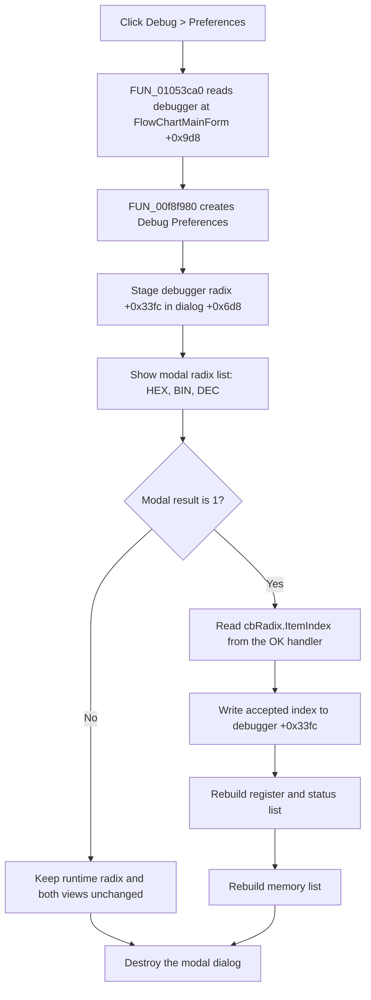

# Open Debug Preferences and apply the display radix

> Analysis status: Complete. The recovered FlowChart menu wrapper, canonical Debug Preferences controller, radix formatter, debugger-view refresh, and runtime synchronization paths support this explanation.

## Control

| Property | Recovered value |
| --- | --- |
| Form | FlowChartMainForm |
| Component path | FlowChartMainForm.MainMenu.mnDebug.mnPreferences |
| Control class | TMenuItem |
| Parent menu | Debug |
| Caption | &Preferences |
| Hint | Not present in the recovered resource. |
| Shortcut | Not present in the recovered resource. |
| Handler name | mnPreferencesClick |
| Handler address | 01053ca0 |
| Graph node | `resource:dfm:FlowChartMainForm/FlowChartMainForm.MainMenu.mnDebug.mnPreferences` |
| Handler node | `function:01053ca0` |
| Graph layer | UI |

## What happens when clicked

`FUN_01053ca0` reads the active debugger-controller pointer from `FlowChartMainForm +0x9d8` and passes it to the canonical Debug Preferences modal controller, `FUN_00f8f980`. The menu wrapper performs no other state change, validation, or refresh.

Normal FlowChart debugger initialization creates the controller and stores it at `+0x9d8` before the menu is used. The click handler does not test the pointer for null.

## Radix preference

The modal form contains one preference input: `cbRadix`, a non-editable `csDropDownList` under the **Radix** label. Its item indexes are:

| Index | Item | Display effect |
| ---: | --- | --- |
| 0 | HEX | Convert a generated binary digit string to hexadecimal. |
| 1 | BIN | Keep the generated binary digit string. |
| 2 | DEC | Convert the generated binary digit string to decimal. |

`FUN_015fa320` proves this mapping. It treats `0` as hexadecimal and `2` as decimal. Other values keep its binary input unchanged.

The modal controller creates `DebugPreferences`, copies the active debugger's runtime radix from field `+0x33fc` into the dialog's staged field `+0x6d8`, and calls `ShowModal`. The recovered call order constructs the form before it stages this value. Because `FormCreate` is the recovered path that copies the staged field to `cbRadix.ItemIndex`, the source does not prove that a nonzero value staged after construction is reflected in the visible combo before the modal call. No unrecovered binding is assumed here.

## Accepted commit and view refresh

When the user clicks the built-in `bkOK` button, `FUN_00f867c0` reads `cbRadix.ItemIndex` and stores it in the dialog's staged radix field. VCL returns accepted modal result `1`.

Only for result `1`, `FUN_00f8f980`:

1. reads the staged radix through `FUN_00f86780`;
2. writes it to the active debugger at `+0x33fc`; and
3. calls `FUN_00f8a700` to rebuild both radix-dependent debugger views.

The refresh dispatcher rebuilds the register/status list through `FUN_00f8ae10` and the memory list through `FUN_00f8a840`. Both routes read debugger field `+0x33fc` when they format numeric values. The change is therefore visible immediately in those two debugger lists. This path does not restart the simulator, change registers or MCU memory, or reload the FlowChart document.

## Cancel and close behavior

The dialog's Cancel control is a built-in `bkCancel` button with no application OnClick handler. If `ShowModal` returns any value other than `1`, the modal controller:

- does not read the dialog's staged radix;
- does not change debugger field `+0x33fc`;
- does not rebuild the register/status or memory list; and
- destroys the dialog.

There is no confirmation prompt, close veto, or separate menu-level Cancel handling.

## Persistence boundary

Acceptance changes the active debugger's runtime radix. Neither the menu wrapper nor the modal controller calls a registry, INI, file, project-save, or settings serializer.

Debugger initialization `FUN_00f8edf0` loads the runtime field from offset `+0x104` of the current recovered debugger/subcircuit record. Separate debugger stop or synchronization paths can call `FUN_00f8f400`, which copies the runtime field back to that record. This proves later in-memory record synchronization. It does not prove immediate project-file or cross-session persistence for the Preferences click.

## Validation and errors

- `cbRadix` prevents free-form typing, but the OK handler does not validate that `ItemIndex` is in `0..2`. A programmatically supplied `-1` or another value is stored unchanged. The formatter treats values other than `0` and `2` as the unchanged-binary route and shows no error.
- `FUN_01053ca0` has no null guard for the active debugger field. If `+0x9d8` is unexpectedly null, the modal controller dereferences it while reading `+0x33fc`.
- The menu wrapper and modal controller have no local exception handler or rollback. Dialog construction, modal display, list allocation, or formatting failures propagate through the Delphi runtime.
- On acceptance, the runtime radix is written before either view is rebuilt. If a refresh fails, the new runtime value remains while one or both lists can be stale or partly rebuilt.
- The dialog-destroy call is after the refresh and is not protected by a recovered local `try/finally`. An exception before that call can bypass this controller's normal destruction path.

## Preferences flow

## Source evidence

- FlowChart Preferences menu wrapper: [FUN_01053ca0](../../../DecompiledSources/Tina16/functions/0000000001053CA0__FUN_01053ca0.c)
- Active debugger construction and storage: [FUN_01051c30](../../../DecompiledSources/Tina16/functions/0000000001051C30__FUN_01051c30.c)
- Canonical Debug Preferences modal controller: [FUN_00f8f980](../../../DecompiledSources/Tina16/functions/0000000000F8F980__FUN_00f8f980.c)
- Accepted radix capture: [FUN_00f867c0](../../../DecompiledSources/Tina16/functions/0000000000F867C0__FUN_00f867c0.c)
- Staged radix setter, getter, and form initialization: [FUN_00f86770](../../../DecompiledSources/Tina16/functions/0000000000F86770__FUN_00f86770.c), [FUN_00f86780](../../../DecompiledSources/Tina16/functions/0000000000F86780__FUN_00f86780.c), and [FUN_00f86790](../../../DecompiledSources/Tina16/functions/0000000000F86790__FUN_00f86790.c)
- Register/status and memory refresh dispatcher: [FUN_00f8a700](../../../DecompiledSources/Tina16/functions/0000000000F8A700__FUN_00f8a700.c)
- Register/status list rebuild: [FUN_00f8ae10](../../../DecompiledSources/Tina16/functions/0000000000F8AE10__FUN_00f8ae10.c)
- Memory list rebuild: [FUN_00f8a840](../../../DecompiledSources/Tina16/functions/0000000000F8A840__FUN_00f8a840.c)
- Radix-dependent number conversion: [FUN_015fa320](../../../DecompiledSources/Tina16/functions/00000000015FA320__FUN_015fa320.c)
- Runtime initialization and later record synchronization: [FUN_00f8edf0](../../../DecompiledSources/Tina16/functions/0000000000F8EDF0__FUN_00f8edf0.c) and [FUN_00f8f400](../../../DecompiledSources/Tina16/functions/0000000000F8F400__FUN_00f8f400.c)

## Resource evidence

- Menu caption: **Preferences**, under the **Debug** menu.
- Dialog caption: **Debug Preferences**.
- Preference label: **Radix**.
- Combo items: **HEX**, **BIN**, and **DEC**, in that order.
- The menu item has no recovered hint, shortcut, action, checked state, image reference, or extracted glyph.
- Nearby label candidate: None.

## Analysis limits and annotation ownership

- The Debug Preferences control article `TIARA-diz.6.7.407` canonically owns `FUN_00f867c0`, `FUN_00f86770`, `FUN_00f86780`, `FUN_00f86790`, and `FUN_00f8f980`. This article cites those functions without redefining them.
- The broad debugger refresh, formatter, initialization, and record-synchronization functions remain evidence-only. This article annotates only the FlowChart-specific menu wrapper.
- The original Delphi field names at FlowChart offset `+0x9d8`, debugger offset `+0x33fc`, and record offset `+0x104` are not recovered. Their names here describe proven data flow.
