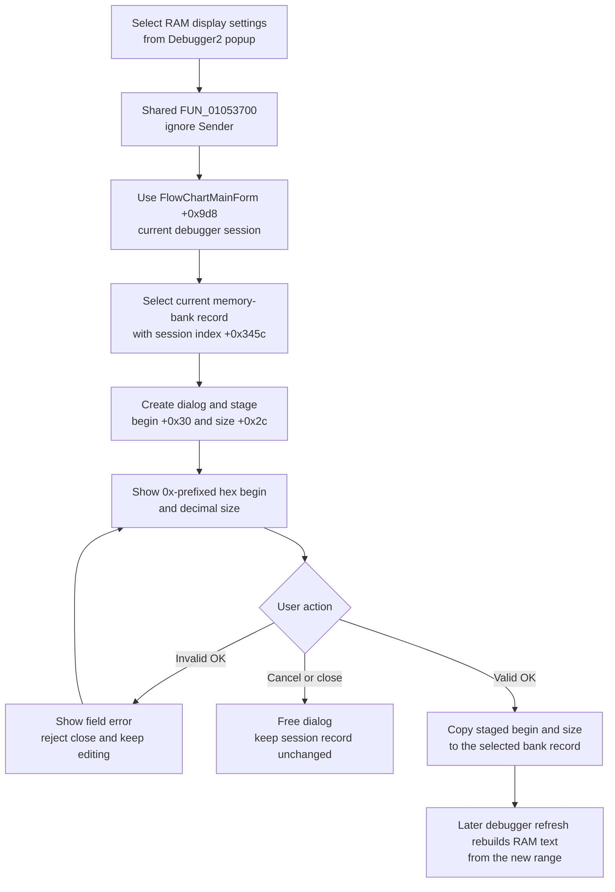

# Configure the shared debugger RAM display from Debugger2

## Control

| Property | Recovered value |
| --- | --- |
| Form | FlowChartMainForm |
| Component path | FlowChartMainForm.pcMain.tsEditorAndCode.pnDebugger2.Debugger2.mnPopupMenuMemory.mnRamdisplaysettings |
| Control class | TMenuItem |
| Caption | Inherited popup item; the base frame resource uses `Ram display settings`. |
| Handler name | sbRamDisplaySettingsClick |
| Handler address | 01053700 |
| Graph node | `resource:dfm:FlowChartMainForm/FlowChartMainForm.pcMain.tsEditorAndCode.pnDebugger2.Debugger2.mnPopupMenuMemory.mnRamdisplaysettings` |
| Handler node | `function:01053700` |
| Graph layer | UI |

## What happens when selected

This popup route opens `Ram Display Settings` for the FlowChart form's current MCU debugger session. It edits the address at which the RAM view starts and the number of bytes that the RAM view displays.

`Debugger2` is the debugger frame on the combined `Flowchart+Code` page. However, this menu item does not pass that frame as the target. Both the full Code-page debugger and this `Debugger2` instance bind to the same `sbRamDisplaySettingsClick` handler. The handler ignores `Sender` and always passes the FlowChart form field at `+0x9d8` to the shared settings coordinator. That field holds the current compiler/debugger session.

The coordinator reads the session's current memory-bank index at `+0x345c` and selects that bank's record from the list at `+0x3518`. Therefore, the current debugger session and current memory bank select the target. The popup instance does not select a separate settings record.

## Dialog input and validation

The coordinator creates a new `TRamDisplaySettings` form for each invocation. It copies the selected bank's current display-begin value from record offset `+0x30` and display-size value from `+0x2c` into the dialog. When the dialog is shown:

- `Display Begin` is rendered as `0x` followed by four hexadecimal digits;
- `Display Size` is rendered as a decimal integer;
- no setting is written back while the dialog is open.

The OK handler validates `Display Begin` as a string with at least one digit after the required `0x` prefix. The remaining characters must be hexadecimal. It validates `Display Size` as decimal digits. An invalid field causes a localized error message, marks the close attempt as rejected, and keeps the dialog open so the user can correct it. The recovered dialog code does not compare either accepted number with the current RAM bank's physical start, end, or total size.

## Accept and cancel behavior

If the modal result is `1` (`mrOk`), the coordinator copies the parsed begin address and display size back to the selected session record at `+0x30` and `+0x2c`. It then frees the dialog. The coordinator does not call the RAM renderer directly.

The RAM refresh path later reads these two record fields. A size of zero produces `<no memory>`. Otherwise, it starts at the stored begin address and builds the requested number of display entries. The renderer uses four-byte units for the recovered `0x800` target type and byte units for the other recovered types.

Cancel clears the dialog's validation-rejection flag and closes without copying either staged value back. Closing the dialog without `mrOk` has the same no-commit result. The session's former RAM-display range remains active.

## Click flow

## State, refresh, and persistence

- The accepted values change only the current in-memory debugger session record.
- The coordinator does not switch the current bank, code page, notebook page, active editor, debugger frame, or MCU target.
- It does not immediately call the RAM-view rebuild or repaint path. A later debugger refresh consumes the new range.
- It does not write an INI file, registry value, project file, FlowChart document, source file, or generated program file.
- New session records receive defaults from their recovered RAM metadata: the display begins at the RAM base, and the initial size is the full range when it is below 101 units, otherwise 64 units for target type `0x800` or 20 units for other recovered types.
- Reopening the dialog in the same session stages the current record values, including values accepted by the previous invocation.

## Failure and no-op behavior

- If the current session, bank list, or bank index is invalid, the recovered path has no local null or bounds guard after selection. A resulting exception propagates outside this handler.
- The dialog handles invalid character formats by keeping the form open. It does not clamp valid numeric input to the bank's physical range.
- An exception during dialog creation, conversion, modal execution, or commit is not caught locally. The recovered code does not provide rollback for a partial commit. The two record assignments are sequential after `mrOk`.
- Cancel and a non-OK window close are clean no-commit paths after normal dialog execution.
- There is no separate `Debugger2` state mutation because the shared handler never inspects the source control.

## Evidence

- [Shared menu handler `FUN_01053700`](../../../DecompiledSources/Tina16/functions/0000000001053700__FUN_01053700.c) ignores the event source and passes only FlowChart form field `+0x9d8` to the shared coordinator.
- [RAM-settings coordinator `FUN_00f8f8a0`](../../../DecompiledSources/Tina16/functions/0000000000F8F8A0__FUN_00f8f8a0.c) selects the current bank, stages four record fields, shows the dialog, commits display begin and size only for modal result `1`, and frees the form.
- [Current-bank selector `FUN_00f8b910`](../../../DecompiledSources/Tina16/functions/0000000000F8B910__FUN_00f8b910.c) indexes the session's record list at `+0x3518`; its call site supplies the current index from `+0x345c`.
- [Dialog show handler `FUN_00f872f0`](../../../DecompiledSources/Tina16/functions/0000000000F872F0__FUN_00f872f0.c) writes the `0x`-prefixed hexadecimal begin value and decimal size into the two editors.
- [Dialog OK handler `FUN_00f873d0`](../../../DecompiledSources/Tina16/functions/0000000000F873D0__FUN_00f873d0.c) validates both editor strings and stages the two parsed outputs, or shows a localized field error.
- [Numeric validator `FUN_00f87190`](../../../DecompiledSources/Tina16/functions/0000000000F87190__FUN_00f87190.c) enforces the hexadecimal prefix for begin and selects hexadecimal or decimal conversion.
- [Dialog Cancel handler `FUN_00f87620`](../../../DecompiledSources/Tina16/functions/0000000000F87620__FUN_00f87620.c) clears the rejection flag, while [CloseQuery `FUN_00f87630`](../../../DecompiledSources/Tina16/functions/0000000000F87630__FUN_00f87630.c) rejects a close after invalid OK input.
- [RAM view builder `FUN_00f8a840`](../../../DecompiledSources/Tina16/functions/0000000000F8A840__FUN_00f8a840.c) consumes record `+0x30` as the first address and `+0x2c` as display size during a later refresh.
- [Session-bank initialization `FUN_00f8e9a0`](../../../DecompiledSources/Tina16/functions/0000000000F8E9A0__FUN_00f8e9a0.c) creates the list, derives RAM bounds, and assigns the default begin and display size.
- [Recovered Delphi resource evidence](../../../DecompiledSources/Tina16/resources/dfm/ui-evidence.json) binds both embedded FlowChart debugger popup items to `sbRamDisplaySettingsClick` and identifies the dialog controls as `Display Begin`, `Display Size`, OK, Cancel, and Help.

## Direct calls

- `FUN_01053700` directly calls only `FUN_00f8f8a0` with the current session field.
- The shared coordinator calls the current-bank selector, the VCL form constructor, `ShowModal`, and object destruction paths. Its canonical function annotation belongs to the primary Code-page control analysis in `TIARA-diz.6.7.528`.

## Analysis limits

- The recovered code proves that both controls use the same session object and current bank. It does not prove how the two visible debugger frames synchronize every visual property before this click.
- The physical meaning and legal maximum of the accepted address and size depend on the selected MCU and bank record. The dialog does not expose those limits.
- The exact refresh schedule after a successful commit is outside this click path. The consumer proves that a later RAM rebuild uses the saved values.
- The recovered modal path does not show a custom Help action; the dialog's Help handler is a no-op.
