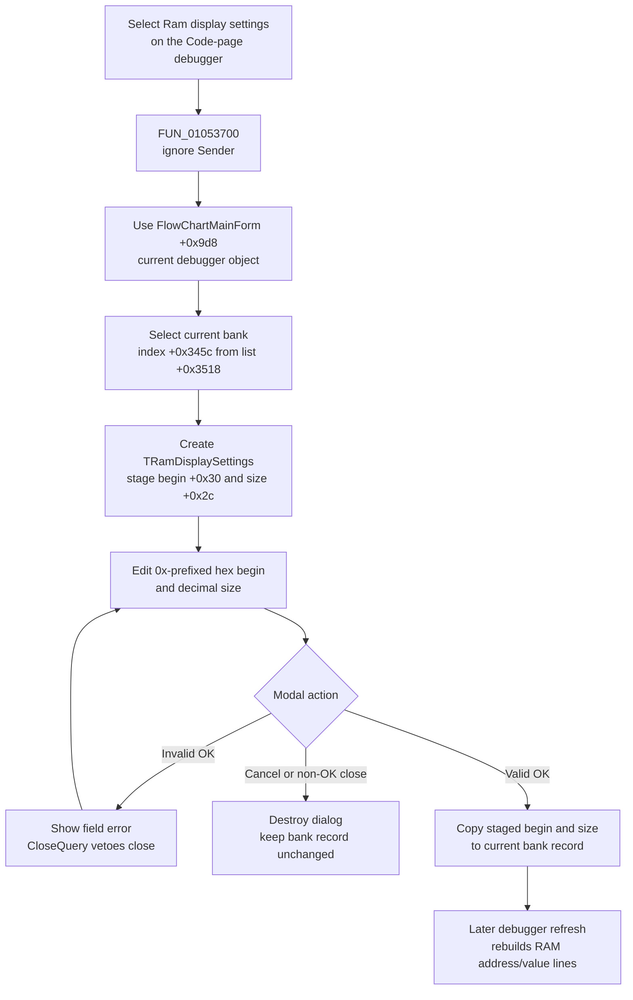

# Configure the current Flowchart debugger RAM display range

## Control

| Property | Recovered value |
| --- | --- |
| Form | FlowChartMainForm |
| Component path | FlowChartMainForm.pcMain.tsCode.Debugger.mnPopupMenuMemory.mnRamdisplaysettings |
| Control class | TMenuItem |
| Caption | Inherited popup item; the base debugger-frame resource uses `Ram display settings`. |
| Handler name | sbRamDisplaySettingsClick |
| Handler address | 01053700 |
| Graph node | `resource:dfm:FlowChartMainForm/FlowChartMainForm.pcMain.tsCode.Debugger.mnPopupMenuMemory.mnRamdisplaysettings` |
| Handler node | `function:01053700` |
| Graph layer | UI |

## What happens when selected

This popup command opens `Ram Display Settings` for the Flowchart form's current debugger session. The dialog edits two properties of the currently selected memory-bank record:

- `Display Begin` is the first address shown in the RAM view.
- `Display Size` is the amount of memory shown.

The command does not derive its target from the popup item or its owning debugger frame. `FUN_01053700` ignores `Sender` and always passes the Flowchart form field at `+0x9d8` to `FUN_00f8f8a0`. Both embedded Flowchart debugger menus use this same handler. They therefore address the same current debugger object even though one menu is on the Code page and the other is in the combined Flowchart-and-Code page.

The coordinator reads the current memory-bank index from debugger offset `+0x345c` and selects that record from the list at `+0x3518`. It stages the record's display-begin value at `+0x30` and display-size value at `+0x2c` in a new modal `TRamDisplaySettings` form. No debugger record changes while the dialog remains open.

## Dialog format and validation

The dialog contains only the two editors, OK, Cancel, and Help. When shown, it formats `Display Begin` as `0x` followed by a hexadecimal value with a four-digit minimum width. It formats `Display Size` as a decimal integer.

The OK handler validates the fields in this order:

1. `Display Begin` must contain the `0x` prefix and at least one following hexadecimal digit.
2. `Display Size` must contain decimal digits.

Invalid input shows a localized field error and sets the dialog's close-rejection flag. `OnCloseQuery` then keeps the modal form open. A later valid OK attempt clears the failure condition and can close the dialog.

The coordinator also stages the memory record's physical base at `+0x20` and capacity at `+0x28` in the dialog. However, the recovered dialog handlers do not read these staged bounds. They validate numeric syntax only. They do not clamp the accepted begin or size, compare the requested range with the bank end, or reject a size of zero.

## Accept, cancel, and refresh

When the dialog returns `mrOk` (`1`), `FUN_00f8f8a0` copies the staged begin and size to the selected record at `+0x30` and `+0x2c`. It then destroys the dialog. These two assignments are the complete commit performed by this command.

Cancel uses the recovered `bkCancel` button and clears the dialog's close-rejection flag. A Cancel result or any other non-OK modal result causes the coordinator to destroy the dialog without copying either value. If the begin field parsed successfully before an invalid size was found, only the dialog's staged begin changed; Cancel still leaves the debugger record unchanged.

The command does not call the RAM renderer after a successful commit. A later debugger refresh calls the RAM-view builder, which reads the stored begin and size. A zero size produces `<no memory>`. Otherwise, the builder starts at the stored address and emits one address/value line for each recovered memory element. It uses four-byte elements for target type `0x800` and byte elements for the other recovered branches.

## Click flow

## Radix, layout, and persistence boundaries

- This dialog does not contain a radix selector. The later RAM renderer reads the separate debugger radix field at `+0x33fc` when it formats each value; this command does not change that field.
- This dialog does not contain a column-count or row-layout option. The recovered renderer creates one address/value text line for each element.
- The accepted range is stored in the current in-memory debugger bank record. This command does not write an INI file, registry value, project file, Flowchart document, source file, or generated program file.
- When debugger bank records are created again, their default display begin is the physical RAM base. The initial display size is the full range when it is below 101 units; otherwise it is 64 units for target type `0x800` and 20 units for the other recovered types.
- Reopening the dialog in the same debugger session stages the values currently held in the selected record, including values accepted by an earlier invocation.

## Failure and no-op behavior

- The current-bank selector can return null when the bank list is absent. The coordinator dereferences the result without a local null check. The recovered path also has no local recovery for an invalid bank index.
- Invalid text is a handled retry path: the dialog reports the field error and remains open.
- Valid but out-of-range numeric input is not rejected or clamped by this dialog. The later memory access behavior depends on the debugger backend and is outside this click path.
- Exceptions from bank selection, dialog construction, conversion, modal execution, or record assignment are not caught here. The command does not implement transaction rollback for such an exception.
- Help has a recovered click handler, but that handler is a no-op.
- Repeated selection simply creates another dialog and stages the current in-memory values. It does not accumulate additional objects after normal dialog destruction.

## Evidence

- [Menu handler `FUN_01053700`](../../../DecompiledSources/Tina16/functions/0000000001053700__FUN_01053700.c) ignores the event source and passes only Flowchart form field `+0x9d8` to the shared coordinator.
- [RAM-settings coordinator `FUN_00f8f8a0`](../../../DecompiledSources/Tina16/functions/0000000000F8F8A0__FUN_00f8f8a0.c) selects the current bank, stages its fields, shows the modal form, commits only for result `1`, and destroys the form without a refresh call.
- [Current-bank selector `FUN_00f8b910`](../../../DecompiledSources/Tina16/functions/0000000000F8B910__FUN_00f8b910.c) reads the debugger's bank list; the coordinator call site supplies the current index from `+0x345c`.
- [Dialog show handler `FUN_00f872f0`](../../../DecompiledSources/Tina16/functions/0000000000F872F0__FUN_00f872f0.c) formats the staged begin with the recovered `0x` prefix and formats size as decimal.
- [Dialog OK handler `FUN_00f873d0`](../../../DecompiledSources/Tina16/functions/0000000000F873D0__FUN_00f873d0.c) validates begin before size, stages successful conversions, and reports the failing field.
- [Numeric parser `FUN_00f87190`](../../../DecompiledSources/Tina16/functions/0000000000F87190__FUN_00f87190.c) requires the two-character hexadecimal prefix for begin and selects hexadecimal or decimal conversion.
- [Cancel handler `FUN_00f87620`](../../../DecompiledSources/Tina16/functions/0000000000F87620__FUN_00f87620.c) clears the close-rejection flag, while [CloseQuery `FUN_00f87630`](../../../DecompiledSources/Tina16/functions/0000000000F87630__FUN_00f87630.c) rejects closing after invalid OK input.
- [RAM-view builder `FUN_00f8a840`](../../../DecompiledSources/Tina16/functions/0000000000F8A840__FUN_00f8a840.c) consumes the record's display begin, size, target type, and separate radix field during a later refresh.
- [Bank initialization `FUN_00f8e9a0`](../../../DecompiledSources/Tina16/functions/0000000000F8E9A0__FUN_00f8e9a0.c) derives RAM bounds and assigns the default begin and display size.
- [Recovered Delphi resource evidence](../../../DecompiledSources/Tina16/resources/dfm/ui-evidence.json) binds both embedded Flowchart debugger popup items to `sbRamDisplaySettingsClick` and identifies the `TRamDisplaySettings` editors and button kinds.

## Direct calls

- `FUN_01053700` directly calls only `FUN_00f8f8a0` with the current debugger field.
- `FUN_00f8f8a0` calls the bank selector, creates the dialog, invokes its modal method, and destroys it.

## Analysis limits

- The source proves that both menu resources use one debugger object. It does not prove how the two visible debugger frames synchronize all other display state.
- The physical address limits and effects of an accepted out-of-range value depend on the selected target and debugger backend.
- The exact event that performs the next RAM refresh is outside this handler path. The consumer proves only that a later refresh uses the accepted fields.
