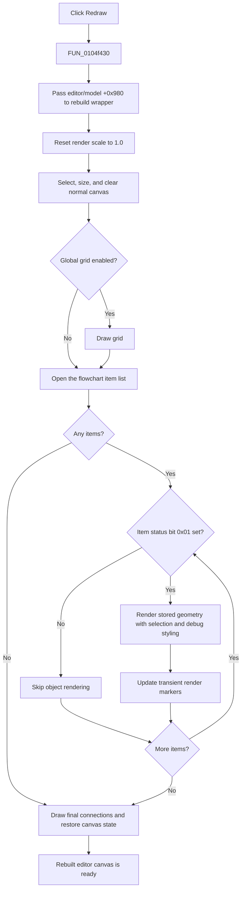

# Redraw

> Analysis status: Complete. The recovered handler and the canonical flowchart rebuild path establish the behavior below.

## Control

| Property | Recovered value |
| --- | --- |
| Form | FlowChartMainForm |
| Component path | FlowChartMainForm.MainMenu.mnTools.mnRedraw |
| Control class | TMenuItem |
| Caption | Redraw |
| Hint | Not present in the recovered resource. |
| Text | Not present in the recovered resource. |
| Handler name | mnRedrawClick |
| Handler address | 0104f430 |
| Graph node | `resource:dfm:FlowChartMainForm/FlowChartMainForm.MainMenu.mnTools.mnRedraw` |
| Handler node | `function:0104f430` |
| Graph layer | UI |

## What happens when clicked

`FUN_0104f430` has no decision or state guard. It calls the canonical editor rebuild wrapper `FUN_010508e0`, which passes the FlowChartMainForm editor/model field at `+0x980` to the shared layout and redraw routine `FUN_00f63b50`.

The rebuild performs these operations:

1. It resets the editor render scale at `+0x68` to `1.0`.
2. It selects the editor's normal drawing target at `+0x90`, applies the stored drawing width and height from `+0x98` and `+0x9C`, and clears the target to white.
3. If the global grid setting is enabled, it redraws the grid at the configured spacing.
4. It traverses the complete flowchart item list at `+0x48`. Items whose status bit `0x01` is set are rendered from their stored bounds and connector data. The renderer uses selection bit `0x08`, current-execution bit `0x20`, and breakpoint bit `0x40` to choose visible styling.
5. It clears or updates transient per-item render markers, including flag `0x04` and byte `+0x40`, and runs the final connection-routing/drawing pass.

This command does not calculate a new automatic arrangement for the model. It redraws from the objects' stored positions and can recalculate dependent drawing geometry, such as connector and label placement, during rendering. It does not add, delete, move, or select an object.

## Click flow

## Model, selection, and debugger state

- Selection is preserved. The renderer reads selection bit `0x08` to choose selection styling but does not set or clear it.
- The current debugger position and breakpoints are preserved. Bits `0x20` and `0x40` affect object colors, but this path does not change those bits or advance debugger execution.
- Stored object positions remain unchanged. The rendering pass consumes the existing object bounds.
- The render scale changes to `1.0`, and transient drawing markers can change as the pass processes objects and connections. These are view/render state, not saved flowchart content.
- The handler does not test the active main-page tab. A direct invocation always targets the form's flowchart editor field.

## Modified state and persistence

The redraw path does not call the model modified-state setter, Save, Save As, the TFC stream writer, code generation, or compilation. It therefore does not mark a clean document as modified, clear an already modified document, or persist the refreshed view. A later Save persists model content through its separate writer; this redraw command itself performs no file or registry operation.

## Repeated, empty, and error behavior

- There is no dirty-region or already-current guard. Every click starts the complete rebuild again.
- With an empty item list, the routine still resets the scale, clears and sizes the canvas, draws the optional grid, and completes its final canvas pass. Only the item loop is skipped.
- The handler and wrappers do not test the form, editor/model, canvas, or item-list pointers for null.
- No local exception handler, retry, or rollback is present. A drawing or object-access exception propagates. The canvas and transient render markers can be partly updated when this occurs, while model content and the document modified flag remain unchanged by the recovered path.

## Handler evidence

- Handler source: [FUN_0104f430](../../../DecompiledSources/Tina16/functions/000000000104F430__FUN_0104f430.c)
- Canonical editor rebuild wrapper: [FUN_010508e0](../../../DecompiledSources/Tina16/functions/00000000010508E0__FUN_010508e0.c)
- Canonical layout and redraw routine: [FUN_00f63b50](../../../DecompiledSources/Tina16/functions/0000000000F63B50__FUN_00f63b50.c)
- Object renderer: [FUN_00f63320](../../../DecompiledSources/Tina16/functions/0000000000F63320__FUN_00f63320.c)
- Grid renderer: [FUN_00f636d0](../../../DecompiledSources/Tina16/functions/0000000000F636D0__FUN_00f636d0.c)
- Final connection pass: [FUN_00f638e0](../../../DecompiledSources/Tina16/functions/0000000000F638E0__FUN_00f638e0.c)
- Complexity: simple
- Distinct outgoing calls: 1

## Direct calls and ownership

- `function:010508e0` — Canonical Flowchart editor rebuild wrapper. Its existing graph annotation owns this shared role and is cited, not duplicated, in this control fragment.
- `function:00f63b50` — Canonical layout and redraw implementation called by the wrapper. Its existing graph annotation owns this broad role and is cited, not duplicated, in this control fragment.

`FUN_0104f130` is a one-call wrapper around this menu handler. Other callers use the same rebuild wrapper after New, Open, object edits, selection changes, and debugger-position changes. These callers establish that the shared routine refreshes the presentation of current model state; they do not make the Redraw menu command perform those model-changing actions.

## Resource evidence

- The DFM binds `FlowChartMainForm.MainMenu.mnTools.mnRedraw.OnClick` to `mnRedrawClick` at `0104f430`.
- The `TMenuItem` caption is `Redraw`.
- The control has no recovered hint, text, image, shortcut, checked state, modal result, or nearby same-parent label.

## Analysis limits

- The original Delphi names for the editor/model fields and item flags are not present in the recovered source. The offsets and flag meanings above come from repeated readers, writers, and render consumers.
- The recovered code proves that object and connector drawing uses current stored geometry. It does not establish an original Delphi name for the transient flag `0x04` or byte `+0x40`.
- No local error presentation is present, so this analysis does not claim how the application-level exception handler reports a redraw failure.
