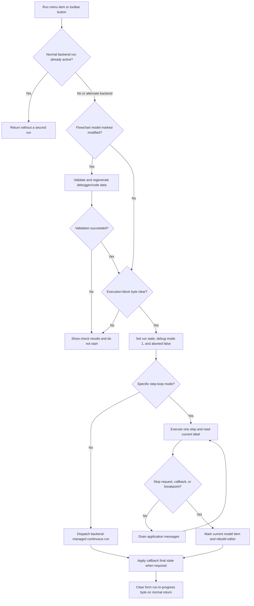

# Run

## Control

| Property | Recovered value |
| --- | --- |
| Form | FlowChartMainForm |
| Component path | FlowChartMainForm.MainMenu.mnDebug.mnRun |
| Control class | TMenuItem |
| Caption | Run |
| Handler name | sbRunClick |
| Handler address | 01052a70 |
| Graph node | `resource:dfm:FlowChartMainForm/FlowChartMainForm.MainMenu.mnDebug.mnRun` |
| Handler node | `function:01052a70` |
| Graph layer | UI |

The toolbar button `FlowChartMainForm.pnToolbar.sbRun` uses the same handler. Its hint is `Run`. Its extracted two-frame glyph shows right-pointing green and yellow triangles. The image supports the Run meaning but does not establish the execution rules by itself.

## What happens when clicked

`sbRunClick` starts or continues flowchart debugger execution. It operates on the simulator at form offset `+0x9d8`, the flowchart model at `+0x980`, and the VHDL MCU interface at `+0x970`.

The first gate reads the simulator run-active byte at `+0x3454` and a backend-mode byte at `+0x3511`. If the run-active byte is already set and the backend-mode byte is clear, the handler returns without changing state. This prevents a second normal-backend Run command while that run is active. The alternate backend path is not rejected by this test.

If the flowchart model reports that it is modified, `FUN_01053ee0` prepares it for execution:

1. It runs the recovered flowchart validation coordinator. That code checks the normal process entry and connections and shows the FlowChart Check results when validation fails.
2. On success, it clears the existing generated-code view, builds target-specific debugger/code data, adds the result to the code view, and clears the model's separate compile-dirty byte at `+0x19`.
3. It stores the inverse validation result in the form byte at `+0x8ed`.

The Run handler reads `+0x8ed` after this preparation. A set value stops the command before it changes debugger or simulator state. If the model is not marked modified, the preparation helper is not called; the current `+0x8ed` value remains the execution gate.

## Execution start and backend selection

After the gates pass, the handler performs these changes before it invokes a backend:

- It sets the form run-in-progress byte at `+0x8eb` and clears the Stop-request byte at `+0x6c4`.
- It sets the simulator run-active byte and clears its stopped byte at `+0x33f8`.
- It calls `VHDL_DLL2.DLL::_MCU_SetDebugMode` with mode `1`.
- It calls `VHDL_DLL2.DLL::_MCU_SetAborted` with `0`.

The source then selects one of two proven execution shapes.

### Backend-managed run

For the normal general case, the handler dispatches simulator initialization and continuous execution through `FUN_00f8d6c0` and `FUN_00f8da20`. The normal implementation calls `_if_compile_design`, checks that the compiled design and debugger state are usable, and repeatedly steps the MCU. It updates MCU status, animation data, the current instruction or flowchart state, and the Run Until condition. It drains application messages during the loop. An alternate backend-mode flag selects shorter setup and run adapters instead of this loop.

The handler copies the form animation choice at `+0x940` to the simulator before it starts the continuous run. The animation setter also calls `VHDL_DLL2.DLL::_MCU_SetAnimate`.

### Explicit flowchart-step loop

A separate predicate detects a specific MCU-selection and simulator-type combination. In this case, the handler runs an explicit loop while no stop callback is pending and the simulator stopped byte remains clear:

1. `FUN_01052800` executes one backend step. This shared helper belongs to the Step Forward control analysis.
2. The handler reads the simulator's current flowchart label.
3. `FUN_010521e0` finds the corresponding model item and tests its `0x40` breakpoint flag.
4. At a breakpoint, the handler clears the run-active byte and sets the simulator stopped byte. Otherwise, it preserves the current stopped state.
5. `FUN_0080cc70` drains pending application messages before the next loop test.

After this loop, the handler reads the final label, clears the `0x20` current-item flag from the model, sets it on the matching item, and rebuilds the flowchart editor view. This updates the visible current-flow marker.

## Stop, break, and Run Until

The message drain keeps the synchronous loop responsive to the toolbar and menu Stop command. The separate Trace Stop handler clears the simulator run-active byte, restores animation, sets the MCU aborted state, calls the backend-specific abort routine, and sets form byte `+0x6c4`. In the explicit loop, the next shared step dispatch sees this request, sets the simulator stopped byte, and lets the loop end. The continuous backend also drains messages and checks its own stop and abort state.

A breakpoint is a `0x40` flag on the model item for the current flowchart label. The explicit loop stops when it finds that flag. The handler does not add or remove a breakpoint; Toggle Breakpoint owns that mutation.

Run Until is a wrapper around this same Run handler. It gets an accepted target from its dialog, programs the MCU and simulator Run Until target, and then calls `sbRunClick`. The continuous backend clears the Run Until target when it reaches that point or another stop condition.

Two recovered callbacks set form byte `+0x8ea` and a reason byte at `+0x941`. When this happens during debugger mode `1`, `sbRunClick` calls one of two simulator final-state adapters according to the reason byte. It always clears the form run-in-progress byte on the normal return path.

## UI state, persistence, and errors

The handler does not directly call a menu-item or button `Enabled` setter. Its visible changes come from simulator animation updates, current-item marking, and the final editor rebuild in the explicit loop. The recovered source does not prove that Run, Step, or editing commands are disabled for the full run. The application-message drain is what permits Stop and other dispatched messages to run while this synchronous handler is active.

Run does not save the flowchart or write a configuration file. Successful modified-flowchart preparation clears the compile-dirty byte at `+0x19`, but it does not clear the separate modified-state byte at `+0x18`. Execution therefore consumes regenerated in-memory data without proving that the document was persisted.

The handler has these proven failure boundaries:

- A validation failure shows the FlowChart Check result path, sets the execution-block byte, and performs no debugger start.
- Backend preparation can return without running when its compiled-design or debugger checks fail.
- The normal continuous backend reports `TINA: Internal error in the HDL engine` when a simulator step fails and then leaves its loop.
- The two direct MCU state-setting calls have no checked return value in this handler.
- The handler has no simulator-null guard, local exception handler, or `finally` cleanup. If an exception escapes after `+0x8eb` is set, the recovered function does not prove that the run-in-progress, debug-mode, animation, or abort state is restored.
- On normal backend return, including a handled stop or internal-loop exit, the handler reaches its final run-in-progress clear.

## Run flow

## Evidence

- [Run handler](../../../DecompiledSources/Tina16/functions/0000000001052A70__FUN_01052a70.c): contains the re-entry and validation gates, debugger setup, backend selection, explicit loop, breakpoint check, current-item update, and normal cleanup.
- [Modified-flowchart preparation](../../../DecompiledSources/Tina16/functions/0000000001053EE0__FUN_01053ee0.c): validates, rebuilds target-specific debugger data, clears compile-dirty state, and records the execution-block result.
- [Validation coordinator](../../../DecompiledSources/Tina16/functions/0000000001050AF0__FUN_01050af0.c) and [top-level validity check](../../../DecompiledSources/Tina16/functions/0000000000F77D30__FUN_00f77d30.c): build and show the FlowChart Check result path and return validity.
- [Target-specific debugger-data builder](../../../DecompiledSources/Tina16/functions/0000000001050900__FUN_01050900.c): selects a generator by target type, configures it, runs it, and attaches its result to the code view.
- [Backend start dispatcher](../../../DecompiledSources/Tina16/functions/0000000000F8D6C0__FUN_00f8d6c0.c), [continuous-run dispatcher](../../../DecompiledSources/Tina16/functions/0000000000F8DA20__FUN_00f8da20.c), and [normal continuous loop](../../../DecompiledSources/Tina16/functions/0000000000F8DAA0__FUN_00f8daa0.c): establish the two backend shapes, design preparation, step loop, Run Until checks, message processing, and internal-engine error.
- [Shared step dispatcher](../../../DecompiledSources/Tina16/functions/0000000001052800__FUN_01052800.c): consumes the Stop-request byte, executes the selected step path, updates animation, and refreshes the current model item.
- [Breakpoint predicate](../../../DecompiledSources/Tina16/functions/00000000010521E0__FUN_010521e0.c): maps a simulator label to a model item and tests its `0x40` flag.
- [Current-item marker](../../../DecompiledSources/Tina16/functions/0000000000F65450__FUN_00f65450.c) and [editor rebuild wrapper](../../../DecompiledSources/Tina16/functions/00000000010508E0__FUN_010508e0.c): update the `0x20` current-item flag and rebuild the visible flowchart.
- [Application-message drain](../../../DecompiledSources/Tina16/functions/000000000080CC70__FUN_0080cc70.c): repeatedly fetches and dispatches pending messages.
- [Trace Stop handler](../../../DecompiledSources/Tina16/functions/0000000001052D50__FUN_01052d50.c) and [abort dispatcher](../../../DecompiledSources/Tina16/functions/0000000000F8E020__FUN_00f8e020.c): prove how a Stop click reaches the active execution paths.
- [Run Until handler](../../../DecompiledSources/Tina16/functions/000000000104F440__FUN_0104f440.c): programs the target and calls this Run handler.
- [Run toolbar glyph](../../../glyph/0168_FlowChartMainForm_FlowChartMainForm_pnToolbar_sbRun_Glyph_Data.png): contains the two recovered triangle frames.

## Limits

- The recovered source does not name the backend-mode byte at `+0x3511` or the specific MCU selection recognized by `FUN_010527b0`. This article describes their tested values and effects without assigning an unsupported product name.
- The two callback reason values at `+0x941` select different final-state adapters, but their original Delphi enumeration names are not recovered.
- No direct persistence call or complete command-enablement policy is present in this handler.
