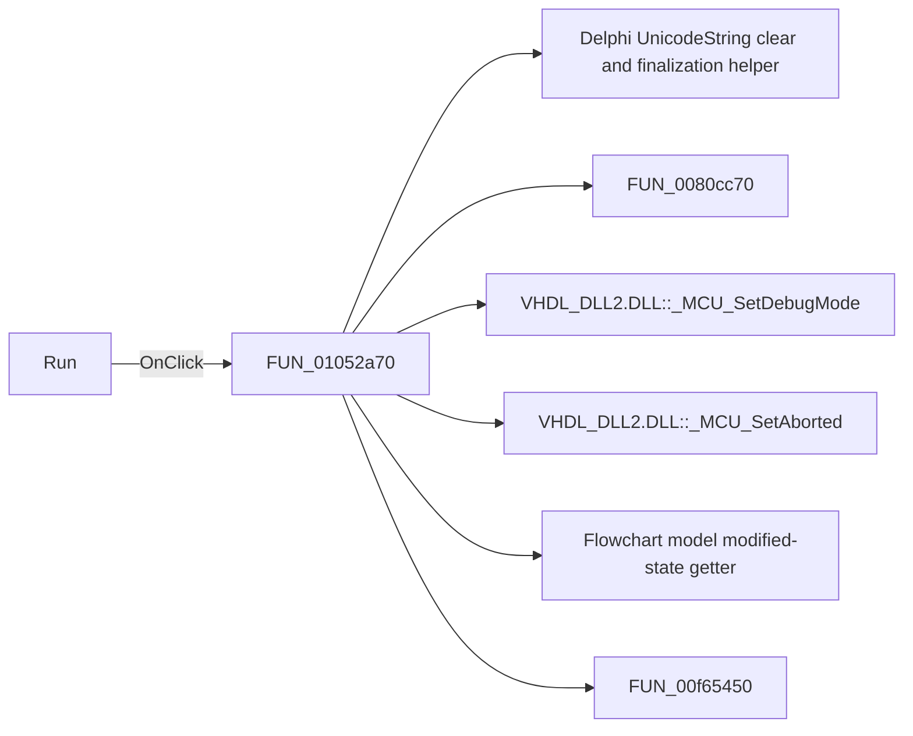

# Run

> Analysis status: Pending individual source review.

## Control

| Property | Recovered value |
| --- | --- |
| Form | FlowChartMainForm |
| Component path | FlowChartMainForm.MainMenu.mnDebug.mnRun |
| Control class | TMenuItem |
| Caption | Run |
| Hint | Not present in the recovered resource. |
| Text | Not present in the recovered resource. |
| Handler name | sbRunClick |
| Handler address | 01052a70 |
| Graph node | `resource:dfm:FlowChartMainForm/FlowChartMainForm.MainMenu.mnDebug.mnRun` |
| Handler node | `function:01052a70` |
| Graph layer | UI |

## What happens when clicked

Pending individual analysis. An agent must read the recovered handler source and its relevant callees before it replaces this text.

## Click flow

## Handler evidence

- Source: [DecompiledSources/Tina16/functions/0000000001052A70__FUN_01052a70.c](../../../DecompiledSources/Tina16/functions/0000000001052A70__FUN_01052a70.c)
- Recovered role: Not present in the recovered resource.
- Current graph summary: Handles 2 Delphi UI events: FlowChartMainForm.pnToolbar.sbRun.OnClick, FlowChartMainForm.MainMenu.mnDebug.mnRun.OnClick.
- Current graph behavior: Not present in the recovered resource.
- Current graph evidence: Not present in the recovered resource.
- Complexity: complex
- Distinct outgoing calls: 25

## Direct calls

- `function:00414480` — Delphi UnicodeString clear and finalization helper
- `function:0080cc70` — FUN_0080cc70
- `function:00e03b80` — Calls the VHDL_DLL2.DLL export _MCU_SetDebugMode.
- `function:00e03be0` — Calls the VHDL_DLL2.DLL export _MCU_SetAborted.
- `function:00f629a0` — Flowchart model modified-state getter
- `function:00f65450` — FUN_00f65450
- `function:00f8d140` — FUN_00f8d140
- `function:00f8d160` — Flowchart simulator animation-mode setter
- `function:00f8d190` — FUN_00f8d190
- `function:00f8d1a0` — FUN_00f8d1a0
- `function:00f8d1c0` — FUN_00f8d1c0
- `function:00f8d1d0` — FUN_00f8d1d0
- `function:00f8d220` — FUN_00f8d220
- `function:00f8d300` — FUN_00f8d300
- `function:00f8d6b0` — FUN_00f8d6b0
- `function:00f8d6c0` — FUN_00f8d6c0
- `function:00f8da20` — FUN_00f8da20
- `function:00f8e070` — FUN_00f8e070
- `function:00f8f400` — FUN_00f8f400
- `function:010508e0` — Flowchart editor rebuild wrapper
- `function:010521e0` — FUN_010521e0
- `function:010527b0` — FUN_010527b0
- `function:01052800` — FUN_01052800
- `function:01053ed0` — FUN_01053ed0
- `function:01053ee0` — FUN_01053ee0

## Resource evidence

- Kind: Not present in the recovered resource.
- Modal result: Not present in the recovered resource.
- Checked state: Not present in the recovered resource.
- List items: Not present in the recovered resource.
- Image reference: Not present in the recovered resource.
- Extracted glyph: None.

## Nearby label candidates

Nearby labels are layout candidates only. They are not proof of behavior.

- No same-parent label candidate is available.

## Analysis limits

- Do not infer behavior from the control class, caption, hint, glyph, or nearby label alone.
- Do not replace the pending status until the handler source and relevant call path provide enough evidence.
